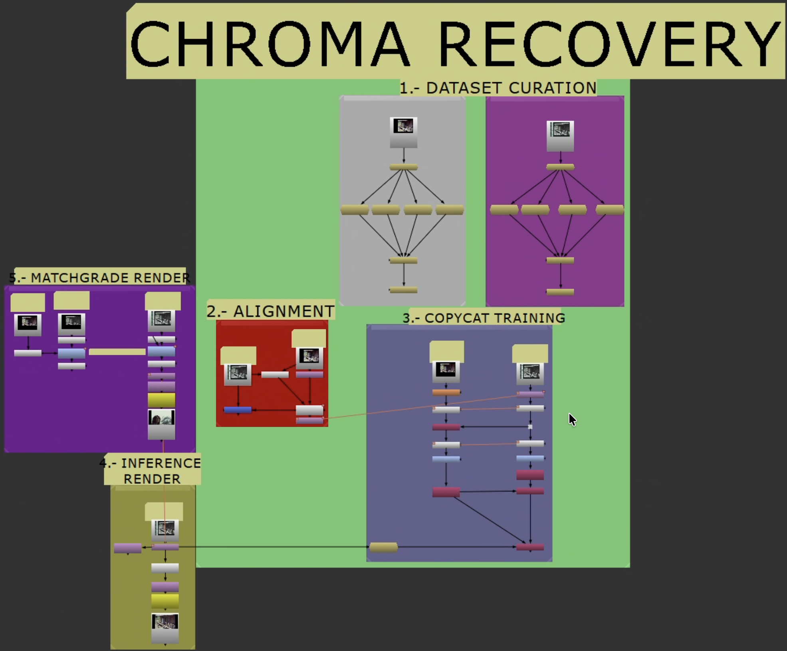

# Custom Machine Learning for Film Restoration in Nuke

A comprehensive workflow template for training custom machine learning models using Foundry Nuke's `CopyCat` node and convolutional neural networks (CNNs) for **both spatial recovery and color recovery** in film restoration. This approach addresses limitations of traditional spatial and temporal filters by training small, film‑specific models on data, helping preserve the unique analog characteristics of the original material.


Figure 1 — Node graph overview.

---

## Quick Start

1. **Color Recovery** → [docs/chroma-recovery.md](docs/chroma-recovery.md)
2. **Spatial Recovery** → [docs/spatial-recovery.md](docs/spatial-recovery.md)
3. **Provenance & Metadata** → [docs/provenance-metadata.md](docs/provenance-metadata.md)
4. **Glossary — Terms and definitions** → [docs/references/terms-and-definitions.md](docs/references/terms-and-definitions.md)

---

**Presentations**
- Slides and papers: [docs/presentations/README.md](docs/presentations/README.md)

---

## Overview

### Scope

This repository covers end‑to‑end workflows, templates, and conventions for training and applying small, film‑specific ML models in Nuke `CopyCat` for chroma and spatial recovery—spanning dataset curation, alignment, training, inference, and validation with links to procedures and case studies—while also capturing research experiments and findings in reference‑based recovery, non‑reference chroma reconstruction, dataset design, and validation methods. It does not prescribe conformance requirements or provide general‑purpose colorization workflows, and it excludes licensed media and learned weights.

### The Foundry NukeX

NukeX is the advanced edition of Foundry’s Nuke, an industry‑standard, node‑based compositing application used in VFX and finishing. It includes integrated machine‑learning nodes (`CopyCat` and `Inference`) alongside mature color management, robust image I/O, and GPU acceleration. In this template, NukeX serves as a single, versioned environment for dataset curation, alignment, supervised training, inference, and deterministic rendering—so the entire process stays visible and reproducible inside one graph.

### What This Template Provides

Custom machine learning-based film restoration using supervised learning with convolutional neural networks (CNNs), addressing two fundamental types of film damage:

**Color Recovery**
- Restores missing or faded **color information** in chromogenic film stocks affected by dye degradation
- **Reference-based**: Trains models using DVDs, telecines, or other color-accurate sources
- **Non-reference**: Infers color from paintings, photographs, or manually created references
- Addresses **inter-frame damage**: Color fading across sequences

**Spatial Recovery**
- Restores **spatial features** (resolution, sharpness, grain structure) lost to damage or generational degradation
- **Reference-based**: Transfers spatial characteristics from actual film sources (different gauges, generations, preservation elements like telecines/safety copies)
- Real-world projects often combine multiple source differences (e.g., 16mm print + 35mm internegative)
- Addresses **intra-frame damage**: Detail loss, degradation affecting individual frames
- **Note**: Non-reference spatial recovery (using commercial/open-source models) is outside the scope of this repository

### Why Custom ML for Film Restoration?

Custom ML complements traditional film restoration methods, addressing challenges previously deemed impossible or prohibitively costly:

**What traditional methods cannot do:**
- **Spatial and temporal filters**: limited to local neighborhoods and short temporal windows; cannot use external references or distant shots
  - Operate on small pixel neighborhoods or short temporal windows; reset at cuts; no scene memory
  - Cannot ingest higher quality sources as guidance during filtering
  - Sharpen/denoise can amplify artifacts in degraded scans
- **Traditional color correction** (LUTs, channel balancing): remaps existing channels but cannot reconstruct missing color information
  - Faded dye layers remove signal; LUTs cannot add absent chroma
  - Cross channel contamination and nonlinear fading break simple channel adjustments
  - Global grades are context agnostic; they cannot learn from external references
  - Manual painting is theoretically possible frame by frame but impractical at scale

**New value of multiple film elements:**
Custom ML gives new purpose to multiple copies or elements of the same film. Different prints, generations, or gauges can each contribute unique information to training, improving model accuracy and making previously "redundant" archive materials valuable for restoration.

**The role of larger models (open-source, commercial):**
With advancements in open weights, Low‑Rank Adaptation (LoRA) adapters, and fine‑tuning capabilities, larger models could eventually complement custom approaches for scenarios with little or no reference material. However, archival restoration requires careful, guided application to maintain historical authenticity.


---

## Practical Workflow Considerations

**Granularity principle for chroma/spatial recovery.** Train and infer at the broadest scope that remains compositionally consistent. Correlative shots within a sequence or scene can share a model if framing, lighting, motion, and subject distribution are stable. When visual characteristics or reference quality diverge, compartmentalize and work at a finer granularity (down to shot by shot), mirroring modern generative AI VFX practices.

**When to pick sequence, scene, or shot:**
- **Sequence‑level processing** — Correlative shots with similar composition and stable lighting and camera; consistent reference quality
- **Scene‑level grouping** — Same scene with moderate shifts in composition, lens, grade, or damage; break at scene boundaries
- **Shot‑by‑shot processing** — Major composition changes, new subjects or angles, fast cuts, heavy damage, or weak/uneven reference
- **Rule of thumb** — If composition or reference quality changes, step down in granularity

See [case studies](docs/case-studies.md) for experimental examples demonstrating these approaches.

### Process Overview
1. **Curate dataset** — Select representative frame pairs from different containers; choose the best container per target dimension and hold out frames for validation (for example, 3–4 per shot; ~16 per scene; 33+ per sequence)
2. **Align sources** — Register reference to source at pixel level; ensure identical picture area; crop or mask overlays; match resolution and frame rate
3. **Train model** — Use `CopyCat` supervised learning; isolate the target dimension (color vs spatial); validate on held‑out frames
4. **Infer and render** — Apply the trained model to the full source and render outputs

Optional steps:
- **Chroma**: MatchGrade baseline render for comparison and QC
- **Spatial**: Luma matching pass for integration when needed


## Recovery Procedures

### Color Recovery Workflow

**When to use:** Chromogenic film stocks with dye fading, color negatives with degraded color layers, films requiring historical color reconstruction

Note: Colorization is outside this repository's scope. Early `CopyCat` colorization experiments suggested that if a model can synthesize color from grayscale, recovering faded color using references is even more tractable.

**Approach:**
- **Reference‑based recovery** — Uses DVDs, telecines, or other color‑accurate sources to train supervised models
- **Non‑reference recovery** — Infers color from paintings, period photographs, or manually created references when no direct reference exists

**Process Overview:**
1. **Curate dataset** — Select representative source+reference frame pairs; hold out validation frames (for example, 3–4 per shot; ~16 per scene; 33+ per sequence)
2. **Align sources** — Precisely match reference to source at pixel level
3. **`CopyCat` training** — Train a CNN with supervised learning to reconstruct chroma while preserving original spatial information
4. **Infer and render** — Apply the trained model to the full source for the selected scope and render outputs
5. **Validate** — Compare against a MatchGrade baseline

**Detailed Guide:** → [docs/chroma-recovery.md](docs/chroma-recovery.md)

### Spatial Recovery Workflow

**When to use:** Films with generational loss, multiple sources of same content, gauge related quality differences, damage requiring detail reconstruction

**Core Approach:**
Transfer spatial characteristics from better quality sources to degraded targets using supervised learning with CNNs.

**Common Source Scenarios:**
- Multiple film gauges (16mm vs 35mm)
- Different generations (print, internegative, duplicate)
- Early preservation elements (telecines, safety copies made closer to original)
- Multiple prints/scans of varying quality
- **Combinations** (e.g., 35mm internegative + 16mm print = gauge + generation differences)

**Process Overview:**
1. **Curate dataset** — Select overlapping frame pairs from different containers (low‑quality target + higher‑quality spatial reference); hold out validation frames (for example, 3–4 per shot; ~16 per scene; 33+ per sequence)
2. **Align sources** — Precisely match reference to source at pixel level; ensure identical picture area; crop borders, subtitles, and logos
3. **`CopyCat` training** — Train a CNN to transfer spatial features (resolution, grain, sharpness); match color so only spatial features differ between source and reference
4. **Infer and render** — Apply the trained model to the full source and render outputs
5. **Validate** — Check spatial consistency (detail transfer, grain structure) across the target scope

**Detailed Guide:** → [docs/spatial-recovery.md](docs/spatial-recovery.md)

---

## Case Studies

### Color Recovery Examples
- **[Candy Candy Opening - 16mm](docs/case-studies/candy-candy-opening.md)** - Reference-based recovery using DVD source
- **[Friends](docs/case-studies/friends-chroma-recovery.md)** - Reference-based color reconstruction
- **[Rebelión de Tapadas](docs/case-studies/rebelion-de-tapadas-chroma-recovery.md)** - Non-reference recovery using historical paintings
- **[Ben](docs/case-studies/ben-chroma-recovery.md)** - Manual reference creation approach
- **[Muralla Verde](docs/case-studies/muralla-verde-chroma-recovery.md)** - Trailer restoration
- **[Frontier Experience](docs/case-studies/frontier-experience-chroma-recovery.md)** - Telecine reference-based recovery

### Spatial Recovery Examples
- **[Mission Kill](docs/case-studies/missionkill-combined-recovery.md)** - 35mm internegative + 16mm print (gauge + generation + color recovery)
- **[El Tinterillo](docs/case-studies/tinterillo-spatial-recovery.md)** - Early telecine preservation element (two-step approach)
- **[Knights of the Trail](docs/case-studies/knights-trail-spatial-recovery.md)** - Multiple nitrate print sources with varying quality

**All Case Studies:** → [docs/case-studies.md](docs/case-studies.md)

---

## Repository Structure

```
nuke-chroma-recovery-template/
├── README.md                              # This file - project overview
├── docs/
│   ├── chroma-recovery.md                 # Chroma recovery workflow
│   ├── spatial-recovery.md                # Spatial recovery workflow
│   ├── (operator quick refs in annexes)   # See chroma/spatial docs Annex A
│   ├── case-studies.md                    # All case studies index
│   ├── case-studies/                      # Individual case studies
│   └── images_kebab/                      # Workflow images (canonical)
├── notes/                                 # Project notes and QC logs
├── nuke_base/                             # Store base .nknc templates
└── pipeline/                              # Stage-based pipeline templates
    ├── 01_dataset_curation/
    ├── 02_alignment/
    ├── 03_copycat_training/
    ├── 04_inference_render/
    └── 05_matchgrade_render/
```

---

 

## Getting Started

### Prerequisites
- Foundry NukeX (Non‑Commercial or commercial) with `CopyCat` node
- Source film material (scanned)
- Reference material (same film or compatible)
- Basic understanding of ML concepts (helpful but not required)

### First Project
1. Choose your recovery type: **Chroma** (color) or **Spatial** (resolution, grain, detail)
2. Read the appropriate workflow guide
3. Review relevant case studies
4. Follow the stepwise procedure in the selected workflow guide
5. Start with dataset curation

### For Different Film Types

Examples are summarized in Table 1.

Table 1 — Recovery selection examples.

| Film Type | Recommended Recovery | Examples |
|-----------|---------------------|----------|
| Color‑faded prints | Chroma Recovery | Candy Candy, Friends |
| Multiple sources available | Spatial Recovery | Knights of the Trail, El Tinterillo |
| Complex degradation | Combined Recovery | Mission Kill |
| Historical material | Chroma Recovery (careful) | Rebelión de Tapadas |

---

 

## Contributing

Contributions are welcome:
- **Case studies** — representative projects with documentation
- **Workflow improvements** — optimized techniques
- **Documentation** — guide and example enhancements
- **Tools** — utility scripts and templates

---

## License

This workflow template is provided for educational and research purposes in film preservation and restoration.

---

## Questions & Support

- **Technical Details:** See annexes in chroma/spatial docs
- **Quick Reference:** See annexes in chroma/spatial docs
- **Real Examples:** Browse [case studies](docs/case-studies.md)
