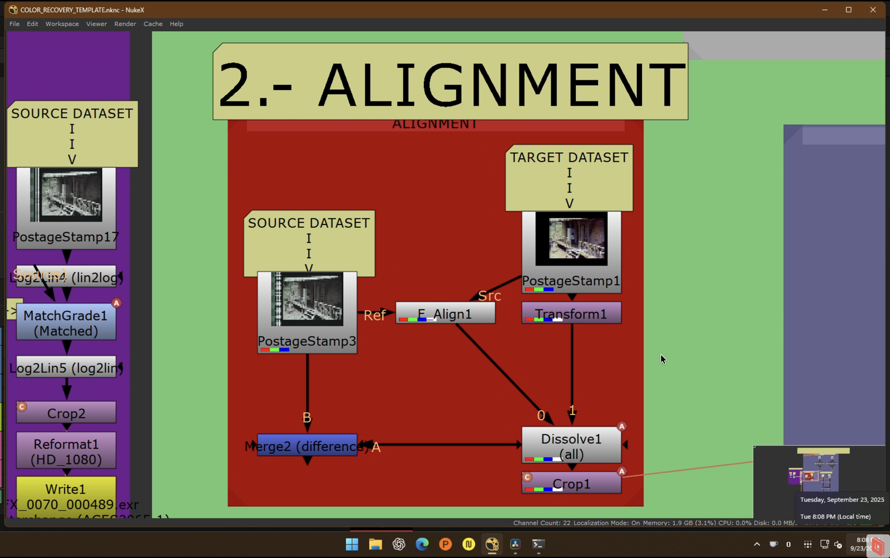

# Chroma Recovery Workflow Template for Nuke

This repository documents a reusable workflow for machine‑learning‑assisted chroma recovery in film restoration, implemented in Foundry Nuke with the CopyCat node. It captures the logic and purpose of each stage without project‑specific settings, serving as a foundation for consistent, adaptable restoration work.


---

## Start Here
- Read the canonical workflow guide: [WORKFLOW_GUIDE.md](WORKFLOW_GUIDE.md)
- Operator checklist and SOP: [DOCS/copycat_sop.md](DOCS/copycat_sop.md)
- Log decisions and QC notes: [notes/experiments.md](notes/experiments.md)

Quick start commands:
- Alignment (iterate): `nuke --nukex --script pipeline/02_alignment/<shot>.nk`
- CopyCat training (headless): `nuke --nukex --bg --script pipeline/03_copycat_training/<session>.nk`
- Inference render: `nuke --nukex --script pipeline/04_inference_render/<shot>_render.nk`

---

## Purpose and Rationale
Restore missing or degraded chroma in scanned film by training small, targeted models on curated source and reference material. This approach prioritizes:
1. Archival integrity — ethically sourced, verifiable references; no opaque pre‑trained data.
2. Specificity — per‑film or per‑reel models to keep grain, texture, and color traits.
3. Control — transparent, reproducible decisions end‑to‑end.

---

## Workflow Stages

### 1) Dataset Curation
Select representative frames from faded source and matching color reference. Lock matching frames (FrameHold) and assemble with AppendClip.


### 2) Alignment (with linked Crop)
Align reference precisely to source so only chroma differs. Combine global F_Align with manual Transform for edge cases; use Dissolve to compare modes; apply a linked Crop for consistent framing.



### 3) CopyCat Training
Reconstruct chroma only while preserving original luma and detail. Replace reference luma with source luma, remove extra channels, clamp values, and train CopyCat on aligned pairs.


### 4) Inference & Render
Apply the trained model to the full sequence, remove non‑image areas (sprockets/audio), format for output, and render to the archival colorspace.


### 5) MatchGrade Baseline (optional)
Compare ML recovery to Nuke’s MatchGrade using the same dataset frames as a baseline.


---

## Docs Index
- Workflow guide: [WORKFLOW_GUIDE.md](WORKFLOW_GUIDE.md)
- SOP/quick checklist: [DOCS/copycat_sop.md](DOCS/copycat_sop.md)
- Notes and QC log: [notes/experiments.md](notes/experiments.md)
- Reference images: [DOCS/images/](DOCS/images) · Cropped: [DOCS/images_cropped/](DOCS/images_cropped)

---

## Repository Structure
```
nuke-chroma-recovery-template/
├── README.md
├── WORKFLOW_GUIDE.md
├── DOCS/
│   ├── copycat_sop.md
│   └── images/
├── notes/
│   └── experiments.md
├── nuke_base/                # store base .nknc template
└── pipeline/
    ├── 01_dataset_curation/
    ├── 02_alignment/
    ├── 03_copycat_training/
    ├── 04_inference_render/
    └── 05_matchgrade_render/
```

---

## Versioning
- Track changes in [CHANGELOG.md](CHANGELOG.md). Use commit scopes per stage (e.g., `alignment:`, `copycat:`).
- Tag stable checkpoints after QC review, e.g., `git tag -a v0.1.0 -m "first working template" && git push origin v0.1.0`.

---

## License
Currently unlicensed and private. All rights reserved until finalized.
