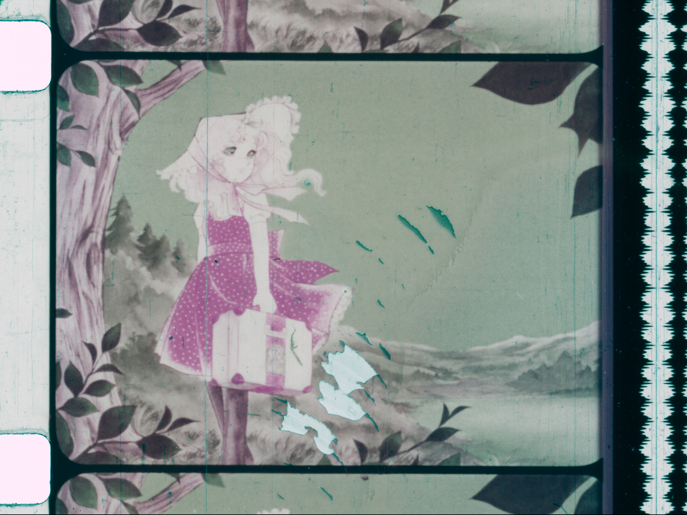
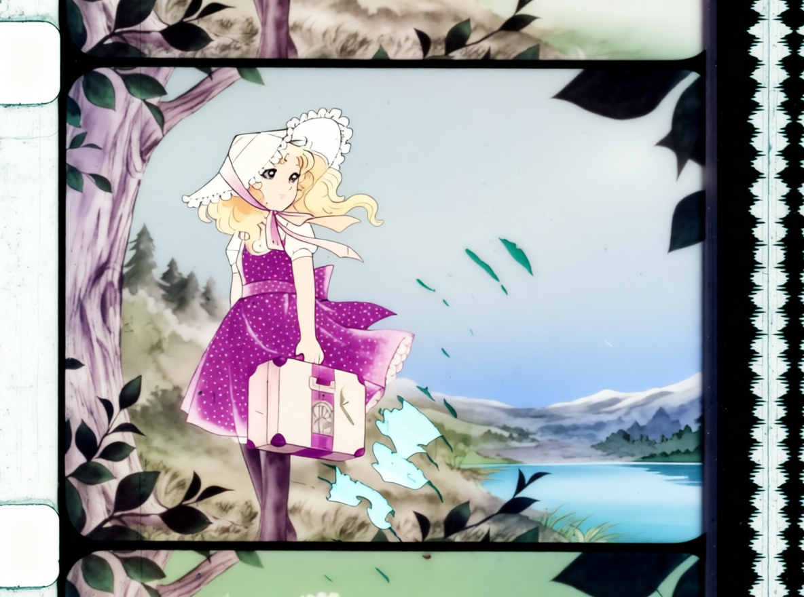
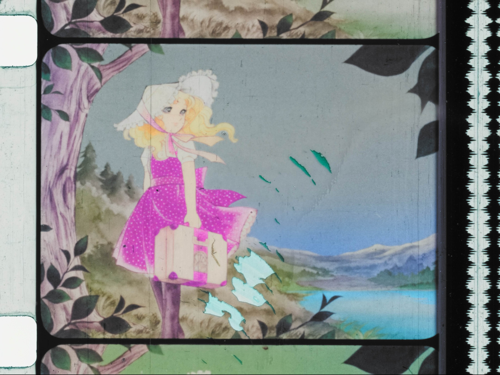

# Machine Learning for Film Restoration

Open research and practical workflows for recovering colour and detail in faded or damaged moving images.

This repository follows two connected lines of work:

1. **Open-weight colour recovery:** the main current research area, using Qwen Image Edit and related open models to propose colour while preserving the source frame’s luminance, texture, geometry, and damage.
2. **Reference-trained recovery:** the established Nuke CopyCat workflow, using aligned source/reference pairs to recover chroma or spatial detail with a model trained for one film project.

The project is written for film archives, restoration practitioners, colourists, researchers, and students. It is research material rather than a finished commercial product.

  <a href="https://fabiocolor.github.io/custom-machine-learning-for-film-restoration/"><strong>Explore the research website</strong></a>
  &nbsp;·&nbsp;
  <a href="docs/qwen-color-recovery-app.md">Try the Qwen workflow</a>
  &nbsp;·&nbsp;
  <a href="docs/seapavaa-2026-companion.md">SEAPAVAA 2026 companion</a>

## Open-weight colour recovery

Qwen Image Edit can use a faded source frame, visual references, and written direction to create a colour proposal. The public workflow recombines that proposal with the original source luminance so fine detail and photographic structure do not come solely from the generated image.

> **Ongoing research:** the Qwen material records the current state of the experiments, not a fixed final method. Workflows, prompts, recommended settings, and conclusions will change as the research develops and new evidence is reviewed.

Start with:

- [Open-weight colour recovery overview](docs/open-weight-color-recovery.md)
- [Research routes, evidence, and unresolved questions](docs/open-weight-research-routes.md)
- [Qwen Image Edit workflow and downloads](docs/qwen-color-recovery-app.md)
- [SEAPAVAA 2026 presentation companion](docs/seapavaa-2026-companion.md)
- [Credits and attribution](docs/credits.md)

| Faded source | Qwen colour proposal | Source-preserving composite |
| --- | --- | --- |
|  |  |  |

## Reference-trained recovery in Nuke

The CopyCat workflow trains a compact model on selected examples from one production. It supports two distinct tasks:

| Task | Use it when | What the model learns |
| --- | --- | --- |
| **Chroma recovery** | Detail survives, but colour has faded, shifted, or collapsed | Colour from a stronger reference while retaining source luminance |
| **Spatial recovery** | Colour survives, but detail is weaker than the reference | Luminance detail from the reference while retaining source colour |

Start with:

- [CopyCat workflow overview](docs/copycat-workflow.md)
- [Shared preparation and project setup](docs/start-here.md)
- [Chroma recovery](docs/chroma-recovery.md)
- [Spatial recovery](docs/spatial-recovery.md)
- [Training, inference, and review](docs/training-inference-review.md)
- [Preparing reliable training pairs](docs/automated-dataset-preparation.md)
- [Case studies](docs/case-studies.md)

The current Nuke Indie template is available from the [latest release](https://github.com/fabiocolor/custom-machine-learning-for-film-restoration/releases/latest).

## Publications and presentations

- Fabio P. Bedoya Huerta, [Exploring Experimental Machine Learning in Film Restoration](https://library.imaging.org/archiving/articles/22/1/35), *Archiving Conference* 22(1), 2025.
- [SEAPAVAA 2026 companion: Advancing Open-Weight AI Models for Color Recovery in Faded Film](https://fabiocolor.github.io/custom-machine-learning-for-film-restoration/seapavaa-2026-companion/).
- [Video walkthrough of the CopyCat chroma-recovery workflow](https://youtu.be/kXerjFGX9Kg).

## Repository guide

- `docs/`: the public research website and downloadable Qwen material
- `templates/`: the Nuke Indie workflow template
- `scripts/`: checks for the downloadable Qwen material

## Responsible use

Generated colour is an interpretation unless supported by a known reference. Keep the original scan, identify all references, show intermediate results, and record the choices that shaped the output. The source and its historical context should remain more authoritative than the model.

## Support

If this research is useful to your work, you can [sponsor it on GitHub](https://github.com/sponsors/fabiocolor) or [support it through PayPal](https://paypal.me/fabiocolor).

## Rights, licences, and attribution

No single licence covers everything referenced in this repository. Original research material, third-party film footage, visual references, model files, and software may each have different owners and terms.

See [Credits & Attribution](docs/credits.md) for the public source record and [Third-Party Notices](THIRD_PARTY_NOTICES.md) for the principal model and software projects. Credit is not permission to reuse third-party material, and this repository does not relicense it.
