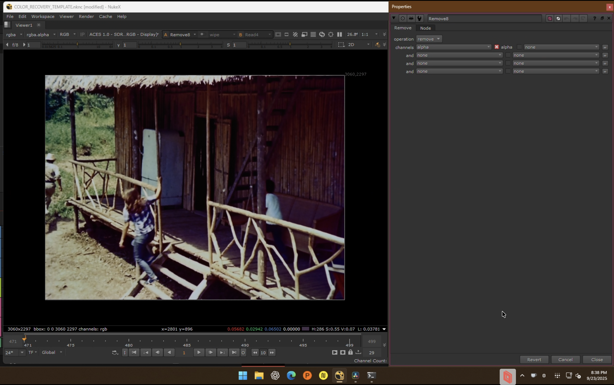

# Chroma Recovery Workflow Guide

*Machine Learning Based Film Restoration using Nuke CopyCat*

## Overview

This workflow demonstrates chroma recovery for degraded film using machine learning techniques. The process involves training a custom ML model to restore color information while preserving original luma and film grain characteristics.

**Example Project**: La Muralla Verde trailer restoration
**Degradation**: Severe magenta shift typical of faded chromogenic film
**Reference**: DCP color-corrected version
**Result**: Restored chroma with preserved film grain and texture

### Before/After Comparison
*La Muralla Verde - Frame 1503*


*Original scan showing severe magenta shift characteristic of faded chromogenic film*


*Complete workflow comparison: Original → Balanced → Reference → ML Result*

---

## Workflow Philosophy

- **Recovery, Not Enhancement**: Restore what was originally there
- **Preservation First**: Maintain analog film characteristics (grain, texture)
- **Reference-Based**: Use verifiable sources for ML training
- **Shot-Specific**: Parameters adapt to each source/reference pair
- **Quality Control**: Compare ML results against traditional methods

---

## Project Structure

This repo follows a 5 stage pipeline layout tailored for Nuke + CopyCat. All paths are repository relative to avoid hard coded absolutes.

```
.
├── pipeline/
│   ├── 01_dataset_curation/    # Curated source/reference frames, shot notes
│   ├── 02_alignment/           # Alignment NK scripts and diagnostic renders
│   ├── 03_copycat_training/    # CopyCat sessions, logs (no weights in git)
│   ├── 04_inference_render/    # Inference NK + renders
│   └── 05_matchgrade_render/   # LUT baseline comparisons + QC plates
├── nuke_base/                  # Base .nknc template(s) duplicated per reel
├── DOCS/                       # Supporting docs and reference material
├── notes/
│   └── experiments.md          # Decisions, parameters, QC observations
└── README.md                   # Entry points and quick links
```

Nuke command shortcuts for each stage:
- Dataset curation/alignment: `nuke --nukex --script pipeline/02_alignment/<shot>.nk`
- Training (headless): `nuke --nukex --bg --script pipeline/03_copycat_training/<session>.nk`
- Inference render: `nuke --nukex --script pipeline/04_inference_render/<shot>_render.nk`

---

## Start Here

- Preferred scope: shot by shot projects (best quality and stability).
- Dataset pairs: start with 3 to 9 representative pairs; increase as needed. Above roughly 33 pairs, training time can exceed 20 hours depending on hardware and settings. Rule of thumb: shots 3 to 4 pairs; scenes about 16; sequences 33 or more depending on complexity.
- Alignment: try F_Align first; switch to manual Transform if difference view shows residual edges.
- Crop: remove all black borders and burned in subtitles; link or clone crop across source and reference.
- Colorspace: convert to YCbCr to preserve source luma (Y) and train only on chroma (Cb/Cr).
- CopyCat: batch 3, patch 512 (256 if limited by crop), checkpoints every 10k, total 40 to 80k steps.
- Output: ACES 2065-1 EXR half; write to `pipeline/04_inference_render/`.
- QC: store comps in `QC/YYYY-MM-DD/` under each stage and log findings in `notes/experiments.md`.
 - Training pairs: frame pairs from different containers of the same film. For chroma, use the container with superior color and equalize luma/spatial; for spatial, use the container with superior detail and match color.

## Table of Contents
- Overview and Philosophy
- Project Structure and Commands
- Phase 1: Resolve Preprocessing
- Phase 2: Nuke ML Processing
  - Step 2.1: Dataset Curation
  - Step 2.2: Alignment
  - Step 2.3: CopyCat Training
  - Step 2.4: Inference & Render
  - Step 2.5: MatchGrade Comparison (Optional)
- Phase 3: Resolve Integration
- Technical Notes, Troubleshooting, QC


---

# Phase 1: DaVinci Resolve Preprocessing


*DaVinci Resolve timeline showing source material organization and initial color reference setup*

## Step 1.1: Project Setup

1. **Create New Project** in DaVinci Resolve
   - Project Name: `[FILM_TITLE]_ChromaRecovery`
   - Frame Rate: Match source material
   - Resolution: Full scan resolution (typically 2K-4K)

2. **Import Source Material**
   - **Primary Source**: Degraded film scan sequence
   - **Reference Material**: Color-corrected version (DCP, DVD, telecine)
   - **Media Pool Organization**: Separate bins for source and reference

## Step 1.2: Critical Alignment Process

1. **Resolution & Frame Rate Matching**
   - **Source**: Highest quality degraded material available
   - **Reference**: Ground truth for color recovery (DCP, telecine, DVD)
   - **Critical Requirement**: Match resolution AND frame rate between source and reference
   - **Common Issue**: References often have different frame rates or sizes

2. **Spatial Alignment**
   - **Accept black borders** on reference if necessary
   - **Goal**: Maximize pixel level correspondence between source and reference
   - **Quality Check**: Same luminance information in matching frames

3. **Reference Quality Considerations**
   - Video sources may require frame rate conversion
   - Different aspect ratios require careful cropping decisions
   - Compression artifacts acceptable if temporal sync is maintained

## Step 1.3: Export for Dataset Creation

1. **Render Aligned Sequences**
   - **Format**: EXR sequences (both source and reference)
   - **Purpose**: Prepared datasets for Nuke ML training
   - **Critical**: Both sequences must have identical frame correspondence

## Step 1.4: Export for Nuke


*DaVinci Resolve media settings showing EXR format configuration*


*Project settings showing ACES workflow configuration with Rec.709 output*

**ACES Workflow Integration:**
- **Pipeline**: Modified ACES workflow optimized for ML training
- **Resolve Exports**: Rec.709 colorspace (prevents values above 1.0)
- **Nuke Exports**: ACES 2065-1 color space
- **ML Training Consideration**: Rec.709 input prevents ACES 2065-1 super whites from affecting CopyCat training
- **Color Completeness**: Final ACES 2065-1 output preserves full color information post ML processing
- **Future Adaptability**: May change if Nuke modifies ACES behavior with CopyCat

**Export Settings:**
- **Format**: EXR DWAA compression (recommended) or other EXR variants
- **Bit Depth**: 16-bit half float
- **Colorspace**: Rec.709 (from DaVinci Resolve)
- **File Naming**:
  - Source: `[PROJECT]_SOURCE_####.exr`
  - Reference: `[PROJECT]_REF_####.exr`
  - Balanced: `[PROJECT]_BAL_####.exr`

**Frame Range**:
- Export full sequences initially
- Specific frames for dataset curation will be selected in Nuke

---

# Phase 2: Nuke ML Processing

## Workflow Overview


*Complete 5-stage Nuke workflow: Dataset Curation → Alignment → CopyCat Training → Inference → MatchGrade Comparison*

## Step 2.1: Dataset Curation


*Dataset curation showing target and source frame selection with FrameRange and AppendClip nodes*

**Purpose**: Select representative frame pairs for ML training

### Workflow Approach Decision

1. **Whole Reel Approach**:
   - Single project for entire reel
   - Faster to implement
   - Usually doesn't provide optimal results
   - Good for initial testing

2. **Shot-by-Shot Approach** (Recommended):
   - Individual project per shot
   - **VFX workflow methodology**
   - Significantly better quality results
   - More time-intensive but superior outcomes
   - Each shot gets optimal training parameters

### Node Setup: Dataset Curation Section

1. **Read Nodes**:
   - `Read2` (TARGET_DATASET): Balanced source sequence
   - `Read3` (SOURCE_DATASET): Reference sequence

2. **FrameRange and FrameHold Nodes**:

   
   *FrameRange node showing 1-1 frame range setting for single frame output*

   - **FrameRange**: Set to 1-1 to pass only one frame at a time
   - **Purpose**: Ensures AppendClip receives one frame per input
   - **Target Frames**: `FrameHold26`, `FrameHold24`, `FrameHold1`, `FrameHold27`
   - **Source Frames**: `FrameHold109`, `FrameHold108`, `FrameHold2`, `FrameHold107`

3. **Frame Selection Strategy**:
   - **Minimum**: 3 frames (beginning, middle, end)
   - **Preferred**: 4 frames (beginning, end, two middle)
   - **Mathematical Distribution**: For shot frames 20-60:
     - Frame 1: 20 (beginning)
     - Frame 2: ~40 (middle)
     - Frame 3: ~50 (middle)
     - Frame 4: 60 (end)
   - **Scalability**: Can increase to 7, 11+ frames if training fails

4. **AppendClip Node Structure**:
   - **AppendClip1**: Primary dataset compilation
   - **AppendClip12**: Secondary compilation connected to PostageStamps
   - **Dual Structure Rationale**: Workflow management - easier to modify primary AppendClip without affecting monitoring nodes

### Critical Dataset Verification

**Verification Process**:
1. **Frame-by-Frame Comparison**: Compare source vs reference for each selected frame
2. **Luminance Matching**: Verify same image content (ignore color differences)
3. **Temporal Sync**: Ensure frame numbers correspond to identical moments
4. **Quality Control**: This verification is the baseline for ML training success

**Frame Selection Criteria**:
- **Variety**: Different lighting conditions, subjects, compositions
- **Quality**: Clean areas without major damage
- **Representativeness**: Cover the range of color degradation
- **Alignment**: Frames that can be precisely registered

**Troubleshooting**:
- If training fails, increase frame count progressively (4→7→11)
- Add frames between existing selections
- Insert additional frames in middle segments
- Maintain representativeness across shot duration

## Step 2.2: Alignment


*Alignment section (red) showing F_Align and Transform nodes for precise geometric registration*

**Purpose**: Precisely register reference to source for pixel accurate training

### Dual Alignment System

The alignment workflow provides two methods with path switching capability:

1. **Automatic Alignment Path** (F_Align):
   - Primary method using F_Align node
   - Takes reference from PostageStamp
   - Default settings recommended to avoid over-tweaking

2. **Manual Alignment Path** (Transform):
   - Backup method using Transform node
   - Manual keyframe based alignment
   - Used when automatic alignment fails

### F_Align Node (Automatic Alignment):


*F_Align node showing analysis region setup and tracking parameters*

- **Setup Strategy**: Adjust analysis region to fit reference limits
- **Parameters**: Enable scale, rotate, translate, and perspective
- **Default Settings**: Avoid excessive tweaking - can worsen results
- **Analysis Region**: Define tracking area within reference boundaries
- **Method**: Planar tracking for geometric correction

### Transform Node (Manual Alignment):


*Transform node with scale and translation fine-tuning controls*

- **Manual Control**: Keyframe-based translate and scale values
- **Reference Matching**: Adjust reference to match source
- **Fallback Method**: When automatic alignment insufficient

### Alignment Verification and Switching:

- **Merge Difference Node**: Shows difference between aligned version and source
- **Quality Control**: Visual feedback for alignment accuracy
- **Dissolve Node**: Path selector between automatic (0) and manual (1) alignment
- **Decision Making**: Switch to manual if automatic alignment fails

### Crop Operations (Critical):

**Purpose**: Remove black borders and problematic content before training

**Black Border Removal**:
- **Requirement**: Remove ALL black borders from both source and reference
- **Training Impact**: Black information skews ML training
- **Size Trade-off**: Accept smaller image size for clean training data

**Subtitle Handling**:
- **Problem**: Hard coded or burned in subtitles affect training
- **Training Issues**: Subtitles either disappear or acquire incorrect color
- **Solution**: Crop to exclude subtitle areas
- **Strategy**: Crop bottom portion or work around subtitle placement
- **Information Priority**: Preserve color-rich areas over sky/uniform regions

**Crop Implementation**:
- **Linked Crops**: Same crop applied to source and reference
- **Cloning**: Crop settings automatically replicated across workflow
- **Keyframing**: Animate crop when subtitles appear/disappear
- **Pixel Correspondence**: Ensures identical cropped regions for training

## Step 2.3: CopyCat Training

**Purpose**: Train ML model for chroma-only recovery while preserving luma

### Reference Pre-Processing (Target Dataset)

**PostageStamp**: Visual monitoring of aligned target dataset

**Median Filter for Reference Cleanup**:


*Median filter for reference quality improvement*

- **Purpose**: Remove dust, dirt, compression artifacts from video/telecine references
- **Median Size**: Typically size 10, but highly dependent on reference quality
- **Range**: Can vary from 1-2 points to much higher based on reference condition
- **Advantage**: Better than blur for artifact removal without losing detail
- **Chroma Resolution**: Safe up to size 10 - beyond this may cause color bleeding
- **Luma Impact**: Luma filtering doesn't matter since it's replaced with source luma
- **Quality Dependent**: Lower quality references may need higher values
- **Training Advantage**: This luma replacement technique makes chroma recovery training more feasible than luma recovery, where such ground truth creation methods aren't available

### Source Pre-Processing

**PostageStamp**: Visual monitoring of source dataset
**Crop Application**: Same linked/cloned crop from alignment phase applied here

### Colorspace Conversion Chain

1. **RGB to YUV Conversion**:

   
   *Colorspace conversion from Linear to YUV for luma/chroma separation*

   - **Both Paths**: Linear → YUV transformation
   - **Purpose**: Separate luma (Y) from chroma (U/V) channels
   - **Channel Mapping**: Red→Luma(Y), Green→U(Cb), Blue→V(Cr)

2. **Luma/Chroma Extraction Strategy**:

   
   *Shuffle node for luma/chroma channel manipulation*

   **Target Processing**:
   - Extract only chroma information (U/V channels) from reference
   - Discard luma from reference (often low quality from video sources)

   **Source Processing**:
   - Extract luma information from source
   - Combine source luma with reference chroma

   **Result**: Ground truth with source luma + reference chroma

3. **YUV to RGB Conversion**:
   - Convert back to RGB after luma/chroma combination
   - **Colorspace**: YUV → Linear transformation

### Final Pre-Processing Steps

1. **Grade Node (Quality Control)**:
   - **Black Clamp**: Remove sub-0 values
   - **White Clamp**: Remove above-1 values
   - **Purpose**: Prevent training artifacts from out-of-range values

2. **Channel Cleanup**:

   
   *Remove node for alpha channel elimination*

   - **Remove Alpha**: CopyCat works better training only RGB channels
   - **Both Paths**: Apply to ground truth and input

3. **Bounding Box Management**:
   - Copy bounding box from reference to source
   - Quality control step for consistency

### Training Data Verification

**Final State Check**:
- Ground truth and input should be identical except for color information
- Same resolution, same content, same information
- Only difference: reference colors vs. faded source colors

### CopyCat Training Node


*CopyCat training interface showing model parameters, loss curve monitoring, and contact sheet validation*

1. **Input Connections**:
   - **Input**: Processed source with original luma + faded chroma
   - **Ground Truth**: Processed reference with original luma + reference chroma

### Hardware Requirements

**GPU Selection**:
- **Mac**: Apple Silicon preferred (some legacy Navi cards supported on Mac Pro 2019)
- **PC**: NVIDIA GPUs strongly recommended
- **Performance**: Mid-tier NVIDIA GPU outperforms high-end Apple Silicon
- **Lab Setup**: 4x RTX 3090s for optimal performance

### Training Parameters

**Core Settings**:
- **Data Directory**: Separate folder for each shot/training session
- **GPU**: Enable GPU acceleration (Apple Silicon or NVIDIA)
- **Initial Weights**: None (Advanced options)
- **Model Size**: Medium (Large model testing planned for future)

**Epoch Calculation Strategy**:
- **Standard Formula**: Epochs = Batch Size × 10,000
- **Example**: Batch Size 3 = 30,000 epochs
- **Reduced Crop Size**: When using 256px crop (subtitle removal), double the epochs
- **Example**: Batch Size 3 with 256px crop = 60,000 epochs

**Batch Size Configuration**:
- **Fixed Setting**: Batch Size = 3 (not auto)
- **Rationale**: Consistent results across different machines/GPUs
- **Multi-Machine Workflow**: Different VRAMs and bandwidths handled consistently
- **Alternative**: Auto batch size may work for single-machine workflows

**Patch/Crop Size**:
- **Maximum Available**: Usually 512px
- **Subtitle Handling**: 256px when removing subtitles
- **Size-Dependent**: Based on available image area after cropping

**Checkpoint Management**:
- **Interval**: Every 10,000 steps
- **Training Range**: Typically 40,000-80,000 total steps
- **Recovery**: Good restart points if training interrupts
- **Contact Sheet**: Every 100 steps for clear progress monitoring

2. **Training Monitoring**:
   - **Loss Curve**: Monitor convergence (should decrease steadily)
   - **Contact Sheet**: Visual progress at regular intervals
   - **Validation**: Check for overfitting

3. **Model Output**:
   - **File**: `Training_[TIMESTAMP]_[ITERATIONS].cat`
   - **Location**: `pipeline/03_copycat_training/<shot>/models/` (do not commit large weights unless approved)

### CopyCat Node Settings (Quick Reference)
For screenshots and knob mapping, see `DOCS/copycat_sop.md`.
- Data directory: `pipeline/03_copycat_training/<shot>/session_*`
- GPU: enabled; device auto
- Model size: Medium; Initial weights: None
- Batch size: 3 (fixed for consistency across machines)
- Patch size: 512 (or 256 for subtitle cropped areas)
- Checkpoints: every 10k; plan for 40 to 80k total steps
- Contact sheets: every 100 steps

## Step 2.4: Inference & Render


*Inference stage showing full sequence processing with trained CopyCat model*

**Purpose**: Apply trained model to full sequence

### Training Preview Setup (Optional)

**Preview Strategy**:
- **Frame Hold**: Set to untrained frame for model validation
- **Example**: If training frames 1, 4, 6, 8, set preview to frame 5
- **Purpose**: Monitor model performance on unseen data during training
- **Quality Control**: Early detection of overfitting or training issues

### Inference Setup

1. **Source Sequence**: Load full degraded sequence
   - **PostageStamp**: Input monitoring
   - **Source**: Full sequence for ML processing

2. **Image Cleanup Crop**:
   - **Purpose**: Remove non-image elements (optical sound tracks, frame borders)
   - **Goal**: Process only actual image content
   - **Difference**: This crop removes technical elements, not subtitle/alignment issues

3. **Model Application**:

   
   *Inference node applying trained model to full sequence*

   - **Inference**: Apply trained CopyCat model
   - **Model File**: Load `.cat` file from training
   - **Process**: Frame-by-frame ML inference on full sequence

### Output Processing & Limitations

**Nuke Version Considerations**:
- **NukeX Non-Commercial**: Limited to 1920×1080 output resolution
- **Nuke Indie/Full NukeX**: Access to full resolution rendering
- **Workaround**: Reformat to 1080p for non commercial version only

### Render Settings

- **Format**: EXR DWAA compression
- **Bit Depth**: 16-bit half float
- **File Path**: `pipeline/04_inference_render/[PROJECT]_ML_####.exr`
- **Frame Range**: Full sequence
- **Colorspace**: ACES 2065-1
- **Quality Control**: Import rendered sequence to verify completion and consistency

Tip: For a stage by stage checklist focused on CopyCat, see `DOCS/copycat_sop.md`.

## Step 2.5: MatchGrade Comparison (Optional)


*MatchGrade comparison workflow showing traditional color matching as baseline reference*

**Purpose**: Create baseline comparison using traditional LUT based color matching

### MatchGrade Node Fundamentals

**Nuke's Built-in Color Matching**:
- **Function**: Matches color information between source and reference
- **Output**: Creates LUTs or CDL (Color Decision List) transformations
- **Modes**: 3D LUT (preferred) or CDL monastic transformation
- **Use Case**: Traditional color correction and LUT generation

### MatchGrade Configuration


*MatchGrade node showing automatic color matching settings and controls*

**Analysis Setup**:
- **Reference Frames**: Match the number of training frames (typically 4)
- **Frame Selection**: Same frames used for CopyCat training dataset

**Mode Selection**:
1. **MatchGradeSource**:
   - May produce good results but can introduce artifacts
   - Direct source-to-reference matching
2. **MatchDifferentClip**:
   - Reduces artifacts but may sacrifice accuracy
   - More conservative matching approach

**Technical Parameters**:
- **Transformation**: 3D LUT (maximum quality)
- **Pre-LUT**: Logarithmic conversion
- **LUT Resolution**: 264 (maximum available)
- **Workflow**: Linear → Log → MatchGrade → Log → Linear

### Processing Pipeline

1. **Colorspace Preparation**:
   - **Linear to Log**: Prevent issues with extreme values
   - **Applied to**: Both source and target before MatchGrade

2. **MatchGrade Application**:
   - **Input**: Log-converted source and reference frames
   - **Process**: Generate 3D LUT transformation
   - **Limitation**: Cannot export LUTs directly from node

3. **Full Sequence Processing**:
   - **Copy MatchGrade**: Paste settings to separate tree for full sequence
   - **Input**: Entire source sequence
   - **Pipeline**: Linear → Log → MatchGrade → Log → Linear
   - **Final Crop**: Maximize image area for rendering
   - **Output**: Reformat to 1080p, render as ACES 2065-1 EXR

### Fundamental Limitations of LUT-Based Approach

**Mathematical Constraint**:
- **LUT Function**: Multiplication-based color transformation
- **Critical Issue**: Cannot recover information that no longer exists
- **Faded Content**: Severely degraded values approach zero
- **Result**: "Multiplying by zero" - no recovery possible

**Comparison Value**:
- **Industry Misconception**: LUTs can solve complex color recovery
- **Reality Check**: LUTs limited by available source information
- **ML Advantage**: Can reconstruct missing color information through training

**Quality Benchmark**:
- **Purpose**: Demonstrate ML superiority over traditional methods
- **Evidence**: Show limitations of conventional color correction tools
- **Educational**: Prove necessity of ML-based approach for true color recovery

---

# Phase 3: DaVinci Resolve Integration


*Final integration showing ML results composited in DaVinci Resolve timeline*

## Step 3.1: Import ML Results

1. **Media Import**:
   - Import ML-processed sequence from `05_renders/`
   - Import MatchGrade comparison (if created)
   - Organize in dedicated media pool bins

2. **Timeline Integration**:
   - **V1**: Original degraded source
   - **V2**: ML-processed result
   - **V3**: MatchGrade comparison
   - **V4**: Final composite/grade

## Step 3.2: Quality Assessment

1. **A/B Comparison**:
   - Compare ML result against original
   - Check for artifacts or unnatural color shifts
   - Verify grain and texture preservation

2. **MatchGrade Comparison**:
   - Evaluate ML approach vs traditional color matching
   - Note advantages/disadvantages of each method

## Step 3.3: Final Integration

1. **Composite Setup**:
   - Use ML result as primary restoration
   - Selective masking for problem areas if needed
   - Maintain consistency across cuts

2. **Final Color Grade**:
   - **Purpose**: Integrate ML result into overall color pipeline
   - **Approach**: Minimal adjustment to preserve ML work
   - **Focus**: Match surrounding shots, maintain film look

## Step 3.4: Delivery

1. **Final Render Settings**:
   - **Format**: Match delivery requirements (ProRes, DNxHR, etc.)
   - **Colorspace**: Rec.709, DCI-P3, or specific delivery standard
   - **Input**: ACES 2065-1 from Nuke ML processing
   - **Quality Control**: Full-resolution preview for approval

2. **Archive**:
   - Preserve ML models for future use
   - Document settings and parameters
   - Store reference materials and source files

---

# Technical Notes

## Node Parameters (Reference Only)

**Note**: These parameters are specific to La Muralla Verde and should be adapted per project

### Key Variable Parameters:
- **F_Align**: Analysis regions (shot-specific tracking areas)
- **Transform**: Scale/translation values (depend on source/reference alignment)
- **FrameRange**: Specific training frames (selected based on material quality)
- **Colorspace**: Conversion settings (match source material format)

### Consistent Parameters:
- **CopyCat**: Training methodology (chroma-only with luma preservation)
- **Remove**: Channel isolation (remove Y, keep UV)
- **Workflow Structure**: 5-stage pipeline remains constant

## Troubleshooting

### Common Issues:
1. **Poor Alignment**: Check F_Align analysis region, adjust Transform parameters
2. **Training Convergence**: Monitor loss curve, adjust training frames if needed
3. **Color Artifacts**: Verify chroma/luma separation, check Colorspace settings
4. **Temporal Inconsistency**: Consider frame interpolation or additional training data

### Quality Control:
1. **Visual Inspection**: Check for natural color reproduction
2. **Grain Preservation**: Ensure original film texture is maintained
3. **Artifact Detection**: Look for ML-induced anomalies
4. **Consistency**: Verify smooth transitions between processed shots

---

*This workflow represents a preservation-first approach to film restoration using reference-based machine learning techniques.*

---

 
