# Case Studies

Real-world applications of the CopyCat workflow across different film stocks, gauges, degradation types, and reference sources. Each case demonstrates a different challenge and strategy within the same core method.

> For a peer-reviewed discussion of these experiments, see: Bedoya Huerta, F.P. (2025). [Exploring Experimental Machine Learning in Film Restoration](https://library.imaging.org/archiving/articles/22/1/35). *Archiving Conference*, 22(1), 35.

Footage, source-provider, software, and contributor information is collected on the [Credits & Attribution]({{ '/credits/' | relative_url }}) page. Incomplete source records are identified there rather than silently omitted.

---

## Candy Candy (1976)

**Branch:** Chroma Recovery | **Gauge:** 16mm positive print | **Reference:** PAL DVD (French release)

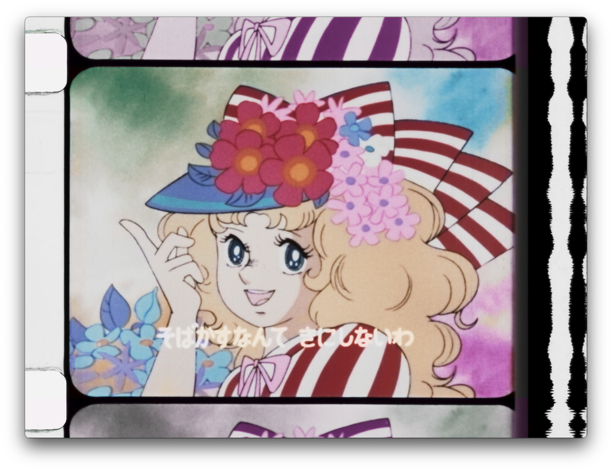
*Machine learning chroma recovery output — colors recovered from PAL DVD reference onto 16mm scan.*

| Field | Details |
|---|---|
| **Director** | Hiroshi Shidara |
| **Problem** | Severe magenta dominance from dye fading. Green and blue channels retain most information; red/cyan layers heavily degraded. Significant flicker concentrated on the red channel. |
| **Reference** | 33 frames extracted from a French PAL DVD set (MPEG-2/MKV → AV1/MP4 via Handbrake for deinterlacing, then imported into Resolve). Standard definition with compression artifacts, but intact color. DVD frame has less image area than the 16mm scan, different warping, and occasional subtitle burn-ins. |
| **Approach** | Reference-based chroma recovery. 33 degraded + 33 DVD reference pairs. Phoenix & Loki (Filmworkz) for cleaning; NukeX CopyCat for color transfer. Pre-balancing with Faded Balancer DCTL to reduce channel imbalance before training. Highlights clamped before training to prevent artifacts and improve convergence. |
| **Key decisions** | DVD reference is SD — acceptable because CopyCat only learns color mapping (Cb/Cr), not spatial detail. Cropped the 16mm source to valid reference area so CopyCat does not learn black borders. Shot-specific models outperformed a single sequence-level model when motion became too complex. |
| **Result** | Successfully replicated DVD colors onto 16mm while preserving original film resolution and grain structure. Established a reusable working method for reference alignment, frame selection, and highlight management. |

---

## Beta

**Branch:** Chroma Recovery | **Gauge:** Film print | **Reference:** Beta tape / earlier video reference

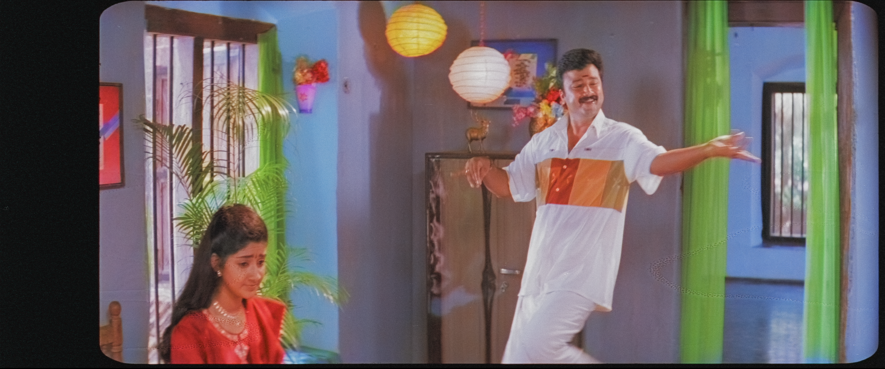
*Machine learning chroma recovery output — colors recovered from Betacam reference.*

| Field | Details |
|---|---|
| **Problem** | Faded print with yellow skew, flicker, blue dust, ghosting, and blue-channel loss. |
| **Reference** | An earlier video state of the film (beta tape) created closer to the original period. Lower quality and compressed, but preserves most color information. |
| **Approach** | Standard reference-based chroma recovery in Resolve + Nuke/CopyCat. Source balanced and lightly cleaned before training. Reference placed into a `2048x858` container from its native `720x576` to reduce alignment problems. Training target keeps source luminance and replaces chroma with beta reference in YCbCr space. |
| **Key decisions** | Started sequence by sequence, then refined shot by shot where the broader model was insufficient. Beta tape accepted as reference despite compression — same logic as Candy Candy DVD. |
| **Result** | Color recovered from the beta reference while preserving the film scan's spatial detail. Both sequence-level and shot-level methods validated. |

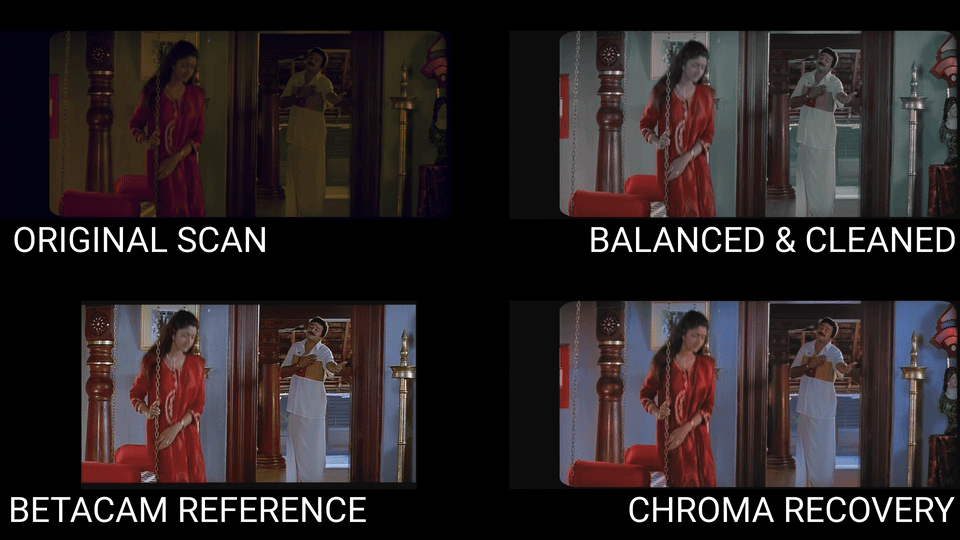
*4-way comparison: Original Scan → Balanced & Cleaned → Betacam Reference → Chroma Recovery.*

---

## PSM

**Branch:** Chroma Recovery | **Gauge:** Film (720x576 source, 2048x858 container) | **Reference:** Betacam

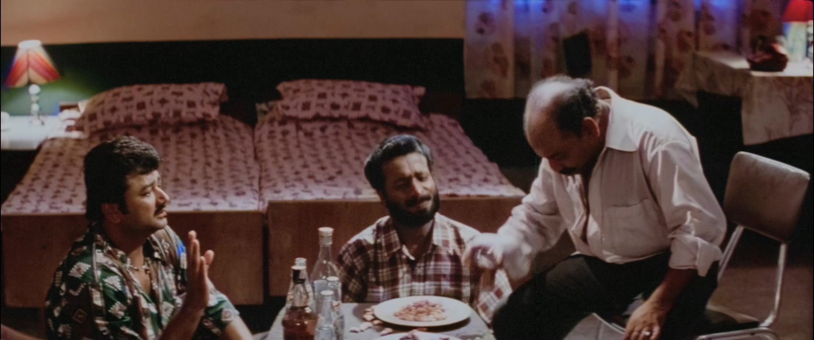
*Machine learning chroma recovery output — colors recovered from Betacam reference.*

| Field | Details |
|---|---|
| **Problem** | Faded Indian film with color degradation. Source at 720x576, placed into a 2048x858 container for alignment. |
| **Reference** | Betacam tape — earlier video state preserving color information. |
| **Approach** | Mixed chroma and luma experimentation. Multiple dedicated training runs explored color recovery, chroma plus luma, luma extension, and reference luma. Training checkpoints ranged from 40,000 to 160,000 steps. This was the earliest experimental case in the series and established the iterative training method later used for Beta. |
| **Key decisions** | Tested both chroma-only and combined chroma+luma output stages. Multiple branch structures (`COLOR_RECOVERY`, `CHROMA_LUMA`, `LUMA_EXTEND`, `REF_LUMA`) confirm this was not a single-pass experiment but an iterative exploration of different recovery strategies. |
| **Result** | Produced about 70 seconds of test material in both chroma-only and combined modes. This showed that the same CopyCat workflow could explore several recovery strategies on one source. |

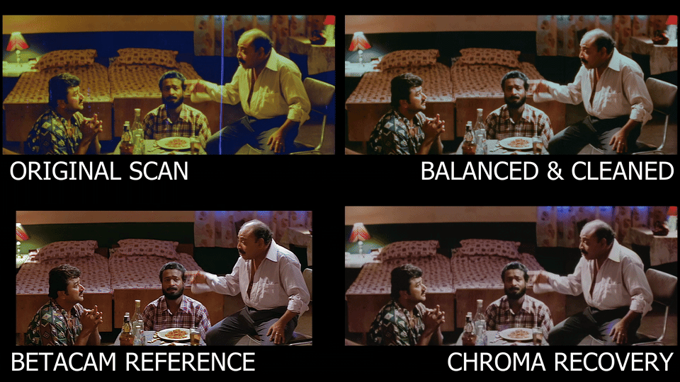
*4-way comparison: Original Scan → Balanced & Cleaned → Betacam Reference → Chroma Recovery.*

---

## Friends (2001)

**Branch:** Chroma Recovery | **Gauge:** Film/video | **Reference:** Direct color reference

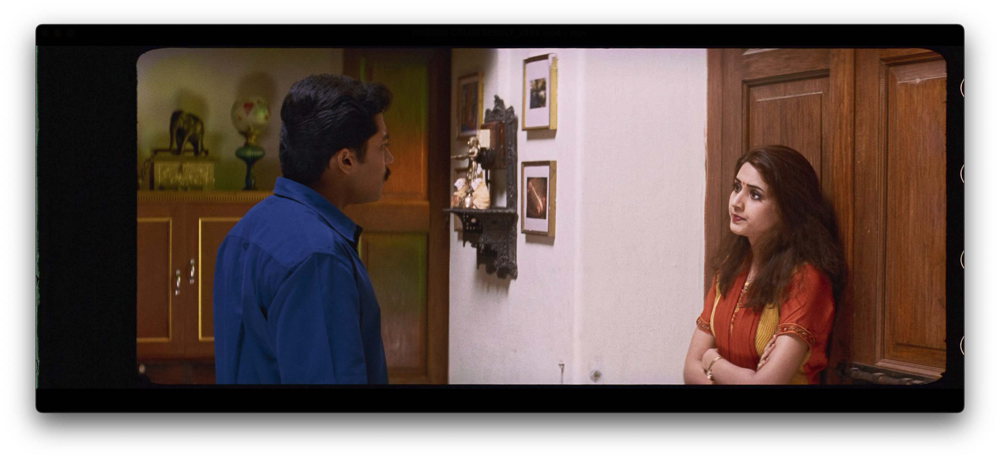
*Machine learning chroma recovery output — natural skin tones and color restored.*

| Field | Details |
|---|---|
| **Problem** | Color damage with significant cast shifts across scenes. |
| **Approach** | Standard reference-based chroma recovery workflow. Direct reference with intact color data used for supervised training pairs. Grouped with Frontier Experience as a straightforward direct-reference case. |
| **Result** | Successful color recovery with natural skin tones and consistent scene-to-scene color. |

*Before/after chroma recovery comparison.*

---

## La Muralla Verde

**Branch:** Chroma Recovery | **Reference:** DVD and DCP material

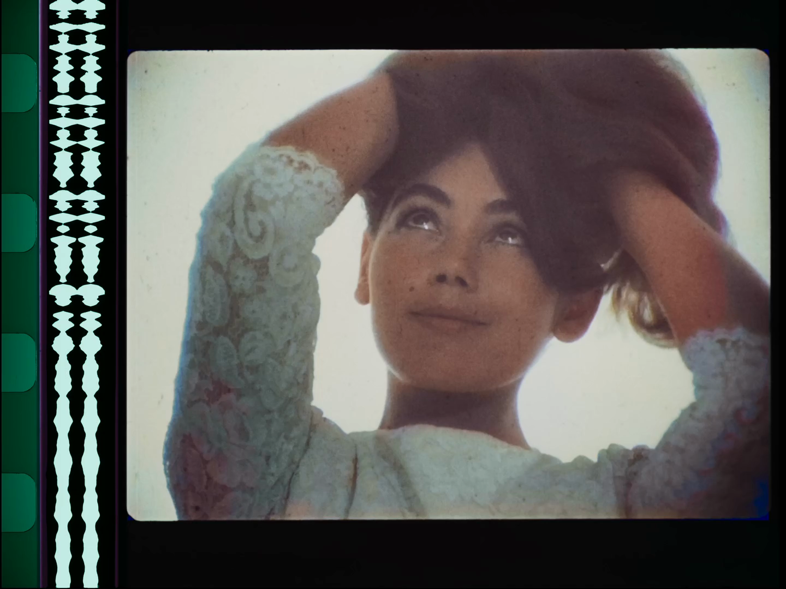
*Machine learning chroma recovery output.*

| Field | Details |
|---|---|
| **Problem** | Faded source with magenta shift requiring both traditional balancing and ML-assisted recovery. |
| **Reference** | DVD and recent DCP material used as color references. |
| **Approach** | Full workflow: raw scan → Faded Balancer DCTL for initial rebalancing → reference preparation and alignment in Resolve → CopyCat training → inference rendering. Custom balancing tools were tested before and alongside the machine-learning stage. |
| **Result** | Mature project with exported script overviews, contact sheets, comparisons, and output frames. Demonstrates the complete Resolve → Nuke → Resolve validation loop. |

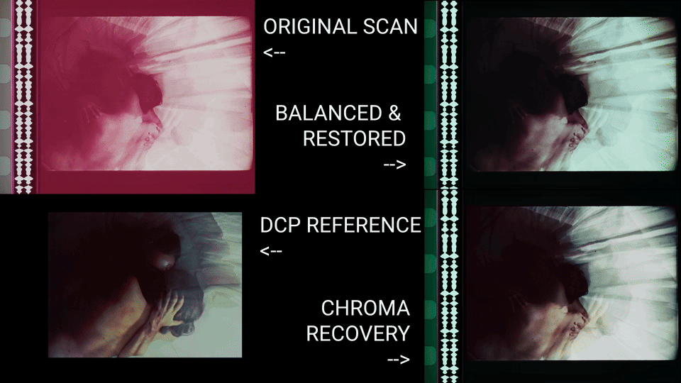
*Before/after chroma recovery comparison.*

---

## Frontier Experience (1975)

**Branch:** Chroma Recovery | **Gauge:** Film print | **Reference:** Telecine (archival secondary source)

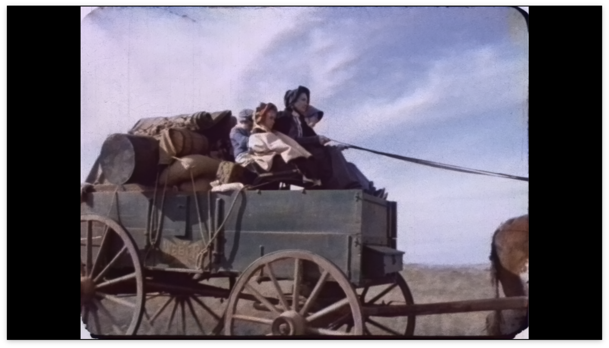
*Machine learning chroma recovery output.*

| Field | Details |
|---|---|
| **Director** | Barbara Loden |
| **Problem** | Faded surviving print with lost chroma information. |
| **Reference** | Telecine supplied by Ross Lipman. Had cadence issues but stayed aligned enough to remain usable as a chroma guide. |
| **Approach** | Standard reference-based chroma recovery. Telecine used only as a source of demonstrable color evidence, not as a spatial reference. Important because it uses a standard archival secondary source rather than artwork or a consumer DVD. |
| **Key challenge** | Difficult sky and shadow areas may need either more training frames or segmentation by scene groups (interiors vs. exteriors). |
| **Result** | Structurally convincing result. Some skies and shadows do not fully resolve, pointing to the limits of sequence-level models on varied lighting conditions. |

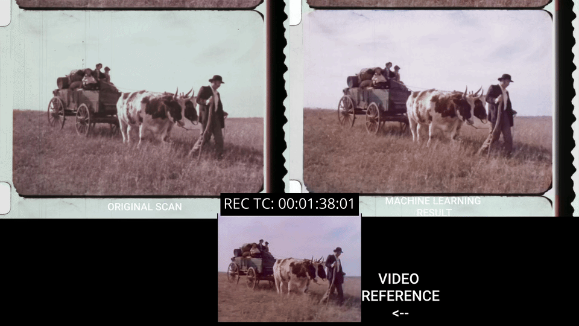
*Original Scan vs. Telecine Reference vs. Machine Learning Output.*

---

## Ben

**Branch:** Chroma Recovery (Constructed Reference) | **Reference:** Photoshop-created references

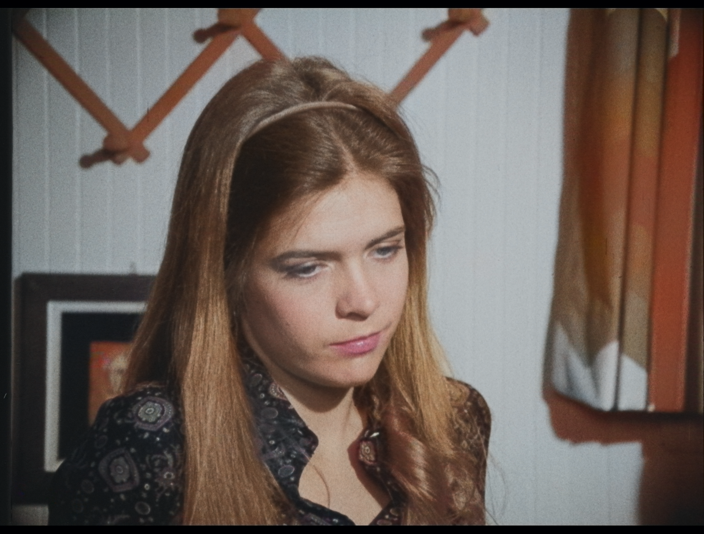
*Machine learning chroma recovery output — colors recovered from Photoshop-constructed reference.*

| Field | Details |
|---|---|
| **Problem** | Source material lacks a direct color reference (no DVD, telecine, or alternate print). |
| **Reference** | Color references manually constructed in Photoshop using Neural Filters (Colorize). Shot-specific reference frames built rather than a single global reference. |
| **Approach** | Non-reference / operator-assisted recovery. Each shot gets its own Photoshop-created reference frame. Contact sheets and comparison passes validate the result across multiple shots. Grouped with Rebelion de las Tapadas as a constructed-reference workflow. |
| **Result** | Reached comparison-ready output stage with 4-way comparisons and a finished output. Demonstrates that when no historical reference survives, operator-constructed references can still drive CopyCat training. |

*Reference construction in Adobe Photoshop using Neural Filters (Colorize).*

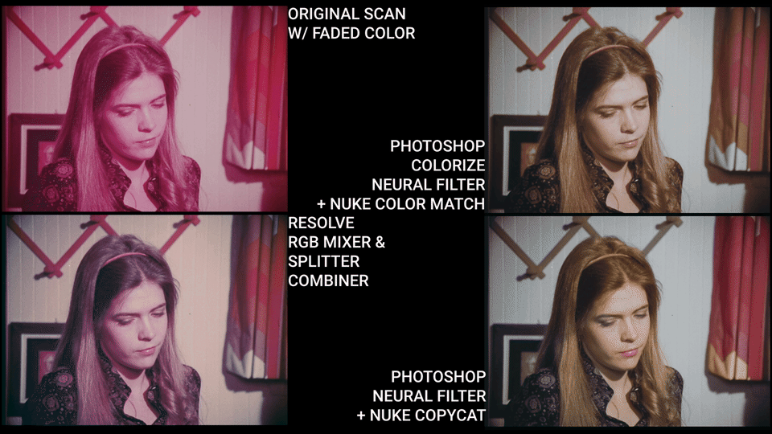
*4-way comparison.*

---

## Rebelion de las Tapadas (1943)

**Branch:** Chroma Recovery (Non-Reference) | **Gauge:** 35mm positive | **Reference:** Colonial-era watercolor paintings

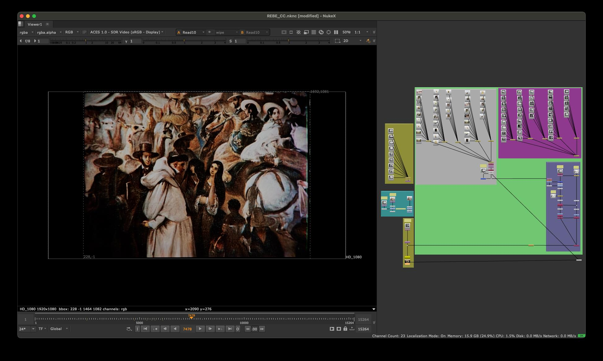
*Machine learning chroma recovery output — colors recovered from historical painting references.*

| Field | Details |
|---|---|
| **Director** | Nelson Garcia Miranda |
| **Problem** | Advanced vinegar syndrome, strong magenta shift, heavy blue-channel loss, and significant physical damage. No direct reference survives — no DVD, no telecine, no alternate print. |
| **Reference** | Colonial-era artwork associated with the visual culture of the film, including work by Johann Moritz Rugendas and Pancho Fierro. |
| **Approach** | Non-reference recovery. One-light balancing pass to reduce magenta cast. DVO Steady for stabilization. RGB flicker removal (material behaves as duotone). Manual clone/paint for heavy defects. CopyCat trained on curated historical paintings to learn plausible period color relationships and texture behavior. |
| **Key decisions** | Some source images in the film are intentionally black and white — the model had to learn what *not* to colorize. Accepted that the output is a plausible reconstruction rather than a faithful recovery. All assumptions documented. |
| **Result** | Recovered color while keeping visible film texture. Demonstrates that artwork can function as a constrained visual reference when direct color reference does not survive. |

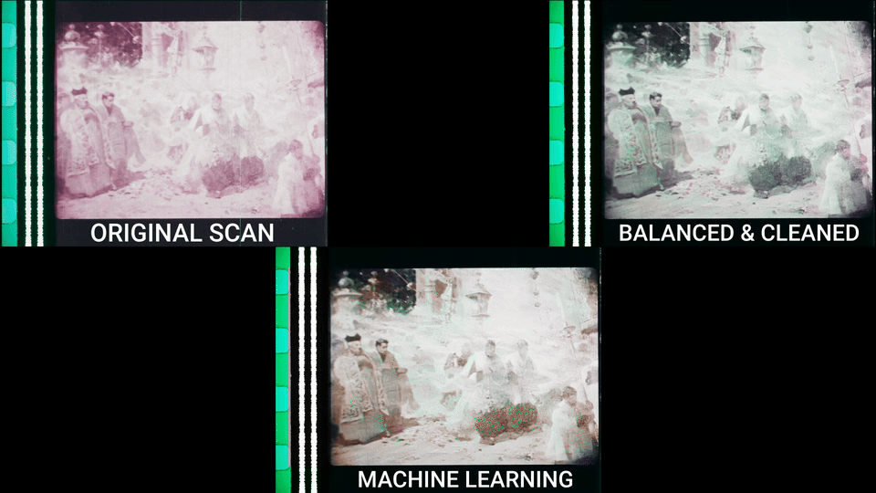
*3-way comparison: Original Scan → Balanced & Cleaned → Machine Learning (painting-referenced).*

---

## Knights of the Trail (1920s)

**Branch:** Spatial Recovery (Multi-Element Composite) | **Gauge:** Nitrate | **Reference:** Composite of nitrate elements

*Machine learning spatial recovery — reconstructing detail from multiple partial nitrate sources.*

| Field | Details |
|---|---|
| **Problem** | Two monochromatic nitrate reels survive, each with different damage and coverage. Reel B is more decayed but retains the strongest spatial detail; Reel A is cleaner and more stable but is missing frames. |
| **Reference** | A composite built from both nitrate sources, eventually incorporating a deacetate positive — a true multi-element composite. |
| **Supporting institutions** | La Cinematheque francaise, Fondazione Cineteca Italiana, George Eastman Museum. Louis B. Mayer Foundation. |
| **Approach** | Align the nitrate elements into a composite full shot. Use the composite as the training reference for CopyCat. The goal is not to invent new detail, but to reconstruct missing structure from better-surviving evidence. |
| **Result** | Demonstrates how multiple partial nitrate sources can act as evidence for spatial reconstruction. One of the strongest examples of using multiple preservation elements as training data rather than choosing only one source. |

*Animated 4-way comparison: Reel A → Reel B → ML Composite → ML Result.*

---

## El Gran Tinterillo (1975)

**Branch:** Spatial Recovery (Analog Video Reference) | **Gauge:** 16mm | **Reference:** Analog telecine

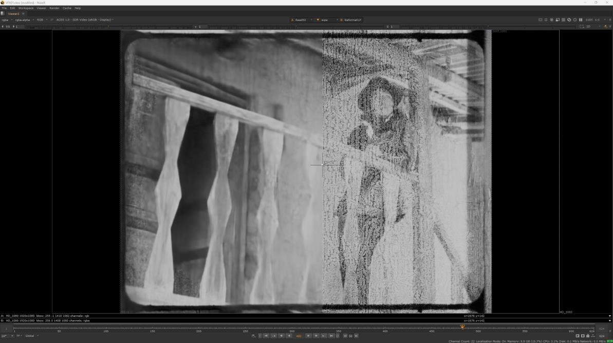
*Machine learning spatial recovery output.*

*Two-direction spatial recovery: 16mm Source + Telecine → ML Result, and Telecine Source + 16mm → ML Result.*

| Field | Details |
|---|---|
| **Problem** | 16mm film with severe damage, warping, cropping issues, and limited recoverable spatial data. The telecine preserves spatial data lost in the film print, but introduces its own artifacts: cropping, limited detail, mask movement, interlacing defects. |
| **Reference** | Analog video telecine made closer to the film's original life. |
| **Approach** | Two-step analog video reference recovery. First model trained on least-damaged sections where both sources overlap, learning the spatial relationship. Second model uses those results to restore the full film frame. Telecine treated as a guide rather than a direct replacement — direct telecine-to-film recovery is too cropped and too soft. |
| **Key decision** | Tested in both directions: telecine-to-16mm and 16mm-to-telecine. Both produced results, demonstrating the bidirectional nature of the concept. |
| **Status** | Proof of concept. Two-step approach produced more convincing full-frame results than direct transfer. Damage and haze reduced while keeping the full 16mm frame instead of collapsing to telecine bounds. Typical spatial recovery artifacts remain. |

*Animated comparison showing spatial recovery results across multiple frames.*

---

## Recovery Taxonomy

These case studies illustrate four distinct recovery strategies, all using the same CopyCat pipeline:

| Strategy | Reference type | Examples | Branch |
|---|---|---|---|
| **Direct reference** | DVD, telecine, beta tape, alternate print | Candy Candy, PSM, Beta, Friends, Frontier Experience, La Muralla Verde | Chroma |
| **Non-reference / constructed** | Paintings, Photoshop colorization, historical sources | Rebelion de las Tapadas, Ben | Chroma |
| **Gauge / generation** | Higher-gauge print, earlier-generation element | Documented in workflow guidance rather than a public case study | Spatial |
| **Multi-element / analog video** | Composite of partial elements, telecine guide | Knights of the Trail, El Tinterillo | Spatial |

The workflow documented in this repository handles all four — the only difference is how you construct the training target in Stage 3.

---

*See also: [Shared Workflow](start-here.md) | [Chroma Recovery](chroma-recovery.md) | [Spatial Recovery](spatial-recovery.md)*
