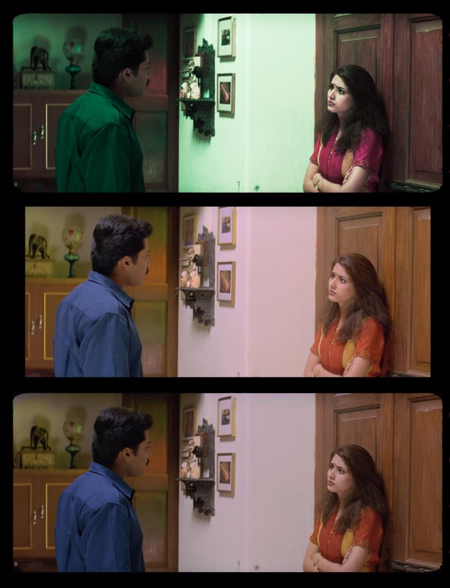
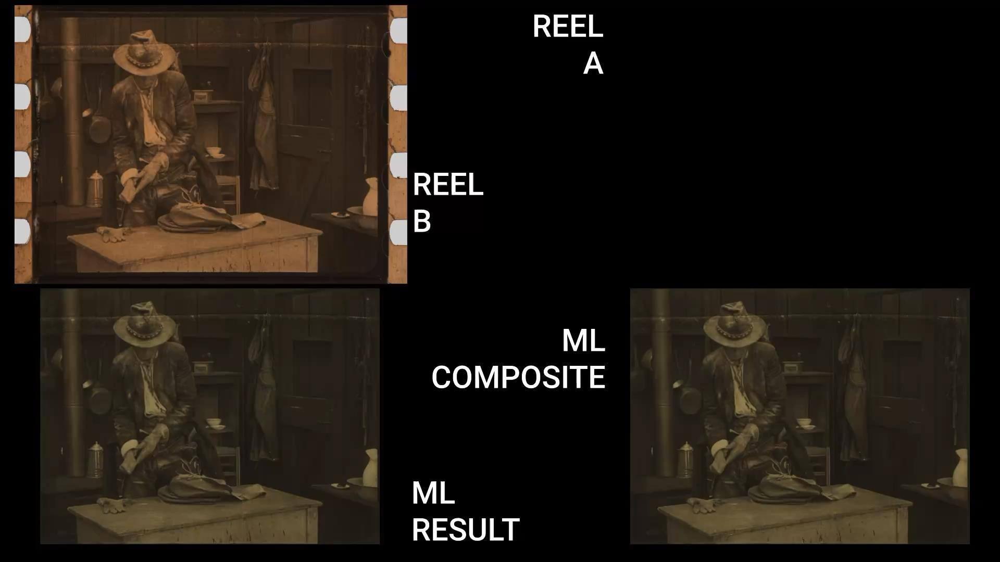

# Case Studies

Real-world applications of custom machine learning-based film restoration, demonstrating both **color recovery** and **spatial recovery** workflows using supervised learning with CNNs in Nuke's CopyCat. Each case study includes project details, specific ML techniques used, challenges encountered, and results.

## Color Recovery Projects

### Reference-Based Recovery
Using DVDs, telecines, or other verifiable color-accurate sources:

### [Candy Candy Opening - 16mm](case-studies/candy-candy-opening.md)
Reference-based color recovery using PAL DVD source. Demonstrates chromogenic film dye fading correction while preserving 16mm grain structure.

### [Friends](case-studies/friends-chroma-recovery.md)
Reference-based color recovery using telecine source for film project restoration.

### [Frontier Experience](case-studies/frontier-experience-chroma-recovery.md)
Reference-based color recovery using video transfer reference.

### [Muralla Verde](case-studies/muralla-verde-chroma-recovery.md)
Trailer project demonstrating reference-based color restoration.

### Non-Reference Recovery
Inferring color from paintings, photographs, or manually created references:

### [Rebelión de Tapadas](case-studies/rebelion-de-tapadas-chroma-recovery.md)
Non-reference color recovery using colonial-era paintings by Pancho Fierro and Johann Moritz Rugendas. Historical archival material requiring period-accurate color reconstruction.

### [Ben](case-studies/ben-chroma-recovery.md)
Non-reference color recovery using manually created references in Photoshop.

---

## Spatial Recovery Projects

Spatial recovery using different source scenarios:

### [Mission Kill](case-studies/missionkill-combined-recovery.md)
**Sources:** 35mm internegative + 16mm positive print
**Scenario:** Gauge difference (16mm vs 35mm) + generational difference (print vs internegative)
Demonstrates spatial recovery addressing multiple source differences simultaneously, combined with color recovery.

### [El Tinterillo](case-studies/tinterillo-spatial-recovery.md)
**Sources:** Early telecine preservation element + damaged 16mm film scan
**Scenario:** Telecine made closer to original (less damage) but with cropping/quality limitations
Two-step approach: trains on less-damaged telecine sections, then applies to full 16mm scan including damaged areas.

### [Knights of the Trail](case-studies/knights-trail-spatial-recovery.md)
**Sources:** Multiple nitrate print sources with varying quality
**Scenario:** Different prints with different damage patterns and spatial qualities
Demonstrates using better-preserved sections from multiple sources to improve degraded sections.

---

## Contributing Case Studies

Each case study _should_ include:
- Source material details (format, condition, challenges)
- Workflow version and any variations from the standard template
- Demo video (YouTube unlisted or similar)
- Results and lessons learned
- Technical notes specific to that project
- Complete process documentation showing all workflow stages

---

[← Back to Main README](../README.md)
