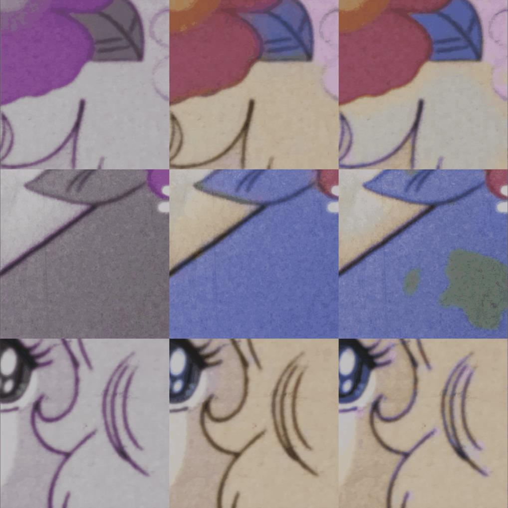
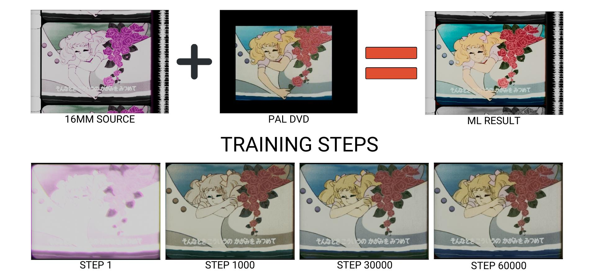
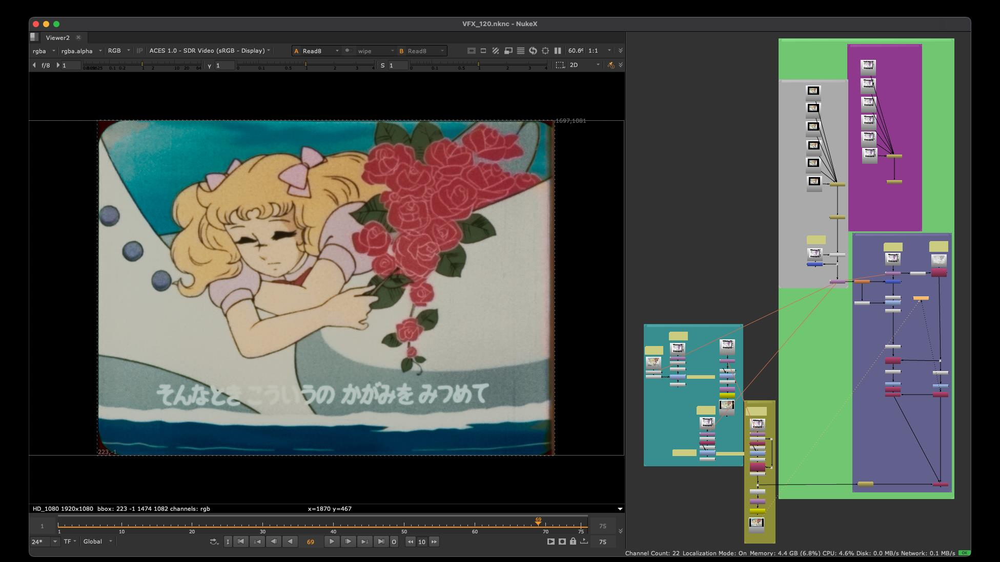
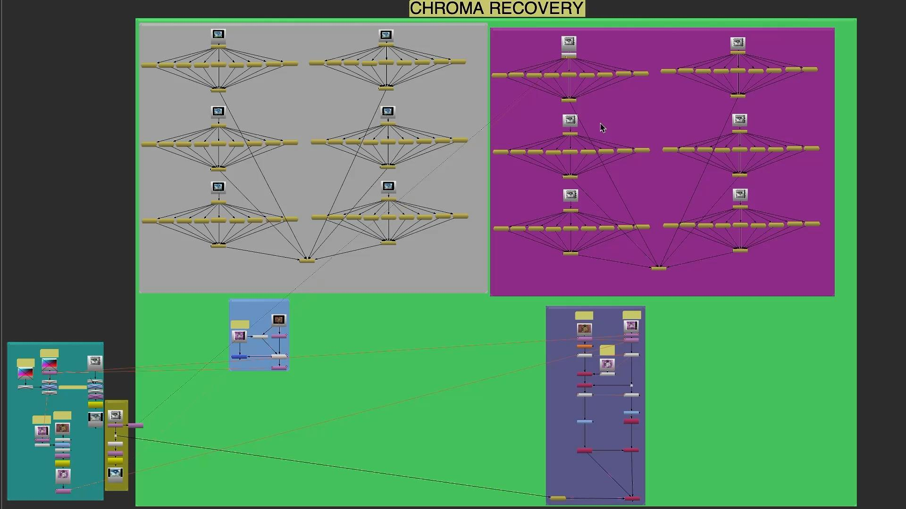

# Candy Candy Opening - 16mm Color Recovery

Classification: Color Recovery (Reference-Based) • Technique: DVD/Telecine Reference

Quick Links: [Chroma Recovery](../chroma-recovery.md) • [All Case Studies](../case-studies.md)

## Overview
Chroma recovery for the opening sequence of Candy Candy, scanned from 16mm film. This demonstration uses a previous version of the workflow and shows effective color reconstruction results while preserving the distinctive characteristics of 16mm source material.

## Demo Video

## Project Details

**Source Material:** 16mm film
**Challenge:** Faded/degraded chroma information
**Workflow Version:** Previous iteration (pre-template standardization)
**Results:** Color recovery with preserved grain characteristics

**Workflow Approach:** Initial sequence level training was attempted but did not work with the opening's fast paced vignettes with rapid scene changes. Changed to shot by shot processing. Opening sequences with multiple distinct visual styles require individual shot treatment.

---

## Complete Process Documentation

### 1. Initial State (Source Material)
The original 16mm scan showing faded/degraded chroma information:

*Note: Add source/faded state image here*

### 2. Training Dataset Selection
Representative frames selected for the training dataset:

### 3. ML Training Process
`CopyCat` training showing iterative improvement:

Training graph showing loss convergence:

### 4. Chroma Recovery Process
The ML-driven color reconstruction workflow for individual shots:

Sequence-level chroma recovery workflow:

### 5. Side by Side Comparison
Four-way comparison showing the recovery process:

### 6. Training Collection Overview
Contact sheet collection showing multiple training sessions:

---

## Technical Notes

This case study demonstrates several key aspects of the `CopyCat` based chroma recovery approach:

1. **16mm Grain Preservation**: The workflow successfully maintains the characteristic grain structure of 16mm film while reconstructing missing chroma information.

2. **Training Dataset Curation**: Careful selection of representative frames ensures the model learns the full range of color and lighting conditions present in the sequence.

3. **Iterative Refinement**: The training steps visualization shows how the model progressively improves its chroma reconstruction accuracy through multiple iterations.

4. **Earlier Workflow Iteration**: While this project used a previous version of the workflow (before the current template standardization), the core principles and effective results demonstrate the robustness of the `CopyCat` approach.

---

## Lessons Learned

- **Dataset diversity is critical**: Including frames with varied lighting conditions and color palettes improves model generalization
- **16mm requires special attention**: The unique characteristics of 16mm film (grain, resolution, color response) must be respected during training and inference
- **Previous workflow versions remain valid**: While the current template offers improved organization and reproducibility, earlier iterations of the workflow produced high-quality results

---

[← Back to all case studies](../case-studies.md) | [Main README](../../README.md)
