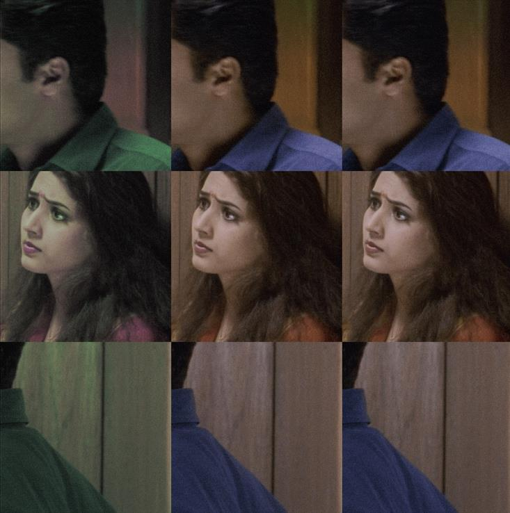
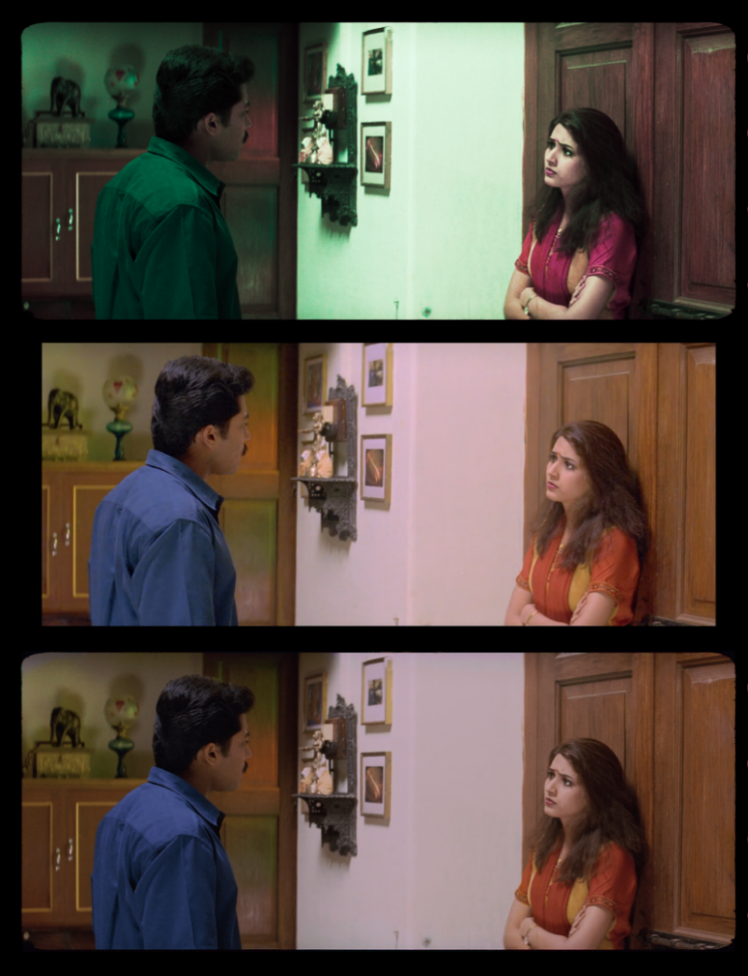

# Friends - Chroma Recovery

Classification: Color Recovery (Reference-Based) • Technique: Telecine Reference

Quick Links: [Chroma Recovery](../chroma-recovery.md) • [All Case Studies](../case-studies.md)

## Overview
Chroma recovery for the Friends film project, demonstrating effective color reconstruction using the `CopyCat` workflow.

## Demo Video

## Project Details

**Source Material:** Film project
**Challenge:** Faded/degraded chroma information
**Workflow Version:** `CopyCat` based chroma recovery
**Results:** Successful color reconstruction with preserved detail

**Workflow Approach:** Sequence level training worked successfully. All shots are correlative with consistent lighting and visual style, allowing effective sequence wide model training. Demonstrates when sequence level processing is appropriate.

---

## Complete Process Documentation

### 1. Initial State (Source Material)
The original scan showing faded chroma information:

*Note: Add source/faded state image here*

### 2. Training Dataset Selection
Representative frames selected for the training dataset:

### 3. ML Training Process
`CopyCat` training showing iterative improvement:

*Note: Add training steps image here*

### 4. Chroma Recovery Process
The ML-driven color reconstruction workflow:

*Note: Add chroma recovery process image here*

### 5. Side by Side Comparison
Four-way comparison showing the recovery process:

---

## Technical Notes

This case study demonstrates the application of `CopyCat` based chroma recovery to the Friends project, showing successful reconstruction of missing chroma information while preserving the original image characteristics.

---

## Lessons Learned

*Note: Add lessons learned specific to Friends project*

---

[← Back to all case studies](../case-studies.md) | [Main README](../../README.md)
