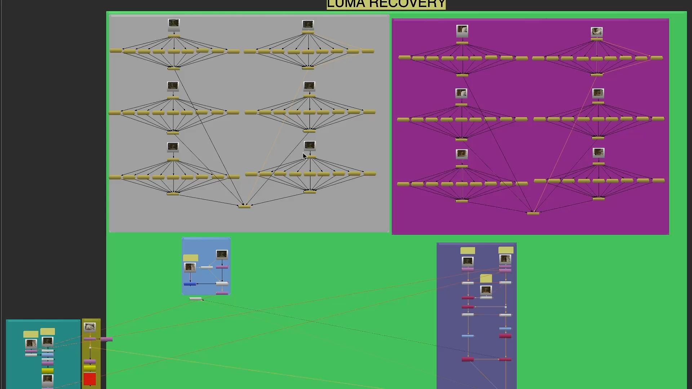
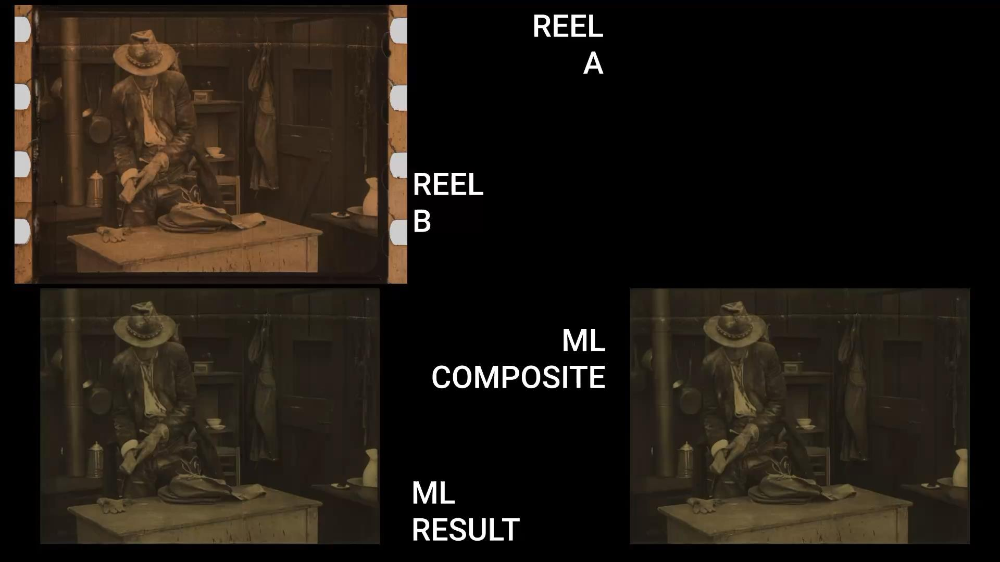

# Knights of the Trail - Spatial Recovery

Classification: Spatial Recovery (Generation Recovery)

Quick Links: [Spatial Recovery](../spatial-recovery.md) • [All Case Studies](../case-studies.md)

## Overview
Spatial recovery for the Knights of the Trail project, enhancing image quality using multiple sources with different spatial characteristics.

## Demo Videos

### Spatial Recovery Process

### Knights Comparison

### Extended Recovery Analysis

## Project Details
**Source Material:** Film project with multiple source elements
**Challenge:** Inconsistent spatial quality across different sources
**Workflow Version:** `CopyCat` based spatial information transfer

---

## Complete Process Documentation

### 1. Initial State (Source Material)
The original scan showing inconsistent spatial quality:
*Note: Add source/faded state image here*

### 2. Multiple Source Identification
Different source elements with varying spatial characteristics:
*Note: Add source elements comparison image here*

### 3. Overlap Detection and Training Dataset Selection
Overlapping frames between sources selected for spatial transfer:
*Note: Add overlap detection image here*

### 4. ML Training Process
`CopyCat` training showing spatial characteristic transfer:
*Note: Add training steps image here*

### 5. Spatial Recovery Process
The ML-driven spatial information transfer workflow:

### 6. Side by Side Comparison
Four-way comparison showing the recovery process:

---

## Technical Notes
This case study demonstrates spatial information recovery using multiple sources with different spatial characteristics. The process involves identifying overlapping content between sources and training a model to transfer desirable spatial qualities (resolution, grain structure, detail) from higher-quality sources to lower-quality elements.

---

## Lessons Learned
- **Multiple source utilization**: Different film elements can provide complementary spatial information
- **Overlap detection is critical**: Accurate identification of matching frames is essential for training
- **Spatial characteristic transfer**: Successfully transferred resolution and detail between sources
- **Quality homogenization**: Achieved consistent spatial quality across the entire sequence
- **Preservation of authenticity**: Maintained the original film characteristics while improving quality

---

[← Back to all case studies](../case-studies.md) | [Main README](../../README.md)
