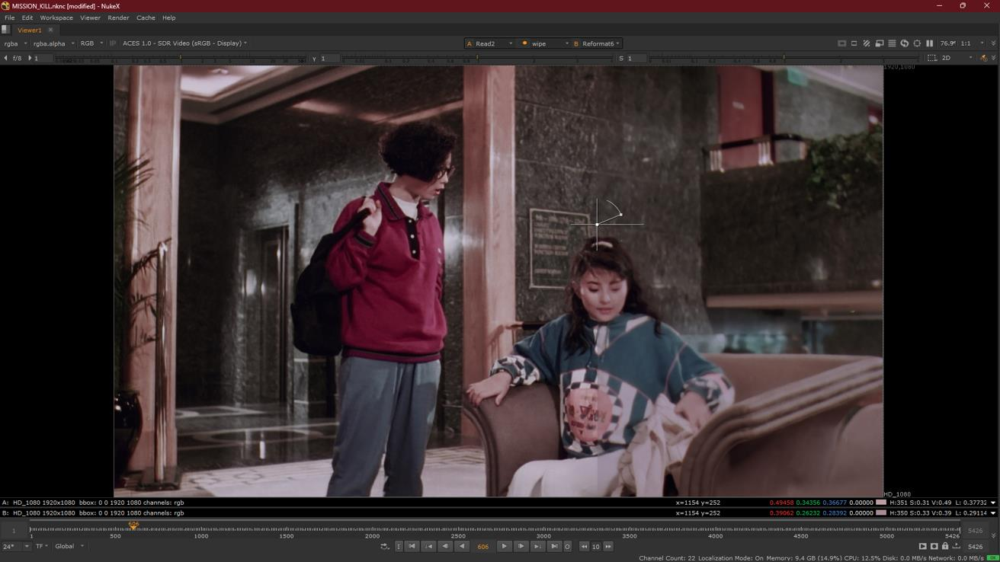

# Mission Kill - Combined Spatial & Chroma Recovery

Classification: Combined Recovery (Spatial + Color) • Spatial Techniques: Gauge Recovery + Generation Recovery • Color: Reference-Based

Quick Links: [Spatial Recovery](../spatial-recovery.md) • [Chroma Recovery](../chroma-recovery.md) • [All Case Studies](../case-studies.md)

## Overview
Comprehensive recovery for the Mission Kill project, demonstrating both spatial and chroma reconstruction using generation based approaches. This case study shows the complete restoration workflow from severely degraded source material to fully recovered output, utilizing multiple sources for spatial enhancement and color reconstruction.

## Demo Videos

### Complete Recovery Process

### MatchGrade Comparison

## Project Details
**Source Material:** Film project with multiple degraded elements (35mm internegative and 16mm positive print)
**Challenge:** Severe degradation requiring both spatial and chroma recovery approaches
**Workflow Version:** `CopyCat` based combined recovery workflow
**Results:** Successful spatial and chroma reconstruction with comprehensive recovery process

**Workflow Approach:** Sequence level training worked successfully. Correlative shots with consistent visual characteristics throughout the sequence allowed effective sequence wide processing. Example of when sequence level approach is appropriate for complex recovery.

---

## Complete Process Documentation

### 1. Initial State (Source Material)
The original scan showing severely degraded spatial and chroma information:
*Note: Add source/faded state image here*

### 2. Multiple Source Analysis
Analysis of different source elements with varying degradation:
*Note: Add source elements comparison image here*

### 3. Training Dataset Selection
Overlapping frames selected from multiple sources for combined recovery:
*Note: Add contact sheet image here*

### 4. ML Training Process
`CopyCat` training showing iterative improvement for both spatial and chroma recovery:
*Note: Add training steps image here*

### 5. Combined Recovery Workflow
The ML-driven spatial and chroma recovery workflow:

### 6. Spatial Recovery Results
Before and after spatial recovery:

### 7. Side by Side Comparison
Three-way comparison showing the combined recovery process:

Additional comparison views:

---

## Technical Notes
This case study demonstrates combined spatial and chroma recovery for severely degraded material using generation based approaches. The project shows how ML techniques can reconstruct missing spatial and chroma information even when degradation is extensive, using multiple sources to achieve comprehensive restoration.

---

## Lessons Learned
- **Severe degradation requires generation approaches**: When spatial and chroma loss is extensive, generation based ML techniques can reconstruct missing information
- **Multiple source utilization**: Different film elements provide complementary information for both spatial and chroma recovery
- **Combined recovery strategies**: The project shows successful integration of spatial and chroma recovery workflows
- **Quality validation**: Multiple comparison methods ensure accuracy of the recovery process
- **Complex workflow management**: Demonstrates how to handle multiple recovery approaches in a single project

---

[← Back to all case studies](../case-studies.md) | [Main README](../../README.md)
