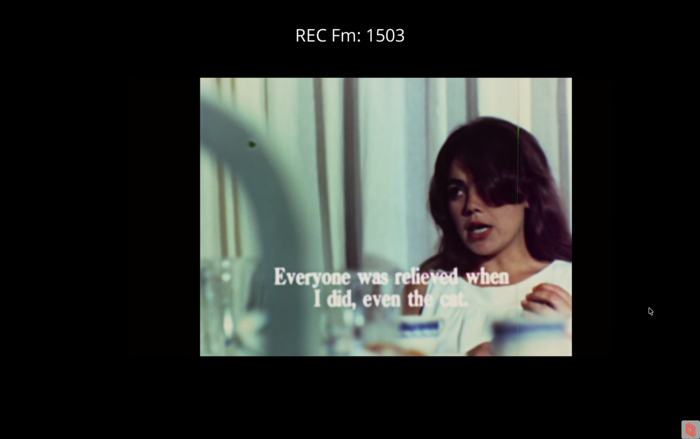
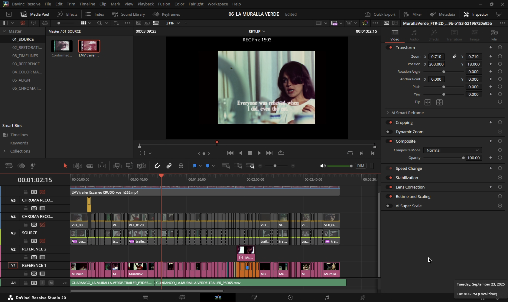
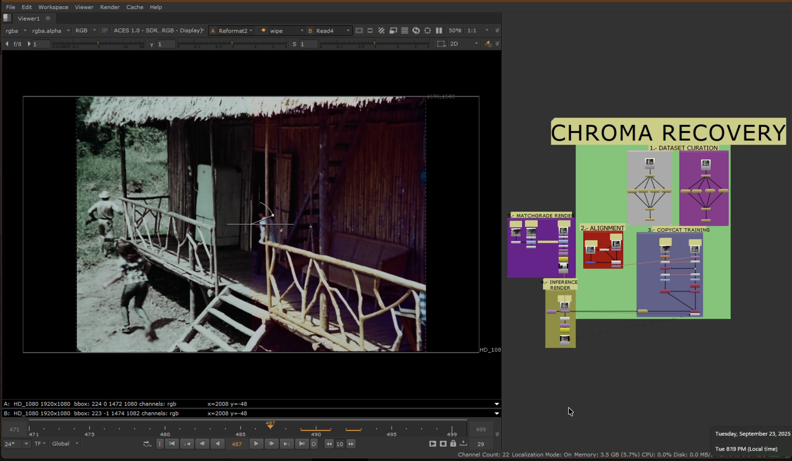
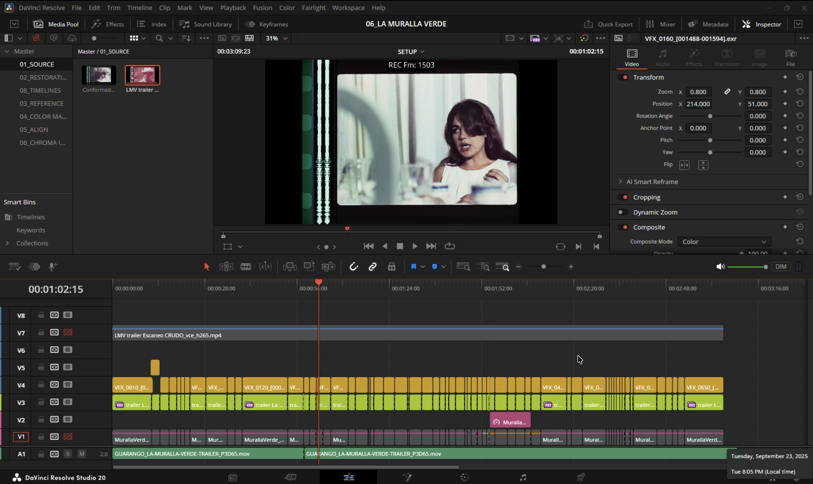

# Muralla Verde - Chroma Recovery

Classification: Color Recovery (Reference-Based) • Technique: DCP/Graded Reference

Quick Links: [Chroma Recovery](../chroma-recovery.md) • [All Case Studies](../case-studies.md)

## Overview
Chroma recovery for the Muralla Verde trailer project.

## Demo Video

## Project Details
**Source Material:** Trailer project
**Challenge:** Faded chroma in trailer material
**Workflow Version:** CopyCat based chroma recovery

**Workflow Approach:** Initial sequence level training failed because trailer contains multiple distinct scenes spliced together. Required shot by shot processing. Trailers with rapid scene cuts and varying visual styles need individual shot treatment for consistent results.

---

## Complete Process Documentation

### 1. Initial State (Source Material)
The original scan showing degraded color information:

### 2. Balanced Source Material
The color-balanced source before chroma recovery:

### 3. Color Reference Material
Reference material for supervised learning:

### 4. Reference Pre-Alignment in Resolve
Initial alignment of reference material in DaVinci Resolve:

### 5. Chroma Recovery Process
The complete ML-driven color reconstruction workflow:

### 6. Final Result
Recovered chroma applied to the full sequence:

### 7. Color Composite Timeline in Resolve
Final color composite assembled in DaVinci Resolve:

---

## Technical Notes

This case study demonstrates comprehensive chroma recovery for the Muralla Verde trailer, showing the complete workflow from raw scan through final composite. The process utilized supervised learning with reference material to reconstruct degraded color information while preserving the original spatial characteristics.

---

[← Back to all case studies](../case-studies.md) | [Main README](../../README.md)
