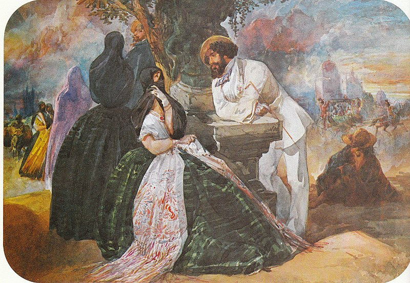
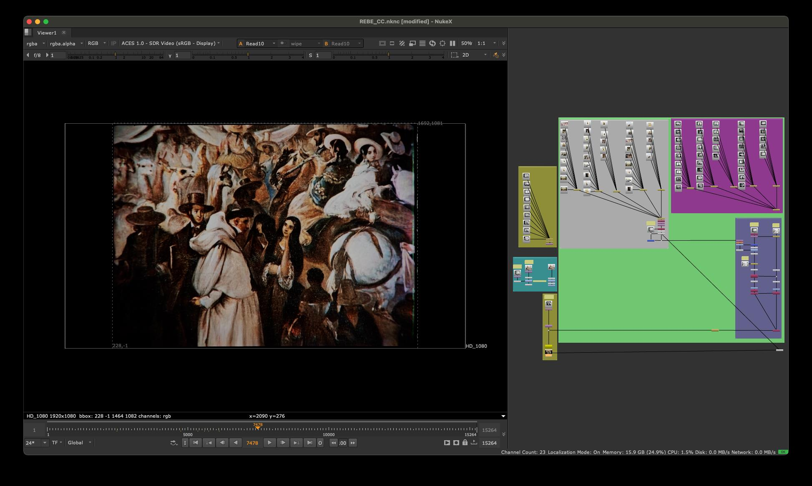
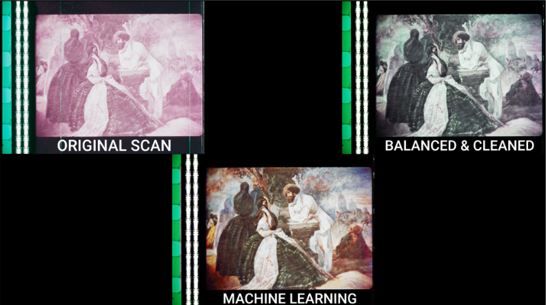
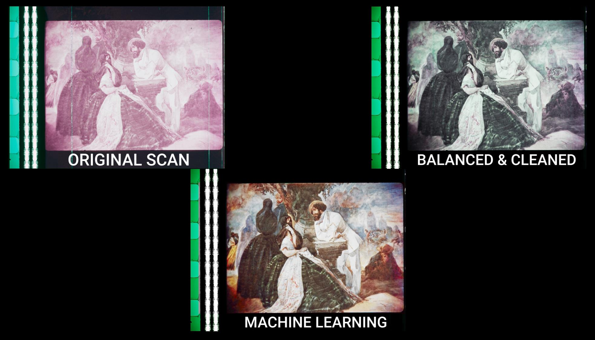

# Rebelión de Tapadas - Chroma Recovery

Classification: Color Recovery (Non-Reference) • Technique: Historical Artwork Reference

Quick Links: [Chroma Recovery](../chroma-recovery.md) • [All Case Studies](../case-studies.md)

## Overview
Chroma recovery for the Rebelión de Tapadas film project, demonstrating effective color reconstruction using the `CopyCat` workflow on historical film material.

## Demo Videos

### Roger Rebelión Process

### Final Recovery Results

### Additional Recovery Process

## Project Details

**Source Material:** Historical film project
**Challenge:** Faded/degraded chroma information in archival material
**Workflow Version:** `CopyCat` based chroma recovery
**Results:** Successful color reconstruction while preserving historical characteristics

---

## Complete Process Documentation

### 1. Initial State (Source Material)
The original archival scan showing faded chroma information:

*Note: Add source/faded state image here*

### 2. Training Dataset Selection
Representative frames selected for the training dataset:

*Note: Add contact sheet image here*

### 3. ML Training Process
`CopyCat` training showing iterative improvement:

*Note: Add training steps image here*

### 4. Reference Material
Artwork used as color reference from colonial-era painters (Pancho Fierro, Johann Moritz Rugendas):

### 5. Chroma Recovery Process
The ML-driven color reconstruction workflow:

### 6. Side by Side Comparison
Three-way comparison showing the recovery process:

Additional comparison views:

---

## Technical Notes

This case study demonstrates the application of `CopyCat` based chroma recovery to historical archival material, showing successful reconstruction of missing chroma information while preserving the authentic characteristics of the original film.

---

## Lessons Learned

- **Archival materials require careful handling**: The workflow successfully preserved the unique characteristics of historical film while reconstructing chroma
- **Historical authenticity**: The ML approach maintained the original look and feel of the archival footage
- **Challenges with aged film**: Special considerations for degraded and aged source materials

---

[← Back to all case studies](../case-studies.md) | [Main README](../../README.md)
