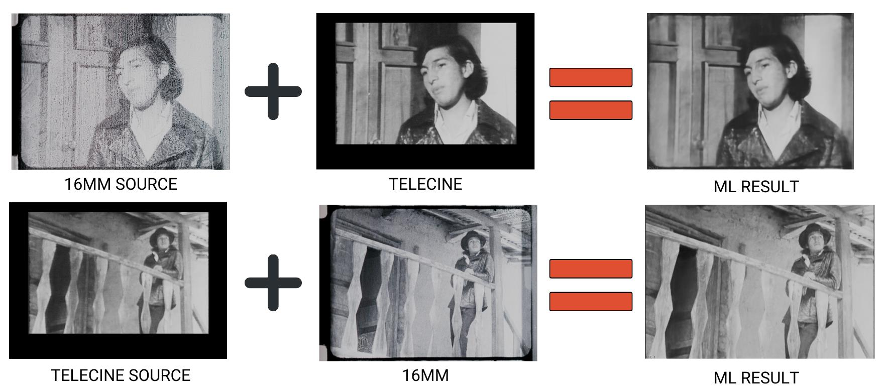
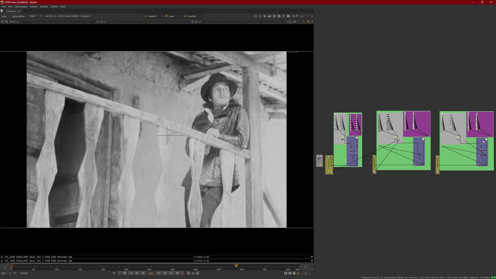
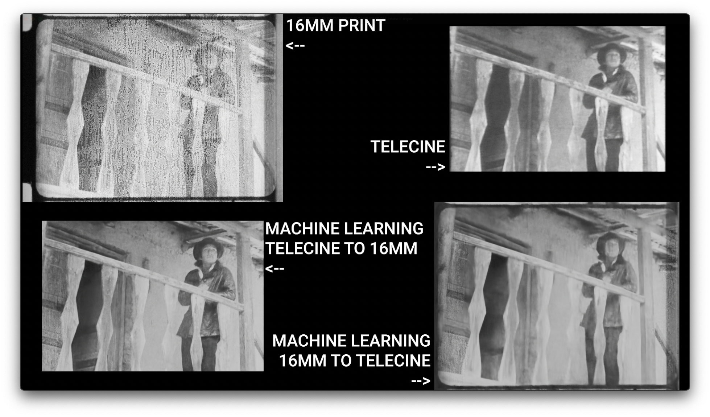
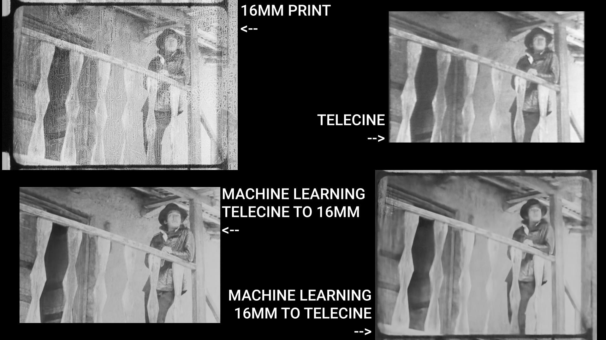
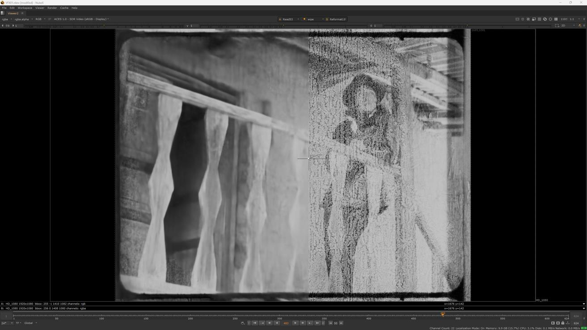
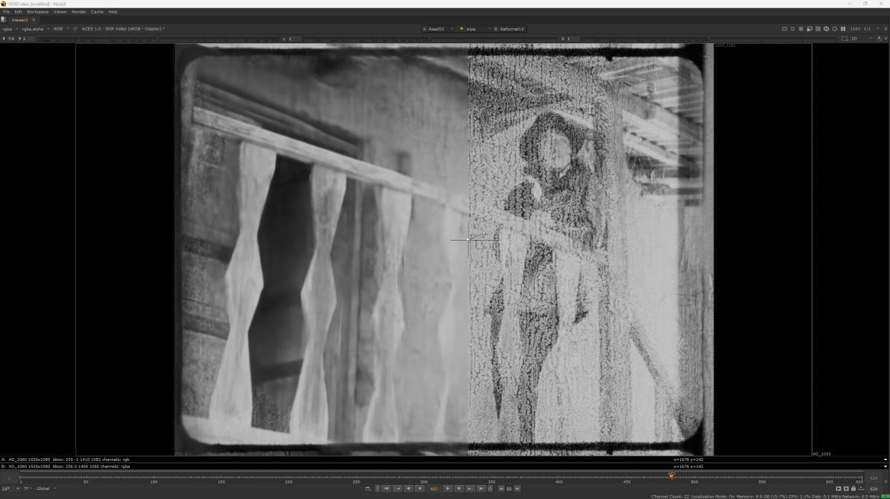

# El Tinterillo - Spatial Recovery

Classification: Spatial Recovery (Analog Video Reference Recovery)

Quick Links: [Spatial Recovery](../spatial-recovery.md) • [All Case Studies](../case-studies.md)

## Overview
Spatial recovery for the El Tinterillo project, demonstrating comprehensive spatial information reconstruction with detailed workflow documentation. This case study showcases the complete process of transferring spatial characteristics between multiple sources.

## Demo Video

## Project Details
**Source Material:** Film project with multiple source elements
**Challenge:** Inconsistent spatial quality across different film elements
**Workflow Version:** `CopyCat` based spatial information transfer
**Results:** Successful spatial reconstruction with comprehensive process documentation

---

## Complete Process Documentation

### 1. Initial State (Source Material)
The original scan showing inconsistent spatial quality:
*Note: Add source/faded state image here*

### 2. Multiple Source Identification
Different source elements with varying spatial characteristics:
*Note: Add source elements comparison image here*

### 3. Overlap Detection and Training Dataset Selection
Overlapping frames between sources selected for spatial transfer:
*Note: Add overlap detection image here*

### 4. Training Dataset Selection
Contact sheet showing representative frames:

### 5. ML Training Process
`CopyCat` training graph showing spatial characteristic transfer:

Training diagram showing the workflow:

### 6. Spatial Recovery Process
The ML-driven spatial information transfer workflow:

### 7. Side by Side Comparison
Four-way comparison showing the recovery process:

Additional comparison views:

### 8. Spatial Recovery Results
Before and after spatial recovery:

---

## Technical Notes
This case study demonstrates comprehensive spatial information recovery with detailed workflow visualization, showing the step by step process of spatial characteristic transfer between multiple sources using `CopyCat` based approaches.

---

## Lessons Learned
- **Multiple source utilization**: Different film elements can provide complementary spatial information
- **Overlap detection is critical**: Accurate identification of matching frames is essential for training
- **Spatial characteristic transfer**: Successfully transferred resolution and detail between sources
- **Workflow documentation is critical**: Detailed process visualization helps in understanding and reproducing results
- **Multiple recovery stages**: The project shows multiple stages of spatial recovery and refinement
- **Quality homogenization**: Achieved consistent spatial quality across different source elements

---

[← Back to all case studies](../case-studies.md) | [Main README](../../README.md)
