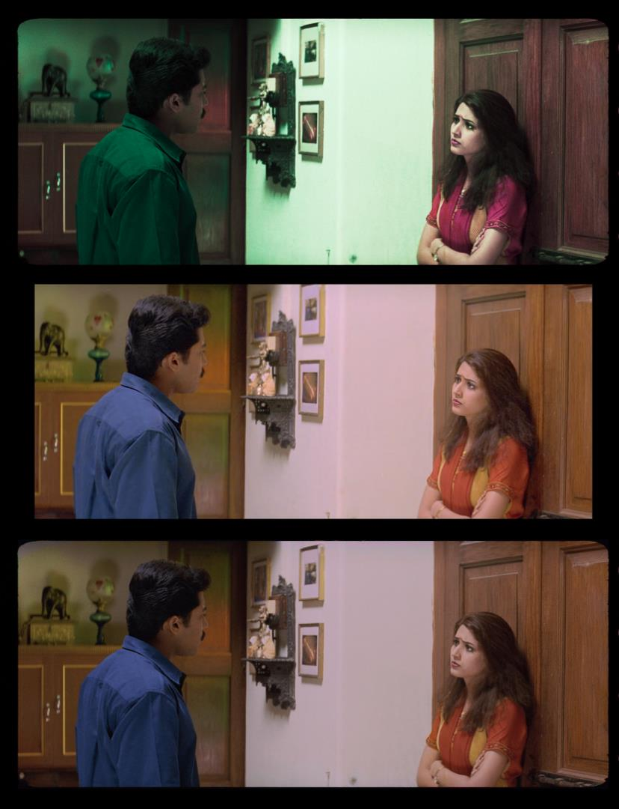

# Color Recovery Workflow

Figure 1 — Chroma recovery overview (Friends comparison).

This guide shows how to use Nuke's `CopyCat` to train a small CNN that restores missing or faded color in chromogenic film affected by dye loss. The model learns from paired frames to rebuild chroma (Cb/Cr) while preserving luma and spatial detail—going beyond traditional grading, which can only adjust existing color.

## When to Use Color Recovery

**Ideal for films with inter-frame damage:**
- Chromogenic film stocks with dye fading (Eastman Color, Fuji, Agfa magenta shifts)
- Color negatives with degraded color layers over time
- Historical material requiring color reconstruction
- Films with inconsistent color across scenes due to degradation

**Addresses limitations of traditional methods:**
- Traditional color grading tools are time-consuming and subjective
- Can only manipulate existing color channels, cannot "learn" color from external references
- ML models overcome this by training on supervised pairs, learning color information impossible for traditional filters

## Two Approaches to Color Recovery

Color recovery encompasses two approaches depending on reference availability:

Note: These approaches are complementary and can be mixed per shot or scene. Availability of direct references guides the choice; direct references yield the highest fidelity when present, while constructed references are informed estimates.

### 1. Reference-Based Recovery
Uses reference materials with accurate color information

**Approach overview:**
- Select best available color-accurate frames (DVD/telecine/prints)
- Align to the faded source and use as ground truth for supervised training
- Combine with constructed references where gaps remain

**Examples:**
- [Candy Candy Opening - 16mm](case-studies/candy-candy-opening.md) - DVD reference-based recovery
- [Friends](case-studies/friends-chroma-recovery.md) - Telecine reference
- [Frontier Experience](case-studies/frontier-experience-chroma-recovery.md) - Video transfer reference

### 2. Non-Reference Recovery
Constructs color references from external sources when direct references are unavailable

**Approach overview:**
- Research period-accurate palettes (paintings, archival photographs, documentation)
- Synthesize plausible reference frames and align to the source
- Train and iterate; document assumptions and sources

**Examples:**
- [Rebelión de Tapadas](case-studies/rebelion-de-tapadas-chroma-recovery.md) - Colonial-era paintings (Pancho Fierro, Johann Moritz Rugendas)
- [Ben](case-studies/ben-chroma-recovery.md) - Manual reference creation

---

## Workflow Overview

Color recovery uses supervised learning with CNNs, training on frame pairs from different containers of the same film (faded source and color reference or constructed reference). Use the container with superior color as ground truth and normalize non target channels so only color differs.

---

### 0. Resolve Export + Nuke Setup
Export in Resolve (Rec.709 ODT), then set up Nuke (OCIO/ACES + Reads).

### 1. Dataset Curation
Select representative paired frames (source + reference or constructed).

### 2. Alignment
Pixel-perfectly align reference to source and remove overscan.

### 3. `CopyCat` Training (CNN)
Train on paired frames (reference as ground truth) to reconstruct chroma while preserving spatial detail. Use CopyCat's preview input with a frame not included in the training dataset to monitor generalization in real-time during training.

### 4. Inference & Render
Apply the trained model to the shot/scene/sequence and render archival-quality outputs.

### 5. Validation
Compare against a baseline (e.g., MatchGrade) and verify color accuracy and grain preservation.

---

## Detailed Workflow Steps

### Stage 0: Resolve Export + Nuke Project Setup

**Objective:** Prepare matching sequences that constrain the task to chroma reconstruction.

**Rationale:**
- Training pairs _should_ differ only in chroma; misalignment or inconsistent transforms introduce nuisance variables that slow or mislead learning.
- Exporting 0–1 bounded image data stabilizes `CopyCat` training and avoids range clipping.

**Inputs:**
- Source scan (faded chroma)
- Reference or constructed reference (best available color)

**Outputs:**
- Two EXR sequences with identical resolution, pixel aspect, frame range, and channel set, in a consistent working/display space.

**Resolve Recipe (Recommended — Rec.709 ODT export for training pairs):**
1. Conform both sources in a single timeline; disable retimes, effects, and per‑clip grades.
2. Align the reference to the source in Edit/Inspector (Translate/Scale/Rotate). Allow letterbox/pillarbox as needed; keep a stable reference framing.
3. Use ACES project settings in Resolve, but export both Source and Reference with Rec.709 2.4 ODT to EXR. This keeps values bounded in [0–1], which `CopyCat` expects.
4. Verify parity: resolution, pixel aspect, frame range/rate, and channel set (RGB only is preferred; omit alpha).
5. Note any global offsets used (scale/translate/rotate) for later reference.
Note: Handling ACES 2065‑1 masters for interchange/delivery is detailed under Technical Considerations → ACES in Nuke (OCIO).

**Source Preparation (Cleaning/Degraining):**
- Clean the Source before Nuke ingest to prevent artifacts from biasing training: remove dust, dirt, scratches, splice flashes, and obvious container defects. Keep the cleanup neutral (no creative grading).
- Degrain the Source for training. High-frequency grain/noise can interfere with chroma learning; mild to heavy degraining may be necessary depending on stock/scan. If you de-grain, document settings and keep a copy of the original plate.
- Global cast neutralization: if the Source scan exhibits a strong magenta/pink (or other) bias from dye fade or scanning, apply a neutral pre-balance so channels are in the same ballpark before training. Recommended: Faded Balancer DCTL/OFX (see https://github.com/fabiocolor/Faded-Balancer-DCTL). Keep this technical (not creative) and document settings.
- Reference cleanup: clean enough to not interfere with training—target compression noise and banding (macroblocking, tape noise, 8‑bit banding), especially for magnetic/video sources. Use light denoise/deband/median; avoid geometry changes or temporal warping.
- Geometry/stabilization: prefer cleanup that does not alter geometry. If you must stabilize or reframe, apply identical transforms to both Source and Reference exports so alignment remains trivial.

**QC Checklist:**
- [ ] Dimensions, frame ranges, and pixel aspect match
- [ ] Channel sets match (RGB), values fall in 0–1 when read into Nuke
- [ ] No inadvertent retimes or additional color transforms

**Project Setup (Nuke):**

Objective: configure ACES/OCIO and Read nodes before dataset curation or alignment.

Project Settings:
- Color management: `OCIO` with `ACES 1.2` or `ACES 1.3`.
- Working space: `ACEScg` (scene‑linear, AP1).
- Viewer process: ACES ODT matching your display (e.g., `ACES 1.0 SDR‑video / Rec.709 2.4`).

Read Node Settings (both Source and Reference):
- Recommended for training pairs (from Resolve Rec.709 2.4 ODT): `Read.colorspace = Utility - sRGB - Color Picking`.
- ACES masters (interchange/comp): `Read.colorspace = ACES - ACES2065‑1`; if used for chroma training, transform to display‑referred (apply Rec.709 2.4 ODT) rather than naïvely clamping.

Verify:
- Toggle Viewer between Source/Reference and confirm consistent appearance under the chosen ODT.
- Confirm identical ingest transforms on both branches before proceeding.

See Technical Considerations → ACES in Nuke (OCIO) for rationale and alternatives (Log domain, Rec.709 vs ACES masters).
### Stage 1: Dataset Curation

**Objective:** Curate paired frames that isolate chroma differences while holding luma and geometry constant.

**Rationale:**
- `CopyCat` _should_ learn a mapping where only chroma differs; mismatched framing or luma variability introduces spurious signals and slows/harms convergence.
- Diversity across lighting, materials, and color families improves generalization; direct references yield the highest fidelity, while constructed references require explicit documentation of assumptions.

**Selection Criteria:**
- Source: intact luma/texture, representative grain, minimal gate weave; avoid frames dominated by motion blur unless matched in the reference.
- Reference: same shot/timecode (when available) or a well‑constructed proxy; avoid heavy compression, baked‑in subtitles/logos, and unstable grades.
- Exclude pairs with occlusions unique to one side (e.g., flashes, splice marks) that the model cannot reconcile.

**Pair counts and distribution (typical):**
- Shots: 4–9 pairs to start; add more if convergence stalls.
- Scenes: 12–24; Sequences: 24–64+, scaled by variability.
- For short ranges (e.g., frames 20–60), anchor at beginning/middle/middle/end.

**Pairing Rules:**
- Temporal 1:1: match the same frame index/timecode; if off‑by‑one, prefer the frame with maximal static structure overlap.
- Spatial parity: identical resolution/orientation; overscan/crop must be shared across both branches (residual differences will be removed in Stage 2).
- Viewing/transfer parity: keep both sides under the same transform (e.g., Rec.709 export for training pairs) so values remain in 0–1.

**Sizing & Coverage:**
- Start with 4–9 pairs per shot; scale with variability.
- Rules of thumb: Shot 4–9; Scene 12–24; Sequence 24–64 (increase if convergence stalls or color families are missing).
- Coverage anchors: lighting (warm/cool, day/night, interior/exterior), subjects (skin tones, foliage/sky, fabrics, neutrals), extremes (deep shadows, specular highlights, saturated primaries).

**Nuke Build (for `CopyCat` dataset extraction):**
- Create a `FrameHold` per selected index on both Source and Reference branches.
- Assemble ordered stacks with `AppendClip`: one stack for Source (Input) and one for Reference (Target).
- Keep a staging `AppendClip` upstream of the one referenced by downstream `PostageStamp` nodes to allow safe reordering.
- Verify each pair with viewer wipe or `Merge (difference)`; judge only geometry/alignment, not color.
- Label each pair consistently and maintain a small table of indices/timecodes for traceability.

**Documentation & QC:**
- Record shot IDs, pair indices, and rationale.
- Note whether references are direct (telecine/DVD/print) or constructed, and cite sources where applicable.
- Flag compromises (compression, residual parallax) for later review during training/validation.

### Stage 2: Alignment

**Objective:** Achieve pixel‑accurate alignment with shared crop/bbox so only chroma differs between branches.

**Rationale:**
- Residual misalignment presents as false color shifts during training and inference; tight alignment directly improves fidelity and reduces training steps.

**Strategy:**
- Do a single global solve with `F_Align` using a conservative central ROI. Avoid iterative tweaking.
- Immediately evaluate with `Merge (difference)`; if edges/geometry remain, switch to the manual path and keyframe `Transform`.
- Keep a single `Dissolve` to compare auto/manual paths quickly.

**Crop and subtitle handling (practical guidance):**
- Remove black borders/overscan on both branches to avoid training on non‑image content.
- Exclude burned‑in subtitles/logos; where unavoidable, animate a shared crop to exclude them.
- Apply the exact same crop to Source and Reference (clone/link) so pixel areas correspond.

**Nuke Build:**
 - Compare Reference to Source using Viewer wipe and `Merge (difference)`. Use a `Dissolve` to switch between auto/manual align paths, and keyframe it (0 = auto, 1 = manual) per frame after inspection to select the best alignment.
 - Auto path (one‑pass): `F_Align` with a conservative central ROI; run a single global solve (Translate/Scale/Rotate/Perspective) and avoid parameter chasing.
 - Manual path (preferred when auto is imperfect): `Transform` (translate/scale/rotate) keyed as needed; judge with `Merge (difference)`.
 - Reference `Crop` only (last step): once alignment is verified, add `Crop` on the aligned Reference to remove overscan/transient overlays. Keep it bypassed while solving; enable as the final step. Save this node to clone/link in Stage 3. Do not crop the Source here.

**Verification Checklist:**
 - [ ] `Merge (difference)` shows only color differences; geometry/edges are near‑black. Do not apply any Grade/color correction here—those will skew training and break parity with the inference path.
 - [ ] No edge shimmer at borders/corners when toggling Source/Reference
 - [ ] After alignment passes, Reference crop removes overscan/mattes without hiding alignment cues

**Troubleshooting Notes:**
- Gate weave/parallax on warped multi‑generation references: expect manual `Transform` keyframing to be time‑consuming.

### Stage 3: `CopyCat` Training

**Objective:** Train a model that reconstructs chroma while preserving luma and geometry.

**Rationale:**
- Stability and fidelity improve when Input and Target share luma/structure; the network focuses on learning the chroma mapping only.

**Training Pair Build (Nuke):**
1. Reference pre‑filter (optional): `Median` (start size ~10) to suppress dust/compression; for magnetic/video references, consider subtle debanding.
2. Apply linked Crop to Source only: clone/link the Stage 2 Reference `Crop` onto the Source branch so both paths have identical picture area. Do not add a new Crop to Reference here (it already has it from Stage 2). BBox parity is enforced later in step 8.
3. Convert both branches to YCbCr: add `Colorspace` on Source and Reference (Working → YCbCr) to separate luma (Y) from chroma (Cb/Cr).
4. Build Ground Truth in YCbCr with `Shuffle`:
   - Goal: Ground Truth = Source luma (Y) + Reference chroma (Cb/Cr) so only chroma differs between Input (Source) and Target (Ground Truth).
   - Inputs: A = Source (YCbCr), B = Reference (YCbCr)
   - YCbCr packing in Nuke: red = Y, green = Cb, blue = Cr
   - Channel mapping:
     - red   ← A.red   (Y from Source)
     - green ← B.green (Cb from Reference)
     - blue  ← B.blue  (Cr from Reference)
     - alpha ← black
5. Convert Ground Truth back to Working space: `Colorspace` (YCbCr → Working) on the Ground Truth.
6. Clamp ranges on both Input and Ground Truth: add `Grade` to both Source (Input) and the Ground Truth; enable black/white clamp to keep values in [0–1].
7. Remove alpha on both: add `Remove` to drop `alpha` on Source (Input) and the Ground Truth.
8. Copy bbox for consistency: `CopyBBox`/`SetBBox` to copy bbox from Reference to Source and the Ground Truth so spatial metadata matches.
9. Connect to `CopyCat`: Input = Source (post clamp/remove/bbox), Target = the Ground Truth (post clamp/remove/bbox). At this point, only chroma differs.

**Hyperparameters:**
- Model: Medium; GPU enabled
- Patch: 512 (use 256 if crop‑limited; increase total steps accordingly)
- Batch: fixed 3 for predictable multi‑machine behavior (tune only if VRAM constrained)
- Steps: ~40–80k; if patch = 256, increase steps proportionally
- Checkpoints: every 10k; enable contact sheets every ~100 steps for visual progress
- Learning rate: default is robust; optional cosine decay after warmup

**Augmentations (paired on Input and ground truth):**
- Geometric: small translate/scale; horizontal flip if composition allows; avoid rotation if alignment is tight.
- Photometric: mild exposure jitter (±0.1). Avoid color transforms that alter chroma relationships.

**Preview Input for Real-Time Validation:**
- Use CopyCat's preview input feature with a frame NOT included in the training dataset to monitor generalization during training.
- Select a preview frame with representative lighting/subjects to gauge whether the model is learning transferable characteristics versus memorizing training pairs.
- Monitor the preview output at checkpoints (every 10k steps) to assess convergence quality before full inference.

**Monitoring & QC:**
- Track training loss progression; observe contact sheets every ~100 steps for visual convergence.
- Luma identity: convert both to YCbCr and difference Y; expect near‑zero.
- Range: confirm clamping prevented <0 or >1 values.
- BBox: confirm identical bbox on both streams.

### Stage 4: Inference & Render

**Objective:** Apply the trained model to full sequences and render archival masters.

**Scope vs Training (train small, infer big):**
- Training uses curated single‑frame pairs (via `FrameHold` + `AppendClip`) to learn the chroma mapping.
- Inference runs on the full shot/scene/sequence to verify generalization and complete the recovery.

**Inference Steps:**
1. Read the original Source; set `Read.colorspace` to match the training ingest domain.
2. Add a live‑area `Crop` (remove sprockets and sound strip). Do not carry over Stage 2/3 crops/transforms. Ensure the picture area feeding `Inference` matches what was used during training. Do not add grades, clamps, filtering, or alpha ops to the Source.
3. `Inference` node: load the trained model (`.cat`) produced by `CopyCat`; use the same patch/tiling settings as training.
4. Convert to delivery space as required by the archival pipeline. Reformat/pad as needed; avoid modifying the Source beyond crop/reformat.
5. Validate on a short range first (e.g., 50–100 frames) before full render.

**Nuke version limits and output settings:**
- NukeX Non‑Commercial is limited to 1920×1080 output; reformat for previews only.
- For archival renders, use Nuke Indie/Full; write EXR 16‑bit half (DWAA/ZIP) with `Write.colorspace = ACES - ACES2065‑1` under `pipeline/04_inference_render/`.

**Outlier Review & Iteration:**
- Scrub the rendered range and flag outlier frames (hue drift, chroma bleed at edges, unstable skin tones, flicker, banding from magnetic sources).
- Extract the flagged indices and add them as new frame pairs (`FrameHold` per index on both Source/Reference). Update the `AppendClip` order to include these pairs while keeping a held‑out validation slice.
- If artifacts are localized to a region or overlay, confirm the live‑area `Crop` excludes it; otherwise, refine the Reference cleanup (light Median/deband) in Stage 3.
- Retraining options:
  - Increase pair count along the escalation path (e.g., 4 → 7 → 11) targeting missing lighting/material/color families.
  - Extend total steps/checkpoints; keep model size and patch consistent with training, unless VRAM requires change.
  - Reduce photometric augmentations if they destabilize chroma; keep geometry augmentations minimal.
- Re‑run training from the best checkpoint or fresh, then re‑infer a short validation range. Iterate until outliers meet acceptance criteria, then render the full sequence.

**Render Settings:**
- Container: EXR (ZIP or DWAA)
- Bit depth: 16‑bit half
- Colorspace: ACES 2065‑1 (AP0) or project archival standard
- Naming: include shot/scene, version, and model/checkpoint identifier

**QA During Render:**
- Check first/last frames and shot joins for seams or crop mismatches.
- Spot‑check difficult frames (skin tones, saturated colors, deep shadows).

### Stage 5: Validation

**Objective:** Validate in Resolve by compositing/AB‑comparing Recovered vs Original; optionally generate a Nuke MatchGrade baseline to illustrate LUT limits.

**Resolve Validation Steps:**
- Import Original (Source) and Recovered (Inference output) into the same ACES‑managed Resolve project used for exports.
- Stack on separate tracks; align timecode/frames; disable all clip grades/effects.
- Use viewer wipe or split‑screen to compare; toggle track visibility for quick A/B.
- Check scopes: waveform (Y) for luma stability; vectorscope for balanced chroma (skin line, saturated primaries, neutrals).
- Review across the whole sequence; note outliers for Stage 4 “Outlier Review & Iteration”.

**Resolve Composition (Chroma Merge):**
- Goal: integrate only the new chroma into the Original while preserving its luma detail and grain.
- Edit page method: place Recovered on V2 above Original on V1, set V2 Composite Mode = `Color`.
- Color page method: feed Original and Recovered into a `Layer Mixer`; set the mixer’s Composite Mode = `Color` (Recovered over Original).
- Keep project ACES‑managed with matched IDTs/ODT; avoid any additional grades on either plate.
- Render the composited result as your validation/final plate; this preserves Original luma while applying learned chroma.

**Optional Nuke MatchGrade Baseline:**
- Produce a LUT baseline to demonstrate traditional limitations: Log pre/post transforms → MatchGrade 3D LUT → back to Linear.
- Compare baseline vs Recovered in Resolve or Nuke to visualize the difference between LUT mapping and learned chroma reconstruction.

**Acceptance Criteria:**
- Luma matches within tolerance; no visible artifacts; color consistent within scene; clear improvement vs MatchGrade baseline.

**Documentation & Delivery:**
- Save model/checkpoint ID, dataset indices, and a handful of validation stills.
- Deliver EXR masters plus a concise validation note (assumptions, references, and any remaining caveats).

---

## Technical Considerations

### ACES in Nuke (OCIO)

**Goal:** Consistent color management from ingest → training → inference → archival delivery using ACES.

**Nuke Project Setup (Recommended Default):**
- Color Management: `OCIO` with `ACES 1.2` or `ACES 1.3` config.
- Working space: `ACEScg` (scene‑linear, AP1). Node ops occur in this space.
- Viewer Process: an ACES ODT matching your display (e.g., `ACES 1.0 SDR‑video` / Rec.709 2.4).

**Read Nodes (Ingest):**
- Recommended for training pairs: Resolve Rec.709 2.4 ODT exports → `Utility - sRGB - Color Picking`. This mirrors our experiments and keeps training values stable after clamping.
- ACES masters/ACEScg: `ACES - ACES2065‑1` or `ACES - ACEScg` for interchange/comp; clamp to [0–1] before training.
- Other:
  - sRGB texture images → `Utility - sRGB - Texture`
  - Rec.709 display‑referred material → `Utility - Rec.709 - Display`
  - Camera‑specific IDTs for log camera material
  Keep both Source and Reference under identical transforms.

**Training Domain Options:**
- Recommended — Display‑referred chroma training: export Rec.709 2.4 ODT, ingest via `Utility - sRGB - Color Picking` (IDT), process in ACEScg, and build Y’CbCr Ground Truth/Input with identical chains. Values are naturally bounded; only light safety clamping may be needed.
- Alternative — Log domain: viable in theory and used in masterclasses, but significantly slower and, in our tests, inferior for chroma recovery fidelity. Use only if your footage demands it.
- Not recommended for chroma — Naïve linear ACES clamp: ingesting ACES 2065‑1 and clamping to [0–1] before training crushes highlights and harms chroma mapping; avoid. If you must start from ACES masters, transform to display‑referred (apply ODT) before training.

Notes:
- Whichever option is chosen, both Input and Target must share the exact same domain and transforms. Do not mix linear and display‑referred between branches.
- If using Option B, convert back to ACEScg after `CopyCat` where needed for compositing or archival conversion.

**Writes (Delivery):**
- Archival masters: `Write.colorspace = ACES - ACES2065‑1` (AP0), EXR 16‑bit half (ZIP/DWAA).
- Review/proxy: convert to Rec.709 ODT and render ProRes/H.264 as needed (document viewing intent and ODT).

**Resolve Interop:**
- Recommended: ACES 1.2/1.3 project; export ACES 2065‑1 EXR masters for ingest to Nuke (ACEScg working space).
- Alternative: for display‑referred training, export Rec.709 2.4 ODT and ingest with `Utility - sRGB - Color Picking`.
- Keep frame size, PAR, and channels identical across Source/Reference.

**Cross‑Reference:**
- Operator quick steps: see Annex A in this document.

## Troubleshooting & QC

### Alignment Issues

**Problem:** Residual misalignment visible in `Merge (difference)`
**Solution:** Switch to keyed `Transform` rather than over‑tuning `F_Align`; keyframe as needed for warped material.

### Training Convergence

**Problem:** Convergence stalls or plateaus
**Solution:** Add representative pairs covering color families (skin, foliage, sky, neutrals) and extremes (deep shadows, specular highlights, saturated primaries); extend training steps; or reduce photometric jitter.

### Color Artifacts

**Problem:** Color bleeding, desaturation, or incorrect hue mapping
**Solution:** Verify YCbCr `Shuffle` mapping (Source.Y + Reference.Cb/Cr); confirm [0–1] clamping with `Grade`; check identical crops/bbox on both branches; reduce model size or training iterations if overfitting.

### Temporal Inconsistency

**Problem:** Flickering or inconsistent color across frames
**Solution:** Expand pair coverage near lighting transitions and difficult textures; re‑evaluate crops for transient overlays (subtitles, burned‑in elements); check alignment consistency.

### Detail Loss

**Problem:** Loss of sharpness or spatial detail
**Solution:** Ensure Source luma (Y channel) is preserved in Ground Truth build; verify `Shuffle` is correctly mapping Source.red → Ground Truth.red.

### Model Sizing

**Trade-offs:**
- **Small**: Faster training, less detail retention, lower VRAM
- **Medium**: Balanced quality/speed (recommended starting point)
- **Large**: Best quality, slower training, higher VRAM requirements

**Recommendation:** Start with Medium; increase to Large only if quality is insufficient after proper dataset curation and alignment.

---

## Annex A (informative) Operator Quick Reference — Chroma

Prerequisites
- NukeX Indie/Full recommended; Non‑Commercial limited to 1920×1080.
- GPU enabled for `CopyCat` (Apple Silicon or NVIDIA).
- Color management: ACES/OCIO; archival plates in ACES 2065‑1 EXR (half).

Color Management (recommended for chroma training)
- Export from Resolve with Rec.709 2.4 ODT.
- Ingest with `Read.colorspace = Utility - sRGB - Color Picking` (IDT).
- Process in ACEScg; build Y’CbCr Ground Truth/Input with identical chains. Clamp to [0–1].

Pipeline Stages (condensed)
1) 01_dataset_curation — pick 4–9 pairs per shot; verify identical content.
2) 02_alignment — `F_Align` first, fallback to keyed `Transform`; compare with `Merge (difference)`; shared crop to remove overscan/subtitles.
3) 03_copycat_training — YCbCr split; Ground Truth = Source Y + Reference Cb/Cr; clamp, remove alpha, copy bbox; train (Batch 3, Patch 512/256, 40–80k steps, 10k checkpoints, contact sheets ~100 steps).
4) 04_inference_render — mirror training transforms; validate on 50–100 frames; render EXR 16‑bit half, ACES 2065‑1.
5) 05_validation — compare to LUT/MatchGrade baseline; keep QC plates/notes.

QC Tips
- Monitor contact sheets; watch for chroma ringing/bleed.
- If patch=256, extend total steps.
- Expand pairs (4 → 7 → 11) if convergence stalls.
- During training, preview an untrained frame (e.g., if pairs 1/4/6/8, check frame 5) to gauge generalization.

**Node Tips:**
- Use Viewer Wipe for before/after comparison
- Enable `CopyCat`’s built-in validation
- Save intermediate results for reference

---
