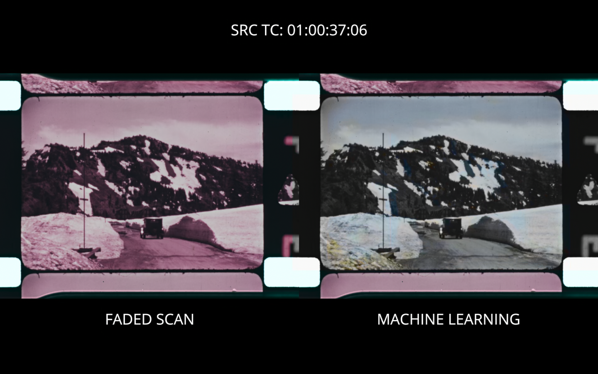
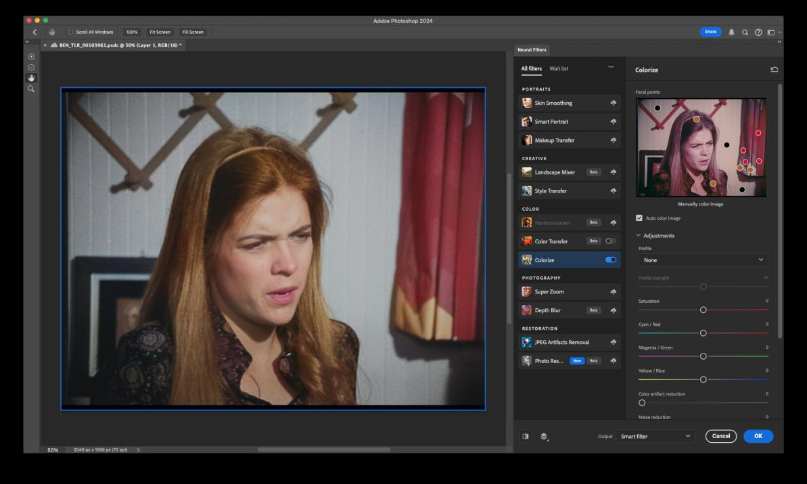
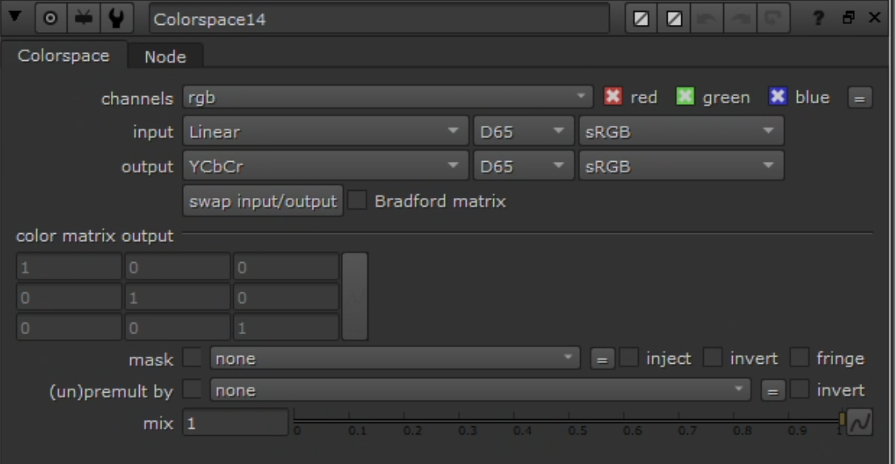
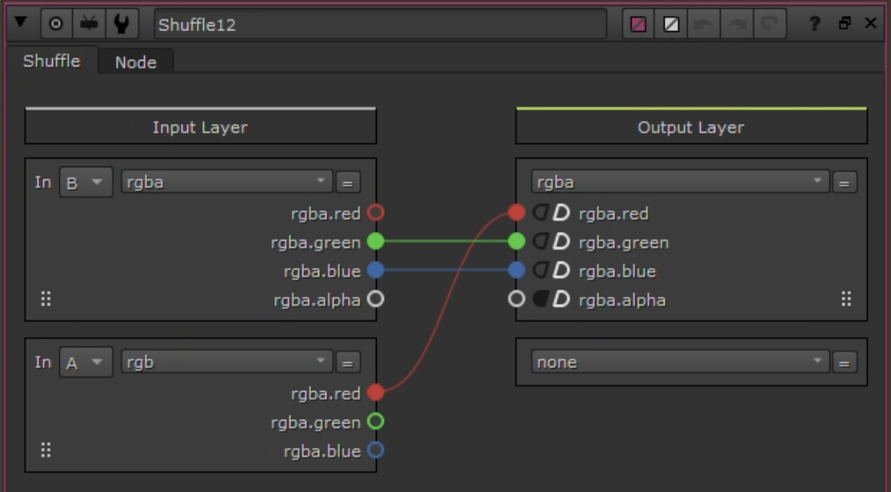
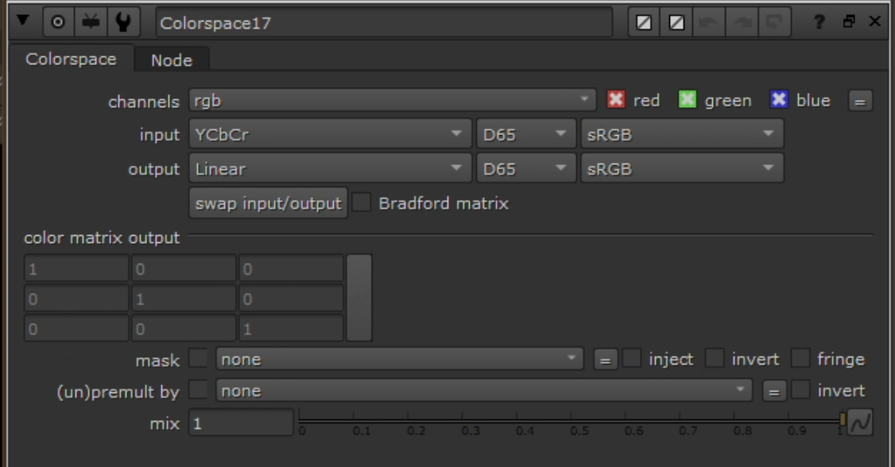
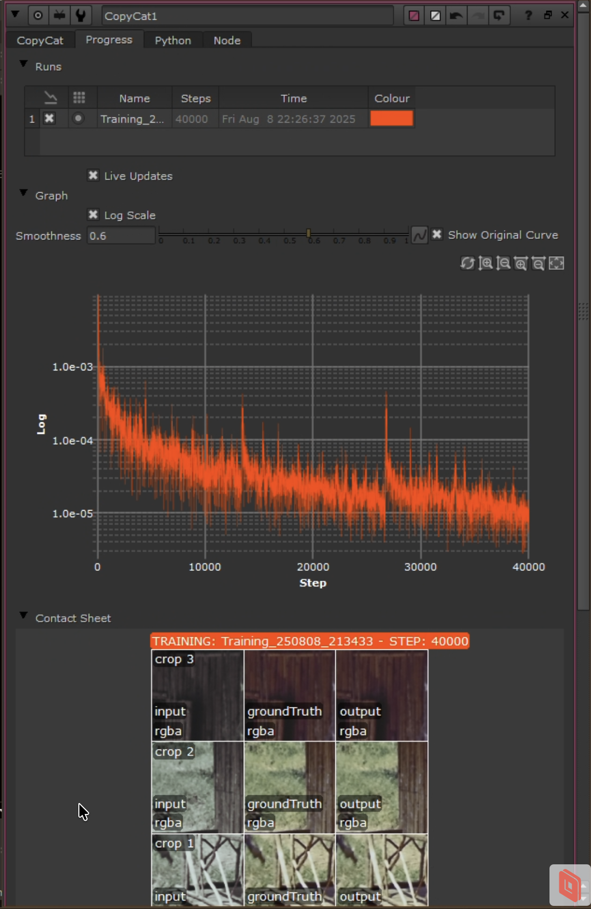
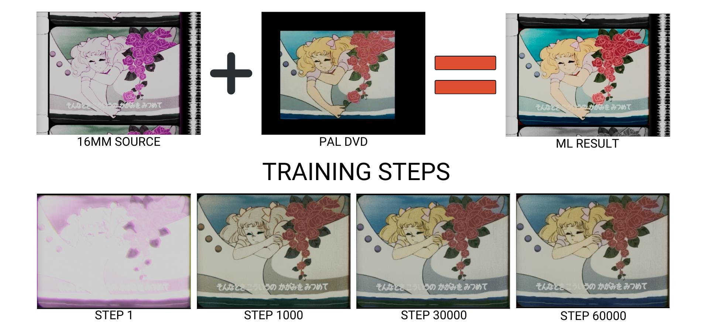

<strong>Language:</strong> English | <a href="{{ '/es/chroma-recovery/' | relative_url }}">Español</a>

# Chroma Recovery — Stages 3–5

*Chroma recovery comparison (Candy Candy).*

**Prerequisites:** Complete [Stages 0–2](start-here.md) first (Resolve export, Nuke setup, dataset curation, alignment, shared crop).

This guide covers chroma-specific target construction, training, inference, and validation. The model learns to reconstruct chroma (Cb/Cr) from paired frames while preserving source luma and spatial detail.

## When to Use Chroma Recovery

- Chromogenic film stocks with dye fading (Eastman Color, Fuji, Agfa magenta shifts)
- Color negatives with degraded color layers
- Historical material requiring color reconstruction
- Films with inconsistent color across scenes due to degradation

Traditional grading manipulates existing channels — it cannot learn color from external references. `CopyCat` overcomes this with supervised pairs.

For a visual explanation of why these sources turn pink/magenta and why a technical neutralization pass helps before training, see [Why Faded Scans Turn Magenta](additional-resources.md#why-faded-scans-turn-magenta).

## Reference Approaches

| Approach | When to use | Notes |
| --- | --- | --- |
| **Reference-based** | Direct color reference available (DVD, telecine, print) | Highest fidelity; align to faded source as ground truth |
| **Non-reference** | No direct reference exists | Research period-accurate palettes; synthesize plausible references; document all assumptions |

These are complementary and can be mixed per shot or scene.

*Non-reference recovery: faded scan (left) vs. ML output trained on a constructed reference (right).*

*Constructing a color reference with Photoshop Neural Filters (Colorize) when no direct reference exists. Focal points guide the colorization. Document all assumptions — this is synthesized, not archival.*

---

## Stage 3: CopyCat Training — Chroma Target

*CopyCat training workflow with YCbCr channel manipulation.*

### Training Pair Build

1. **Reference pre-filter (optional):** `Median` (~size 10) to suppress dust/compression. For magnetic/video references, consider light debanding.
2. **Apply linked Crop to Source:** clone/link the Stage 2 Reference `Crop` onto Source so both paths share identical picture area. Do not add a new Crop to Reference (it already has one from Stage 2). BBox parity is enforced in step 8.
3. **Convert both branches to YCbCr:** `Colorspace` (Working → YCbCr) on Source and Reference.

*Colorspace node: Linear → YCbCr.*

4. **Build ground truth with `Shuffle`:**
   - **Goal:** Ground Truth = Source luma (Y) + Reference chroma (Cb/Cr).
   - Inputs: A = Source (YCbCr), B = Reference (YCbCr)
   - YCbCr packing in Nuke: red = Y, green = Cb, blue = Cr
   - Channel mapping:
     - red ← A.red (Y from Source)
     - green ← B.green (Cb from Reference)
     - blue ← B.blue (Cr from Reference)
     - alpha ← black

*Shuffle: Source.Y + Reference.CbCr.*

5. **Convert ground truth back:** `Colorspace` (YCbCr → Working).

*Colorspace node: YCbCr → Linear (reverse conversion on Ground Truth).*

6. **Clamp:** `Grade` on both Input and Ground Truth — enable black/white clamp to [0–1].
7. **Remove alpha:** `Remove` node to drop alpha on both.
8. **Copy bbox:** `CopyBBox`/`SetBBox` — copy bbox from Reference to Source and Ground Truth.
9. **Connect to `CopyCat`:** Input = Source (post clamp/remove/bbox), Target = Ground Truth (post clamp/remove/bbox). Only chroma differs.

### Hyperparameters

| Parameter | Value | Notes |
| --- | --- | --- |
| Model | Medium | Start here; increase to Large only if quality insufficient |
| GPU | Enabled | Apple Silicon or NVIDIA |
| Patch | 512 | Use 256 if crop-limited; increase steps accordingly |
| Batch | 3 | Fixed for predictable behavior; tune only if VRAM constrained |
| Steps | 40–80k | If patch = 256, increase proportionally |
| Checkpoints | Every 10k | |
| Contact sheets | Every ~100 steps | Visual convergence monitoring |
| Learning rate | Default | Optional cosine decay after warmup |

*CopyCat node configuration.*

### Augmentations

- **Geometric:** small translate/scale; horizontal flip if composition allows. Avoid rotation if alignment is tight.
- **Photometric:** mild exposure jitter (±0.1). Avoid color transforms that alter chroma relationships.

### Preview Input

Use CopyCat's preview input with a frame **not** in the training dataset to monitor generalization during training. Select a frame with representative lighting/subjects. Check at each checkpoint (every 10k steps).

### Monitoring

- Track loss progression; observe contact sheets for visual convergence.
- **Luma identity:** convert both to YCbCr, difference Y — expect near-zero.
- **Range:** confirm clamping prevented <0 or >1 values.
- **BBox:** confirm identical bbox on both streams.

*Contact sheet progression from Step 1 → 360,000 (Candy Candy chroma recovery). Each row shows input (left) / ground truth (center) / output (right) for a different crop. Output starts as noise and progressively converges to match ground truth color. 17 milestones shown: 1, 100, 300, 500, 1k, 2k, 3k, 5k, 7.5k, 10k, 15k, 20k, 30k, 60k, 100k, 200k, 360k steps.*

*Progress tab in CopyCat UI showing loss curve and contact sheets.*

*Preview tab showing loss curve and real-time preview on a held-out frame.*

---

## Stage 4: Inference and Render

*Inference workflow applying trained model to full sequence.*

**Train small, infer big.** Training uses curated single-frame pairs. Inference runs on the full shot/scene/sequence.

*Inference output playing back on the full sequence — model generalizes beyond training pairs, maintaining temporal consistency across frames.*

### Steps

1. Read original Source. Set `Read.colorspace` to match training ingest domain.
2. Add live-area `Crop` (remove sprockets/sound strip). Do not carry over Stage 2/3 crops/transforms. Ensure picture area matches training. Do not add grades, clamps, or alpha ops.
3. `Inference` node: load trained `.cat` model. Same patch/tiling settings as training.
4. Convert to delivery space as required. Reformat/pad as needed.
5. **Validate on 50–100 frames first** before full render.

### Output Settings

- NukeX Non-Commercial: limited to 1920×1080 — use for previews only.
- Archival: Nuke Indie/Full. EXR 16-bit half (DWAA/ZIP), `Write.colorspace = ACES - ACES2065-1`.

### Render Settings

| Setting | Value |
| --- | --- |
| Container | EXR (ZIP or DWAA) |
| Bit depth | 16-bit half |
| Colorspace | ACES 2065-1 (AP0) or project archival standard |
| Naming | Include shot/scene, version, model/checkpoint ID |

### Outlier Review and Iteration

1. Scrub rendered range. Flag: hue drift, chroma bleed at edges, unstable skin tones, flicker, banding.
2. Add flagged frames as new pairs (`FrameHold` on both Source/Reference). Update `AppendClip` order; keep held-out validation frames.
3. If artifacts are localized, confirm live-area `Crop` excludes them. Refine Reference cleanup (light Median/deband) if needed.
4. **Retraining:** increase pairs (4 → 7 → 11) targeting missing color families. Extend steps/checkpoints. Reduce photometric augmentations if chroma is unstable.
5. Retrain from best checkpoint or fresh. Re-infer short validation range. Iterate until acceptable, then render full sequence.

### QA

- Check first/last frames and shot joins for seams or crop mismatches.
- Spot-check skin tones, saturated colors, deep shadows.

---

## Stage 5: Validation

### Resolve Validation

1. Import Original (Source) and Recovered (Inference output) into the same ACES-managed Resolve project.
2. Stack on separate tracks. Align timecode/frames. Disable all clip grades/effects.
3. Viewer wipe or split-screen. Toggle track visibility for A/B.
4. **Scopes:** waveform (Y) for luma stability; vectorscope for balanced chroma (skin line, saturated primaries, neutrals).
5. Note outliers for Stage 4 iteration.

### Resolve Composition (Chroma Merge)

Integrate only new chroma while preserving original luma detail and grain:

- **Edit page:** Recovered on V2 above Original on V1. Set V2 Composite Mode = `Color`.
- **Color page:** Layer Mixer, Composite Mode = `Color` (Recovered over Original).
- Keep ACES-managed. No additional grades.

### MatchGrade Baseline (Optional)

Produce a LUT baseline: Log pre/post transforms → `MatchGrade` 3D LUT → back to Linear. Compare vs. Recovered to visualize the difference between LUT mapping and learned chroma reconstruction.

*Training progression: Step 1 → 1000 → 30000 → 60000. Color is progressively reconstructed from the faded source using the PAL DVD reference.*

*4-way comparison (Friends): Original Scan (faded) → Balanced & Cleaned → Video Reference → Machine Learning Output.*

### Acceptance Criteria

- Luma matches within tolerance.
- No visible artifacts.
- Color consistent within scene.
- Clear improvement vs. MatchGrade baseline.

### Delivery

- Save model/checkpoint ID, dataset indices, validation stills.
- Deliver EXR masters + concise validation note (assumptions, references, caveats).

---

## Troubleshooting

| Problem | Solution |
| --- | --- |
| Residual misalignment in `Merge (difference)` | Switch to keyed `Transform`; keyframe for warped material. See [Stage 2](start-here.md#stage-2-alignment). |
| Convergence stalls | Add pairs covering missing color families (skin, foliage, sky, neutrals, extremes). Extend steps. Reduce photometric jitter. |
| Color bleeding, desaturation, wrong hue | Verify `Shuffle` mapping (Source.Y + Reference.Cb/Cr). Confirm [0–1] clamping. Check identical crops/bbox. Reduce model size or steps if overfitting. |
| Flickering or inconsistent color across frames | Expand pair coverage near lighting transitions. Re-evaluate crops for transient overlays. Check alignment consistency. |
| Detail loss | Ensure Source luma (Y) is preserved in ground truth. Verify `Shuffle`: Source.red → Ground Truth.red. |
| Model sizing | Start Medium. Increase to Large only after proper dataset curation and alignment. Small = faster but less detail retention. |
