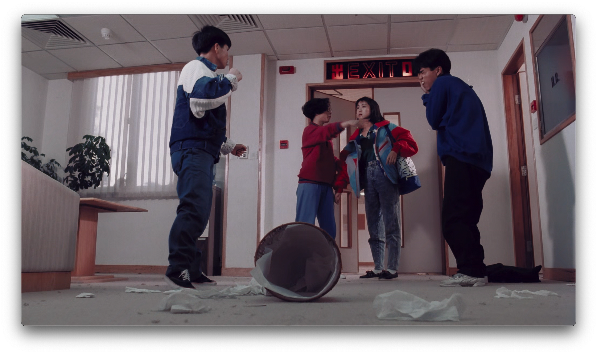

<strong>Idioma:</strong> <a href="{{ '/case-studies/' | relative_url }}">English</a> | Español

# Estudios de Caso

Aplicaciones reales del flujo CopyCat en distintos stocks filmicos, formatos, tipos de degradacion y fuentes de referencia. Cada caso demuestra un reto y una estrategia diferentes dentro del mismo pipeline central documentado en este repositorio.

> Para una discusion revisada por pares de estos experimentos, ver: Bedoya Huerta, F.P. (2025). [Exploring Experimental Machine Learning in Film Restoration](https://library.imaging.org/archiving/articles/22/1/35). *Archiving Conference*, 22(1), 35.

---

## Candy Candy (1976)

**Rama:** Recuperacion de croma | **Formato:** copia positiva 16mm | **Referencia:** DVD PAL (edicion francesa)

*Salida de recuperacion de croma con machine learning: colores recuperados desde la referencia PAL DVD sobre el escaneo 16mm.*

| Campo | Detalles |
|---|---|
| **Director** | Hiroshi Shidara |
| **Problema** | Dominancia magenta severa por desvanecimiento de tintes. Los canales verde y azul conservan la mayor parte de la informacion; las capas rojo/cian estan fuertemente degradadas. Flicker significativo concentrado en el canal rojo. |
| **Referencia** | 33 fotogramas extraidos de un set DVD PAL frances (MPEG-2/MKV -> AV1/MP4 via Handbrake para desentrelazado, luego importados en Resolve). Definicion estandar con artefactos de compresion, pero color intacto. El fotograma DVD tiene menos area de imagen que el escaneo 16mm, warping distinto y subtitulos ocasionales quemados. |
| **Enfoque** | Recuperacion de croma basada en referencia. 33 pares degradados + 33 referencias DVD. Phoenix & Loki (Filmworkz) para limpieza; NukeX CopyCat para transferencia de color. Prebalance con Faded Balancer DCTL para reducir desequilibrio de canales antes de entrenar. Altas luces clipeadas antes del entrenamiento para prevenir artefactos y mejorar convergencia. |
| **Decisiones clave** | La referencia DVD es SD: aceptable porque CopyCat solo aprende mapeo de color (Cb/Cr), no detalle espacial. Se recorto la fuente 16mm al area valida de referencia para que CopyCat no aprendiera bordes negros. Modelos especificos por plano superaron a un unico modelo de secuencia cuando el movimiento se volvio demasiado complejo. |
| **Resultado** | Replico con exito los colores del DVD sobre 16mm preservando la resolucion y estructura de grano originales. Establecio un metodo reutilizable para alineacion de referencia, seleccion de fotogramas y manejo de altas luces. |

---

## Beta

**Rama:** Recuperacion de croma | **Formato:** copia filmica | **Referencia:** cinta Beta / referencia de video anterior

*Salida de recuperacion de croma con machine learning: colores recuperados desde referencia Betacam.*

| Campo | Detalles |
|---|---|
| **Problema** | Copia desvanecida con sesgo amarillo, flicker, polvo azul, ghosting y perdida del canal azul. |
| **Referencia** | Un estado de video anterior de la pelicula (cinta beta) creado mas cerca del periodo original. Menor calidad y comprimido, pero conserva la mayor parte de la informacion de color. |
| **Enfoque** | Recuperacion de croma estandar basada en referencia en Resolve + Nuke/CopyCat. Fuente balanceada y limpiada ligeramente antes del entrenamiento. Referencia colocada en un contenedor `2048x858` desde su nativo `720x576` para reducir problemas de alineacion. El objetivo de entrenamiento conserva luminancia de la fuente y reemplaza croma con la referencia beta en espacio YCbCr. |
| **Decisiones clave** | Se empezo secuencia por secuencia y luego se refino plano por plano donde el modelo amplio no bastaba. La cinta Beta se acepto como referencia pese a la compresion: la misma logica que el DVD de Candy Candy. |
| **Resultado** | Color recuperado desde la referencia beta preservando el detalle espacial del escaneo filmico. Se validaron metodos tanto a nivel de secuencia como de plano. |

*Comparacion en 4 vias: escaneo original -> balanceado y limpiado -> referencia Betacam -> recuperacion de croma.*

---

## PSM

**Rama:** Recuperacion de croma | **Formato:** pelicula (fuente 720x576, contenedor 2048x858) | **Referencia:** Betacam

*Salida de recuperacion de croma con machine learning: colores recuperados desde referencia Betacam.*

| Campo | Detalles |
|---|---|
| **Problema** | Pelicula india desvanecida con degradacion de color. Fuente a 720x576, colocada en un contenedor 2048x858 para alineacion. |
| **Referencia** | Cinta Betacam: estado de video anterior que preserva informacion de color. |
| **Enfoque** | Experimentacion mixta de croma y luma. Multiples entrenamientos dedicados en distintas ramas de pipeline: recuperacion de color, croma+luma, extension de luma y luma de referencia. Checkpoints de entrenamiento desde 40k hasta 160k steps entre ramas. El caso experimental mas temprano de esta serie; precedio a Beta y establecio la metodologia iterativa de entrenamiento. |
| **Decisiones clave** | Se probaron etapas de salida tanto de solo croma como de croma+luma combinados. Multiples estructuras de rama (`COLOR_RECOVERY`, `CHROMA_LUMA`, `LUMA_EXTEND`, `REF_LUMA`) confirman que no fue un experimento de una sola pasada, sino una exploracion iterativa de distintas estrategias de recuperacion. |
| **Resultado** | Produjo media de salida real (~70 segundos de segmento de prueba) en modos de solo croma y combinados. Demuestra que el mismo pipeline CopyCat puede explorar multiples estrategias de recuperacion sobre el mismo material fuente. |

*Comparacion en 4 vias: escaneo original -> balanceado y limpiado -> referencia Betacam -> recuperacion de croma.*

---

## Friends (2001)

**Rama:** Recuperacion de croma | **Formato:** pelicula/video | **Referencia:** referencia de color directa

*Salida de recuperacion de croma con machine learning: tonos de piel naturales y color restaurado.*

| Campo | Detalles |
|---|---|
| **Problema** | Dano de color con desplazamientos de dominante significativos entre escenas. |
| **Enfoque** | Flujo estandar de recuperacion de croma basada en referencia. Referencia directa con datos de color intactos usada para pares de entrenamiento supervisados. Agrupado con Frontier Experience como caso directo de referencia. |
| **Resultado** | Recuperacion de color exitosa con tonos de piel naturales y color consistente entre escenas. |

*Comparacion antes/despues de recuperacion de croma.*

---

## La Muralla Verde

**Rama:** Recuperacion de croma | **Referencia:** material DVD y DCP

*Salida de recuperacion de croma con machine learning.*

| Campo | Detalles |
|---|---|
| **Problema** | Fuente desvanecida con desplazamiento magenta que requiere tanto balance tradicional como recuperacion asistida por ML. |
| **Referencia** | Material DVD y DCP reciente usado como referencias de color. |
| **Enfoque** | Pipeline completo: escaneo crudo -> Faded Balancer DCTL para rebalance inicial -> preparacion y alineacion de referencia en Resolve -> entrenamiento CopyCat -> render de inferencia. Herramientas de balance personalizadas probadas antes y junto a la etapa ML. |
| **Resultado** | Proyecto maduro con overviews de script exportados, contact sheets, comparaciones y fotogramas de salida. Demuestra el ciclo completo de validacion Resolve -> Nuke -> Resolve. |

*Comparacion antes/despues de recuperacion de croma.*

---

## Frontier Experience (1975)

**Rama:** Recuperacion de croma | **Formato:** copia filmica | **Referencia:** telecine (fuente secundaria archivistica)

*Salida de recuperacion de croma con machine learning.*

| Campo | Detalles |
|---|---|
| **Director** | Barbara Loden |
| **Problema** | Copia sobreviviente desvanecida con informacion de croma perdida. |
| **Referencia** | Telecine proporcionado por Ross Lipman. Tenia problemas de cadencia, pero se mantuvo lo suficientemente alineado para seguir siendo usable como guia de croma. |
| **Enfoque** | Recuperacion de croma estandar basada en referencia. Telecine usado solo como fuente de evidencia demostrable de color, no como referencia espacial. Importante porque usa una fuente secundaria archivistica estandar en vez de artwork o un DVD de consumo. |
| **Reto clave** | Areas dificiles de cielo y sombra pueden necesitar mas fotogramas de entrenamiento o segmentacion por grupos de escena (interiores vs. exteriores). |
| **Resultado** | Resultado estructuralmente convincente. Algunos cielos y sombras no se resuelven por completo, senalando los limites de modelos a nivel de secuencia en condiciones de iluminacion variables. |

*Escaneo original vs. referencia telecine vs. salida de machine learning.*

---

## Ben

**Rama:** Recuperacion de croma (referencia construida) | **Referencia:** referencias creadas en Photoshop

*Salida de recuperacion de croma con machine learning: colores recuperados desde referencia construida en Photoshop.*

| Campo | Detalles |
|---|---|
| **Problema** | El material fuente carece de referencia de color directa (sin DVD, telecine ni copia alternativa). |
| **Referencia** | Referencias de color construidas manualmente en Photoshop usando Neural Filters (Colorize). Se construyeron fotogramas de referencia especificos por plano, en vez de una referencia global unica. |
| **Enfoque** | Recuperacion sin referencia / asistida por operador. Cada plano recibe su propio fotograma de referencia creado en Photoshop. Contact sheets y pasadas de comparacion validan el resultado en multiples planos. Agrupado con Rebelion de las Tapadas como flujo de referencia construida. |
| **Resultado** | Alcanzo etapa de salida lista para comparacion con comparaciones en 4 vias y una salida terminada. Demuestra que cuando no sobrevive una referencia historica, referencias construidas por operador aun pueden impulsar entrenamiento CopyCat. |

*Construccion de referencia en Adobe Photoshop usando Neural Filters (Colorize).*

*Comparacion en 4 vias.*

---

## Rebelion de las Tapadas (1943)

**Rama:** Recuperacion de croma (sin referencia) | **Formato:** positivo 35mm | **Referencia:** acuarelas de epoca colonial

*Salida de recuperacion de croma con machine learning: colores recuperados desde referencias pictoricas historicas.*

| Campo | Detalles |
|---|---|
| **Director** | Nelson Garcia Miranda |
| **Problema** | Sindrome de vinagre avanzado, fuerte desplazamiento magenta, perdida intensa del canal azul y dano fisico significativo. No sobrevive referencia directa: sin DVD, sin telecine, sin copia alternativa. |
| **Referencia** | Artwork de epoca colonial asociado con la cultura visual de la pelicula, incluyendo obra de Johann Moritz Rugendas y Pancho Fierro. |
| **Enfoque** | Recuperacion sin referencia. Pasada de balance one-light para reducir dominante magenta. DVO Steady para estabilizacion. Eliminacion de flicker RGB (el material se comporta como duotono). Clone/paint manual para defectos severos. CopyCat entrenado con pinturas historicas curadas para aprender relaciones de color plausibles de epoca y comportamiento de textura. |
| **Decisiones clave** | Algunas imagenes fuente de la pelicula son intencionalmente blanco y negro: el modelo tenia que aprender que *no* colorizar. Se acepto que la salida es una reconstruccion plausible, no una recuperacion fiel. Todos los supuestos documentados. |
| **Resultado** | Recupero color manteniendo textura filmica visible. Demuestra que el artwork puede funcionar como referencia visual restringida cuando no sobrevive referencia directa de color. |

*Comparacion en 3 vias: Original Scan -> Balanced & Cleaned -> Machine Learning (referenciada en pinturas).*

---

## Mission Kill (1990)

**Rama:** Mixta (espacial + croma) | **Formato:** copia positiva 16mm | **Referencia:** internegativo 35mm

*Salida de recuperacion espacial con machine learning: 16mm mejorado hacia calidad de internegativo 35mm.*

| Campo | Detalles |
|---|---|
| **Problema** | La copia positiva 16mm tiene menos definicion que el internegativo 35mm. El 35mm tambien muestra deriva magenta, por lo que se necesita trabajo tanto espacial como de croma. |
| **Referencia** | Internegativo 35mm: mayor formato, generacion mas temprana, mas informacion espacial. |
| **Enfoque** | Flujo mixto. Recuperacion de formato via rama espacial: modelo entrenado con fotogramas solapados de ambos formatos para aprender el mapeo espacial (16mm -> calidad 35mm). Recuperacion de croma realizada como pasada separada. El internegativo 35mm se convierte en la verdad de referencia para detalle espacial, mientras la copia 16mm actua como input: el inverso de un caso de croma como Candy Candy. |
| **Decisiones clave** | Los mejores resultados vinieron de dividir el trabajo plano por plano: el movimiento complejo introduce ruido cuando se entrena demasiado de una vez. La recuperacion espacial es mas dificil que la de croma porque porta estructura de mayor frecuencia y suele necesitar segmentacion mas fina. |
| **Resultado** | 16mm mejorado para aproximarse visualmente a la calidad del internegativo 35mm. Demuestra como formatos o generaciones mezclados pueden homogeneizarse hacia el elemento sobreviviente mas fuerte. Apoya el argumento de preservar multiples copias de la misma pelicula en vez de colapsar todo a un unico elemento preferido. |

*A/B split: fuente desvanecida (izquierda) vs. salida recuperada de croma con ML (derecha).*

*Copia positiva 16mm vs. internegativo 35mm vs. resultado de Machine Learning.*

---

## Knights of the Trail (1920s)

**Rama:** Recuperacion espacial (composite multi-elemento) | **Formato:** nitrato | **Referencia:** composite de elementos de nitrato

*Recuperacion espacial con machine learning: reconstruccion de detalle desde multiples fuentes parciales de nitrato.*

| Campo | Detalles |
|---|---|
| **Problema** | Sobreviven dos rollos monocromaticos de nitrato, cada uno con dano y cobertura distintos. El rollo B esta mas degradado pero conserva el detalle espacial mas fuerte; el rollo A es mas limpio y estable, pero le faltan fotogramas. |
| **Referencia** | Un composite construido a partir de ambas fuentes de nitrato, incorporando eventualmente un positivo deacetate: un verdadero composite multi-elemento. |
| **Instituciones de apoyo** | La Cinematheque francaise, Fondazione Cineteca Italiana, George Eastman Museum. Louis B. Mayer Foundation. |
| **Enfoque** | Alinear los elementos de nitrato en un composite de plano completo. Usar el composite como referencia de entrenamiento para CopyCat. El objetivo no es inventar nuevo detalle, sino reconstruir estructura faltante desde evidencia mejor conservada. |
| **Resultado** | Demuestra como multiples fuentes parciales de nitrato pueden actuar como evidencia para reconstruccion espacial. Uno de los ejemplos mas fuertes de uso de multiples elementos de preservacion como datos de entrenamiento en vez de elegir una sola fuente. |

*Comparacion animada en 4 vias: rollo A -> rollo B -> composite ML -> resultado ML.*

---

## El Gran Tinterillo (1975)

**Rama:** Recuperacion espacial (referencia de video analogico) | **Formato:** 16mm | **Referencia:** telecine analogico

*Salida de recuperacion espacial con machine learning.*

*Recuperacion espacial en dos direcciones: Fuente 16mm + Telecine -> Resultado ML, y Fuente Telecine + 16mm -> Resultado ML.*

| Campo | Detalles |
|---|---|
| **Problema** | Pelicula 16mm con dano severo, warping, problemas de crop y datos espaciales recuperables limitados. El telecine conserva datos espaciales perdidos en la copia filmica, pero introduce sus propios artefactos: crop, detalle limitado, movimiento de mascara, defectos de entrelazado. |
| **Referencia** | Telecine de video analogico hecho mas cerca de la vida original de la pelicula. |
| **Enfoque** | Recuperacion en dos pasos con referencia de video analogico. Primer modelo entrenado en secciones menos danadas donde ambas fuentes se superponen, aprendiendo la relacion espacial. Segundo modelo usa esos resultados para restaurar el fotograma filmico completo. El telecine se trata como guia y no como reemplazo directo: la recuperacion directa telecine-a-film esta demasiado recortada y es demasiado blanda. |
| **Decision clave** | Se probo en ambas direcciones: telecine-a-16mm y 16mm-a-telecine. Ambas produjeron resultados, demostrando la naturaleza bidireccional del concepto. |
| **Estado** | Prueba de concepto. El enfoque de dos pasos produjo resultados de fotograma completo mas convincentes que la transferencia directa. El dano y la bruma se redujeron manteniendo el fotograma 16mm completo en vez de colapsar a los limites del telecine. Persisten artefactos tipicos de recuperacion espacial. |

*Comparacion animada que muestra resultados de recuperacion espacial en multiples fotogramas.*

---

## Taxonomia de Recuperacion

Estos estudios de caso ilustran cuatro estrategias de recuperacion distintas, todas usando el mismo pipeline CopyCat:

| Estrategia | Tipo de referencia | Ejemplos | Rama |
|---|---|---|---|
| **Referencia directa** | DVD, telecine, cinta beta, copia alternativa | Candy Candy, PSM, Beta, Friends, Frontier Experience, La Muralla Verde | Croma |
| **Sin referencia / construida** | Pinturas, colorizacion en Photoshop, fuentes historicas | Rebelion de las Tapadas, Ben | Croma |
| **Formato / generacion** | Copia de mayor formato, elemento de generacion anterior | Mission Kill | Espacial |
| **Multi-elemento / video analogico** | Composite de elementos parciales, guia de telecine | Knights of the Trail, El Tinterillo | Espacial |

El flujo documentado en este repositorio maneja las cuatro: la unica diferencia es como construyes el objetivo de entrenamiento en la Etapa 3.

---

*Ver tambien: [Flujo compartido](start-here.md) | [Recuperacion de croma](chroma-recovery.md) | [Recuperacion espacial](spatial-recovery.md)*
