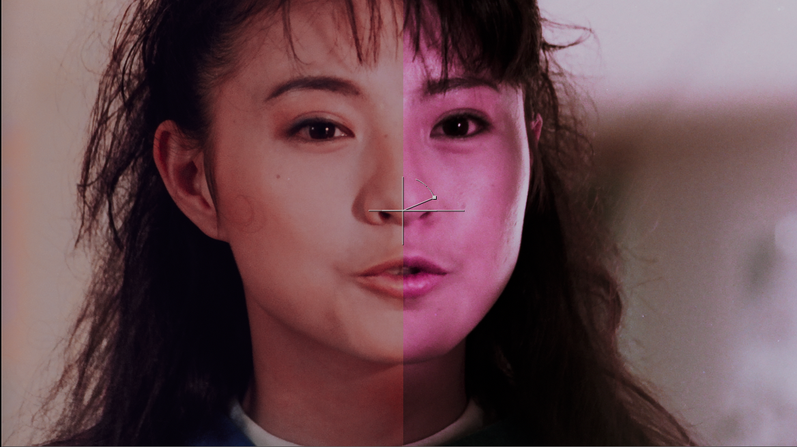

<strong>Idioma:</strong> <a href="{{ '/chroma-recovery/' | relative_url }}">English</a> | Español

# Recuperacion de Croma - Etapas 3-5

*Comparacion de recuperacion de croma (Candy Candy).*

**Prerequisitos:** Completa primero [Etapas 0-2](start-here.md) (exportacion desde Resolve, configuracion de Nuke, curacion del dataset, alineacion, recorte compartido).

Esta guia cubre la construccion del objetivo especifico de croma, el entrenamiento, la inferencia y la validacion. El modelo aprende a reconstruir croma (Cb/Cr) desde fotogramas pareados mientras preserva la luma y el detalle espacial de la fuente.

## Cuando Usar Recuperacion de Croma

- Peliculas cromogenicas con desvanecimiento de tintes (Eastman Color, Fuji, desplazamientos magenta de Agfa)
- Negativos color con capas de color degradadas
- Material historico que requiere reconstruccion de color
- Peliculas con color inconsistente entre escenas debido a degradacion

El grading tradicional manipula canales existentes; no puede aprender color desde referencias externas. `CopyCat` supera esa limitacion con pares supervisados.

Para una explicacion visual de por que estas fuentes se vuelven rosadas/magenta y por que conviene neutralizarlas tecnicamente antes del entrenamiento, revisa [Por que los escaneos desvanecidos se vuelven magenta](additional-resources.md#why-faded-scans-turn-magenta).

## Enfoques de Referencia

| Enfoque | Cuando usarlo | Notas |
| --- | --- | --- |
| **Basado en referencia** | Hay referencia de color directa (DVD, telecine, copia) | Mayor fidelidad; alinear con la fuente desvanecida como verdad de referencia |
| **Sin referencia** | No existe referencia directa | Investigar paletas de epoca; sintetizar referencias plausibles; documentar todos los supuestos |

Estos enfoques son complementarios y pueden mezclarse por plano o escena.

*Recuperacion sin referencia: escaneo desvanecido (izquierda) vs. salida ML entrenada con una referencia construida (derecha).*

*Construccion de una referencia de color con Photoshop Neural Filters (Colorize) cuando no existe referencia directa. Los puntos focales guian la colorizacion. Documenta todos los supuestos: esto es sintetizado, no archivistico.*

---

## Etapa 3: Entrenamiento CopyCat - Objetivo de Croma

*Flujo de entrenamiento CopyCat con manipulacion de canales YCbCr.*

### Construccion de Pares de Entrenamiento

1. **Pre-filtro de referencia (opcional):** `Median` (~size 10) para suprimir polvo/compresion. Para referencias magneticas/de video, considera debanding ligero.
2. **Aplicar Crop vinculado a Fuente:** clone/link del `Crop` de Referencia de la Etapa 2 sobre Fuente, para que ambas rutas compartan area de imagen identica. No agregues un nuevo Crop a Referencia (ya tiene uno desde Etapa 2). La paridad de BBox se fuerza en el paso 8.
3. **Convertir ambas ramas a YCbCr:** `Colorspace` (Working -> YCbCr) en Fuente y Referencia.

*Nodo Colorspace: Linear -> YCbCr.*

4. **Construir verdad de referencia con `Shuffle`:**
   - **Objetivo:** Ground Truth = luma de Fuente (Y) + croma de Referencia (Cb/Cr).
   - Inputs: A = Fuente (YCbCr), B = Referencia (YCbCr)
   - Empaquetado YCbCr en Nuke: red = Y, green = Cb, blue = Cr
   - Mapeo de canales:
     - red <- A.red (Y de Fuente)
     - green <- B.green (Cb de Referencia)
     - blue <- B.blue (Cr de Referencia)
     - alpha <- black

*Shuffle: Fuente.Y + Referencia.CbCr.*

5. **Convertir Ground Truth de vuelta:** `Colorspace` (YCbCr -> Working).

*Nodo Colorspace: YCbCr -> Linear (conversion inversa en Ground Truth).*

6. **Clamp:** `Grade` en Input y Ground Truth: activa black/white clamp a [0-1].
7. **Eliminar alpha:** nodo `Remove` para quitar alpha en ambos.
8. **Copiar bbox:** `CopyBBox`/`SetBBox`: copiar bbox desde Referencia a Fuente y Ground Truth.
9. **Conectar a `CopyCat`:** Input = Fuente (post clamp/remove/bbox), Target = Ground Truth (post clamp/remove/bbox). Solo difiere el croma.

### Hiperparametros

| Parametro | Valor | Notas |
| --- | --- | --- |
| Modelo | Medium | Empieza aqui; sube a Large solo si la calidad no basta |
| GPU | Enabled | Apple Silicon o NVIDIA |
| Patch | 512 | Usa 256 si el crop limita; aumenta pasos proporcionalmente |
| Batch | 3 | Fijo para comportamiento predecible; ajustar solo si VRAM limita |
| Steps | 40-80k | Si patch = 256, aumenta proporcionalmente |
| Checkpoints | Cada 10k | |
| Contact sheets | Cada ~100 steps | Monitoreo visual de convergencia |
| Learning rate | Default | Cosine decay opcional tras warmup |

*Configuracion del nodo CopyCat.*

### Augmentations

- **Geometricas:** pequenos translate/scale; horizontal flip si la composicion lo permite. Evita rotacion si la alineacion es estricta.
- **Fotometricas:** jitter leve de exposicion (±0.1). Evita transformaciones de color que alteren las relaciones de croma.

### Preview Input

Usa el preview input de CopyCat con un fotograma que **no** este en el dataset de entrenamiento para monitorear generalizacion durante el entrenamiento. Selecciona un fotograma con iluminacion/sujetos representativos. Revisa en cada checkpoint (cada 10k steps).

### Monitoreo

- Sigue la progresion de loss; observa contact sheets para convergencia visual.
- **Identidad de luma:** convierte ambos a YCbCr, diferencia Y; deberia ser casi cero.
- **Rango:** confirma que el clamping evito valores <0 o >1.
- **BBox:** confirma bbox identico en ambos streams.

*Progresion de contact sheet desde Step 1 -> 360,000 (recuperacion de croma de Candy Candy). Cada fila muestra input (izquierda) / ground truth (centro) / output (derecha) para un crop distinto. El output empieza como ruido y converge progresivamente hasta igualar el color de ground truth. 17 hitos mostrados: 1, 100, 300, 500, 1k, 2k, 3k, 5k, 7.5k, 10k, 15k, 20k, 30k, 60k, 100k, 200k, 360k steps.*

*Pestana Progress en la UI de CopyCat mostrando curva de loss y contact sheets.*

*Pestana Preview mostrando curva de loss y preview en tiempo real sobre un fotograma reservado.*

---

## Etapa 4: Inferencia y Render

*Flujo de inferencia aplicando el modelo entrenado a la secuencia completa.*

**Entrena pequeno, infiere grande.** El entrenamiento usa pares curados de fotogramas individuales. La inferencia corre sobre el plano/escena/secuencia completa.

*Salida de inferencia reproduciendose sobre la secuencia completa: el modelo generaliza mas alla de los pares de entrenamiento y mantiene consistencia temporal entre fotogramas.*

### Pasos

1. Lee la Fuente original. Configura `Read.colorspace` para coincidir con el dominio de ingesta del entrenamiento.
2. Agrega `Crop` de area util (quitar perforaciones/banda de sonido). No arrastres crops/transforms de Etapas 2/3. Asegura que el area de imagen coincida con entrenamiento. No agregues grades, clamps ni operaciones de alpha.
3. Nodo `Inference`: carga el modelo `.cat` entrenado. Mismos ajustes de patch/tiling que en entrenamiento.
4. Convierte al espacio de entrega segun necesidad. Reformat/pad si hace falta.
5. **Valida primero en 50-100 fotogramas** antes del render completo.

### Ajustes de Salida

- NukeX Non-Commercial: limitado a 1920x1080; usalo solo para previews.
- Archivo: Nuke Indie/Full. EXR 16-bit half (DWAA/ZIP), `Write.colorspace = ACES - ACES2065-1`.

### Ajustes de Render

| Ajuste | Valor |
| --- | --- |
| Contenedor | EXR (ZIP o DWAA) |
| Profundidad | 16-bit half |
| Colorspace | ACES 2065-1 (AP0) o estandar archivistico del proyecto |
| Naming | Incluir plano/escena, version, ID de modelo/checkpoint |

### Revision de Outliers e Iteracion

1. Scrub del rango renderizado. Marca: deriva de tono, bleeding de croma en bordes, tonos de piel inestables, flicker, banding.
2. Anade fotogramas marcados como nuevos pares (`FrameHold` en Fuente/Referencia). Actualiza el orden de `AppendClip`; conserva fotogramas de validacion reservados.
3. Si los artefactos son localizados, confirma que el `Crop` de area util los excluya. Refina la limpieza de Referencia (Median/deband ligero) si hace falta.
4. **Reentrenamiento:** aumenta pares (4 -> 7 -> 11) apuntando a familias de color faltantes. Extiende steps/checkpoints. Reduce augmentations fotometricas si el croma es inestable.
5. Reentrena desde el mejor checkpoint o desde cero. Re-infiere un rango corto de validacion. Itera hasta que sea aceptable y luego renderiza la secuencia completa.

### QA

- Revisa primeros/ultimos fotogramas y cortes entre planos por seams o desajustes de crop.
- Haz spot-check de tonos de piel, colores saturados y sombras profundas.

---

## Etapa 5: Validacion

### Validacion en Resolve

*A/B split (Mission Kill): fuente desvanecida (izquierda) vs. salida de recuperacion de croma (derecha). Tonos de piel y saturacion de color recuperados desde una copia con tinte desvanecido.*

1. Importa Original (Fuente) y Recovered (salida de Inference) en el mismo proyecto Resolve gestionado con ACES.
2. Apila en pistas separadas. Alinea timecode/fotogramas. Desactiva todos los grades/efectos de clip.
3. Viewer wipe o split-screen. Alterna visibilidad de pistas para A/B.
4. **Scopes:** waveform (Y) para estabilidad de luma; vectorscope para croma balanceado (skin line, primarios saturados, neutros).
5. Anota outliers para iteracion en Etapa 4.

### Composicion en Resolve (Chroma Merge)

Integra solo el croma nuevo preservando detalle de luma y grano originales:

- **Edit page:** Recovered en V2 sobre Original en V1. Set V2 Composite Mode = `Color`.
- **Color page:** Layer Mixer, Composite Mode = `Color` (Recovered sobre Original).
- Mantener ACES-managed. Sin grades adicionales.

### Linea Base MatchGrade (Opcional)

Produce una linea base LUT: transformaciones Log pre/post -> `MatchGrade` 3D LUT -> vuelta a Linear. Compara contra Recovered para visualizar la diferencia entre mapeo LUT y reconstruccion de croma aprendida.

*Progresion de entrenamiento: Step 1 -> 1000 -> 30000 -> 60000. El color se reconstruye progresivamente desde la fuente desvanecida usando la referencia PAL DVD.*

*Comparacion en 4 vias (Friends): escaneo original (desvanecido) -> balanceado y limpiado -> referencia de video -> salida de machine learning.*

### Criterios de Aceptacion

- La luma coincide dentro de tolerancia.
- Sin artefactos visibles.
- Color consistente dentro de la escena.
- Mejora clara frente a la linea base MatchGrade.

### Entrega

- Guarda ID de modelo/checkpoint, indices del dataset y stills de validacion.
- Entrega masters EXR + nota breve de validacion (supuestos, referencias, salvedades).

---

## Solucion de Problemas

| Problema | Solucion |
| --- | --- |
| Desalineacion residual en `Merge (difference)` | Cambia a `Transform` con keys; keyframe para material deformado. Ver [Etapa 2](start-here.md#etapa-2-alineacion). |
| La convergencia se estanca | Anade pares que cubran familias de color faltantes (piel, follaje, cielo, neutros, extremos). Extiende steps. Reduce jitter fotometrico. |
| Bleeding de color, desaturacion, tono incorrecto | Verifica mapeo de `Shuffle` (Fuente.Y + Referencia.Cb/Cr). Confirma clamping [0-1]. Revisa crops/bbox identicos. Reduce tamano del modelo o steps si hay overfitting. |
| Flicker o color inconsistente entre fotogramas | Amplia cobertura de pares cerca de transiciones de iluminacion. Reevalua crops por overlays transitorios. Revisa consistencia de alineacion. |
| Perdida de detalle | Asegura que la luma de Fuente (Y) se preserve en Ground Truth. Verifica `Shuffle`: `Source.red` -> `Ground Truth.red`. |
| Tamano del modelo | Empieza en Medium. Sube a Large solo despues de una buena curacion de dataset y alineacion. Small = mas rapido, pero retiene menos detalle. |
