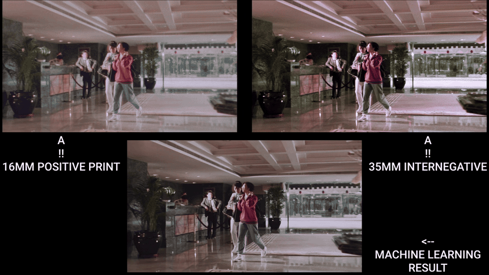

<strong>Idioma:</strong> <a href="{{ '/spatial-recovery/' | relative_url }}">English</a> | Español

# Recuperacion Espacial - Etapas 3-5

*Comparacion de recuperacion espacial (Mission Kill): copia positiva 16mm vs. internegativo 35mm vs. resultado de Machine Learning.*

**Prerequisitos:** Completa primero [Etapas 0-2](start-here.md) (exportacion desde Resolve, configuracion de Nuke, curacion del dataset, alineacion, recorte compartido).

**Estado: experimental.** Esta rama esta en desarrollo y no se presenta como un flujo terminado listo para archivo. Tratala como contexto de investigacion.

*Prueba de concepto (El Tinterillo): copia 16mm vs. telecine vs. transferencia espacial ML en ambas direcciones. Los resultados muestran potencial, pero tambien artefactos tipicos: inconsistencias de borde, diferencias de estructura de grano y alucinacion de detalle, lo que ilustra por que esta rama sigue siendo experimental.*

Esta guia cubre la construccion del objetivo especifico espacial, entrenamiento, inferencia y validacion. El modelo aprende a transferir caracteristicas espaciales (resolucion, grano, nitidez) desde la referencia mientras preserva el croma de la fuente.

## Cuando Usar Recuperacion Espacial

- Perdida de detalle por dano fisico, perdida generacional o descomposicion de nitrato
- Diferencias de calidad por formato (16mm vs. 35mm)
- Degradacion generacional (copia -> duplicado -> internegativo)
- Multiples fuentes con calidades espaciales distintas que requieren homogeneizacion
- Dano parcial donde telecines o fuentes alternativas conservan mejor informacion espacial

Los filtros espaciales tradicionales (sharpen, blur, interpolation) operan dentro del mismo fotograma o en fotogramas vecinos; no pueden aprender caracteristicas espaciales desde referencias externas.

## Escenarios de Fuente Comunes

- Multiples formatos de pelicula (16mm vs. 35mm)
- Distintas generaciones (copia, internegativo, duplicado)
- Elementos tempranos de preservacion (telecines, copias de seguridad hechas mas cerca del original)
- Multiples copias/escaneos de calidad variable

---

## Etapa 3: Entrenamiento CopyCat - Objetivo Espacial

*Diagrama de entrenamiento (El Tinterillo): transferencia espacial bidireccional entre fuentes 16mm y Telecine. Fuente + Referencia = Resultado ML en ambas direcciones.*

### Construccion de Pares de Entrenamiento

1. **Pre-filtro de Fuente (opcional, usar con cautela):** Si Fuente tiene artefactos de compresion severos o bordes dentados, se *puede* aplicar un `Median` muy ligero (size 3-5) solo a Fuente. **Critico:** si preprocesas Fuente durante entrenamiento, **debes** aplicar el mismo preprocesamiento durante inferencia. En la mayoria de casos, evita filtrar por completo. **No** apliques median/blur a la Referencia: preserva todo el detalle espacial.
2. **Aplicar Crop vinculado a Fuente:** clone/link del `Crop` de Referencia de la Etapa 2 sobre Fuente. No agregues un nuevo Crop a Referencia. La paridad de BBox se fuerza en el paso 8.
3. **Convertir ambas ramas a YCbCr:** `Colorspace` (Working -> YCbCr).

*Nodo Colorspace: Linear -> YCbCr.*

4. **Construir verdad de referencia con `Shuffle`:**
   - **Objetivo:** Ground Truth = luma de Referencia (Y) + croma de Fuente (Cb/Cr).
   - Inputs: A = Referencia (YCbCr), B = Fuente (YCbCr)
   - Empaquetado YCbCr en Nuke: red = Y, green = Cb, blue = Cr
   - Mapeo de canales:
     - red <- A.red (Y de Referencia)
     - green <- B.green (Cb de Fuente)
     - blue <- B.blue (Cr de Fuente)
     - alpha <- black

*Shuffle: Referencia.Y + Fuente.CbCr: el inverso del Shuffle de recuperacion de croma.*

5. **Convertir Ground Truth de vuelta:** `Colorspace` (YCbCr -> Working).

*Nodo Colorspace: YCbCr -> Linear (conversion inversa en Ground Truth).*

6. **Clamp:** `Grade` en Input y Ground Truth: activa black/white clamp a [0-1].
7. **Eliminar alpha:** nodo `Remove` para quitar alpha en ambos.
8. **Copiar bbox:** `CopyBBox`/`SetBBox`: copiar bbox desde Referencia a Fuente y Ground Truth.
9. **Conectar a `CopyCat`:** Input = Fuente (post clamp/remove/bbox), Target = Ground Truth (post clamp/remove/bbox). Solo difiere la luma.

### Hiperparametros

Igual que recuperacion de croma: consulta [hiperparametros de chroma-recovery.md](chroma-recovery.md#hiperparametros) para la tabla completa. Valores clave: modelo Medium, Patch 512, Batch 3, 40-80k steps.

### Augmentations

- **Geometricas:** pequenos translate/scale; horizontal flip si la composicion lo permite. Evita rotacion si la alineacion es estricta.
- **Fotometricas:** jitter leve de exposicion (±0.1). **Evita** transformaciones que alteren caracteristicas espaciales (sin sharpening, blurring ni sintesis de grano).

### Preview Input

Mismo enfoque que en croma: usa un fotograma que **no** este en el dataset de entrenamiento y que tenga texturas/bordes representativos. Monitorea en cada checkpoint de 10k.

### Monitoreo

- Sigue la progresion de loss; observa contact sheets.
- **Identidad de croma:** convierte ambos a YCbCr, diferencia Cb/Cr; deberia ser casi cero.
- **Rango:** confirma que el clamping evito valores <0 o >1.
- **BBox:** confirma bbox identico en ambos streams.

Consulta [monitoreo en chroma-recovery.md](chroma-recovery.md#monitoreo) para capturas de la pestana CopyCat Progress (contact sheet y preview). La UI es identica para ambas ramas.

---

## Etapa 4: Inferencia y Render

*Flujo de inferencia aplicando el modelo entrenado a la secuencia completa.*

### Pasos

1. Lee la Fuente original. Configura `Read.colorspace` para coincidir con el dominio de ingesta del entrenamiento.
2. **Aplica el preprocesamiento de Fuente identico de la Etapa 3** si usaste alguno (por ejemplo, `Median` ligero). Si no usaste ninguno, omite este paso.
3. Agrega `Crop` de area util. Asegura que el area de imagen coincida con entrenamiento.
4. **No hace falta conversion de espacio de color.** El modelo mapea Fuente -> (Referencia.Y + Fuente.CbCr), por lo que preserva el croma original mientras mejora detalle espacial. Alimenta Fuente tal cual tras preprocesamiento/crop.
5. Nodo `Inference`: carga el modelo `.cat` entrenado. Mismo patch/tiling que en entrenamiento.
6. Convierte al espacio de entrega. Reformat/pad segun necesidad.
7. **Valida primero en 50-100 fotogramas.**

### Ajustes de Salida y Render

Igual que recuperacion de croma: consulta [ajustes de render en chroma-recovery.md](chroma-recovery.md#ajustes-de-render). EXR 16-bit half, ACES 2065-1.

### Revision de Outliers e Iteracion

1. Scrub del rango renderizado. Marca: exceso de sharpening, halos, inconsistencia de grano, flicker, artefactos de borde.
2. Anade fotogramas marcados como nuevos pares. Actualiza `AppendClip`; conserva fotogramas de validacion reservados.
3. Si los artefactos son localizados, confirma que `Crop` los excluya. Refina la limpieza de Referencia (solo eliminacion de polvo/rayaduras; **sin** median/blur en Referencia).
4. **Reentrenamiento:** aumenta pares (4 -> 7 -> 11) apuntando a familias de texturas/bordes faltantes. Extiende steps. Reduce augmentations fotometricas si hay inestabilidad.
5. Reentrena, re-infiere un rango corto e itera.

### QA

- Revisa primeros/ultimos fotogramas y cortes entre planos.
- Haz spot-check de texturas finas, bordes nitidos y gradientes suaves.

---

## Etapa 5: Validacion

### Validacion en Resolve

*Viewer wipe de Nuke (Knights of the Trail): fuente original (izquierda) vs. salida de recuperacion espacial (derecha). Compara detalle, estructura de grano y definicion de bordes.*

1. Importa Original y Recovered en el mismo proyecto Resolve gestionado con ACES.
2. Apila, alinea y desactiva grades.
3. Viewer wipe / split-screen / alterna visibilidad.
4. **Scopes:** waveform (Y) para mejora de detalle/resolucion de luma; vectorscope para croma (deberia coincidir con el original: el croma se preserva por diseno).
5. Anota outliers para iteracion en Etapa 4.

### Composicion en Resolve (Spatial Merge)

Integra el detalle espacial mejorado mientras preservas el color original:

- **Edit page:** Recovered en V2 sobre Original en V1. Set V2 Composite Mode = `Luminosity`.
- **Color page:** Layer Mixer, Composite Mode = `Luminosity` (Recovered sobre Original).
- Mantener ACES-managed. Sin grades adicionales.

### Criterios de Aceptacion

- Bordes mas nitidos, mejor estructura de grano y mejor retencion de detalle.
- Sin artefactos temporales (flicker, grano inconsistente).
- Color preservado, sin cambios no intencionados.
- Sin exceso de sharpening ni halos.

### Entrega

- Guarda ID de modelo/checkpoint, indices del dataset y stills de validacion.
- Entrega masters EXR + nota de validacion (tipos de fuente, evaluacion de calidad espacial, salvedades).

---

## Solucion de Problemas

| Problema | Solucion |
| --- | --- |
| Desalineacion residual | Cambia a `Transform` con keys. Ver [Etapa 2](start-here.md#etapa-2-alineacion). |
| La convergencia se estanca | Anade pares que cubran familias de texturas (tela, follaje, piel, bordes, extremos). Extiende steps. Reduce jitter fotometrico. |
| Exceso de sharpening o halos | Reduce steps totales. Disminuye patch size. Verifica que la referencia tenga calidad espacial superior sin artefactos. Revisa intercambio de canales YCbCr. |
| Flicker / calidad espacial inconsistente | Amplia cobertura de pares cerca de transiciones de iluminacion. Reevalua crops. Revisa consistencia de alineacion. |
| Incompatibilidad de estructura de grano | Verifica caracteristicas de grano de la referencia. Anade mas fotogramas con textura. Asegura que la referencia tenga grano superior. |
| Perdida de detalle | Asegura que Ground Truth use Referencia.Y. Verifica `Shuffle`: `Reference.red` -> `Ground Truth.red`. Reduce complejidad del modelo si hay overfitting. |
