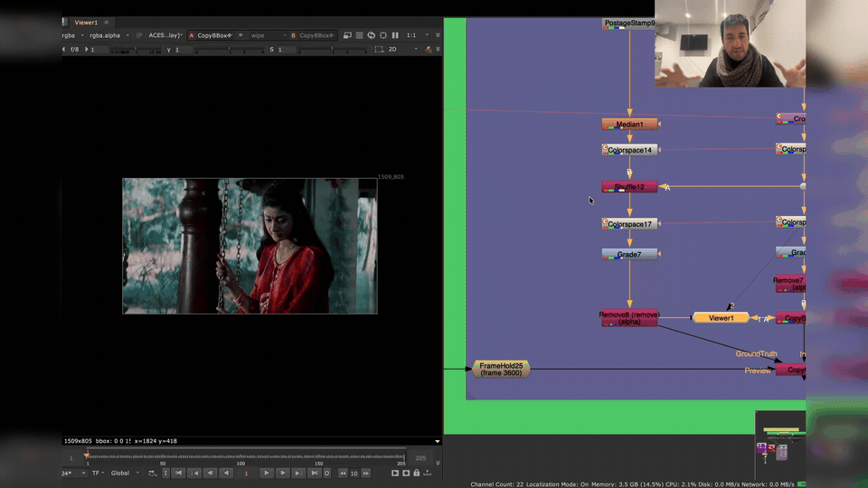
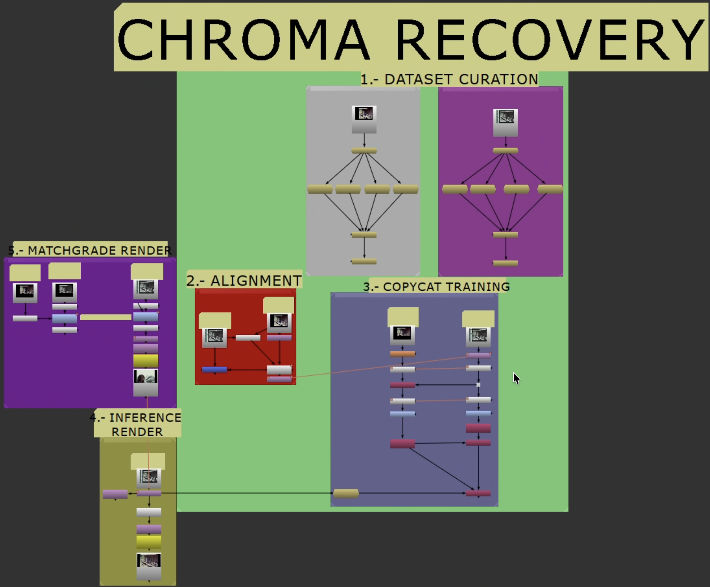

# Custom Machine Learning for Film Restoration

Reference-based restoration workflow for NukeX using `CopyCat` and `Inference`. Trains small CNNs against real source/reference pairs to recover lost chroma or spatial detail in degraded film elements.

Not a plugin. A repeatable, documented workflow for archives, preservation teams, and restoration practitioners.

  <a href="{{ '/start-here/' | relative_url }}" class="btn btn-primary">Get Started</a>
  <a href="https://github.com/fabiocolor/custom-machine-learning-for-film-restoration/releases/latest" class="btn btn-primary" style="background: linear-gradient(135deg, #10b981 0%, #059669 100%);" target="_blank">📥 Download Nuke Templates</a>
  <a href="https://youtu.be/kXerjFGX9Kg" class="btn btn-outline" target="_blank">Watch YouTube Walkthrough</a>

*Video walkthrough — a visual companion to this repository.*

*Recovery workflow overview.*

## Recovery Modes

| Mode | Use when | Ground truth target |
| --- | --- | --- |
| **Chroma recovery** | Luma/detail intact, chroma faded, shifted, or collapsed | Source `Y` + Reference `Cb/Cr` |
| **Spatial recovery** | Color acceptable, detail/sharpness/grain degraded vs. reference | Reference `Y` + Source `Cb/Cr` |

Start with chroma recovery unless your problem is clearly spatial. Do not combine both in the same target build — treat them as separate passes.

## Getting Started

Follow these in order:

1. **[Shared Workflow](start-here.md)** — Stages 0-2: Resolve export, Nuke setup, dataset curation, alignment, shared crop, and the branch decision.
2. **[Chroma Recovery](chroma-recovery.md)** — Stage 3 onward: chroma target build, training, inference, validation.
3. **[Spatial Recovery](spatial-recovery.md)** — Stage 3 onward: spatial target build, training, inference, validation.

## Supporting Material

- [Case Studies](case-studies.md) — Real-world results across eleven projects.
- [Glossary](references/terms-and-definitions.md)
- [Provenance and Metadata](provenance-metadata.md) *(future — ethical training data documentation)*

## Requirements

- Foundry NukeX with `CopyCat` and `Inference` (GPU: Apple Silicon or NVIDIA)
- A source scan with surviving image information
- A reference with stronger color or spatial detail
- Resolve (or equivalent) for pre-alignment and container prep
- ACES/OCIO color management
