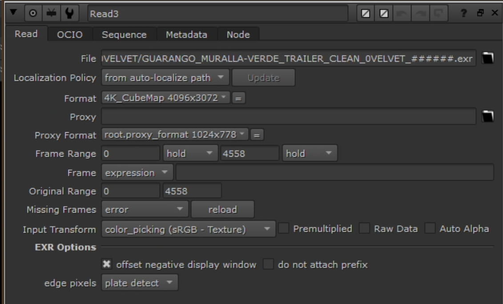
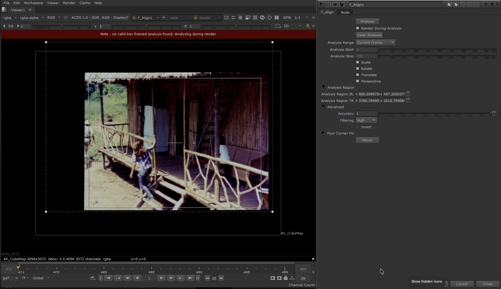
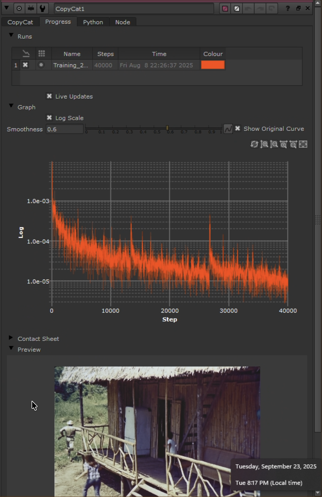
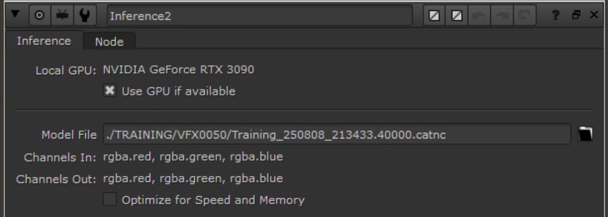
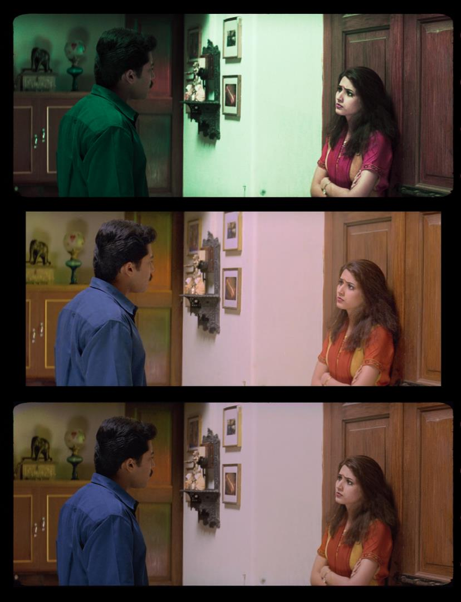
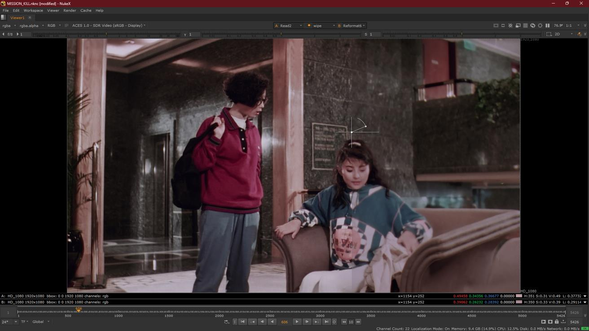

# One-Step Reference Recovery Guide

This is the single operational guide for the repository. If you follow only one page, follow this one.

It covers the shared reference-based workflow for both chroma recovery and spatial recovery in NukeX using `CopyCat`. The branch point comes after alignment and dataset prep, when you decide which channels belong in the ground-truth target.

Figure 1 - High-level overview of the recovery process.

## Decide Which Problem You Are Solving

| If the main damage is | Use this branch | Ground-truth build |
| --- | --- | --- |
| Color fading, dye loss, chroma collapse, or unstable color separation | Chroma recovery | Source `Y` + Reference `Cb/Cr` |
| Detail loss, softness, generational damage, weak grain structure, or lower-resolution source detail | Spatial recovery | Reference `Y` + Source `Cb/Cr` |

Important constraints:

- Start with chroma unless you have a strong reason to do otherwise.
- Spatial recovery is more alignment-sensitive and remains more experimental in this repo.
- Do not combine chroma and spatial recovery in one target build. Treat them as separate problems.
- If you need both, validate one pass fully before deciding whether the second pass is defensible.

## What You Need Before Training

- Foundry NukeX with `CopyCat` and `Inference`
- A degraded source plate
- A usable reference that preserves better color or better spatial information than the source
- Resolve or another prep stage to place both elements in the same container before Nuke
- Enough storage for EXR exports, checkpoints, and inference renders
- Written notes for frame picks, references used, checkpoints tested, and final acceptance decisions

## Workflow At a Glance

1. Stabilize and technically balance the source.
2. Prepare the reference and align both sources in Resolve.
3. Export matched image sequences.
4. Open the Nuke template and verify project and `Read` settings.
5. Curate a small dataset of representative frame pairs.
6. Align the reference precisely and apply a shared crop.
7. Build the target in YCbCr for either chroma or spatial recovery.
8. Train a sequence-level model first.
9. Run inference on the full source and render test outputs.
10. Validate against the original source and a simpler baseline, then split to shot-level retrains only where needed.

## 1. Stabilize the Source First

Do not train directly on a source that still contains strong flicker, severe channel imbalance, or obvious contamination unless those defects are part of the question you are explicitly testing.

The goal of prep is not to cosmetically finish the image. The goal is to keep the model from learning damage that should have been removed earlier.

Recommended source prep:

- neutral technical balancing
- deflicker when flicker is severe enough to confuse training
- basic cleanup for dirt, dust, splice flashes, or scanning defects
- reference cleanup only to the extent needed to remove transfer artifacts that would pollute training

Figure 2 - Example of a source that still needs technical balancing.

Figure 3 - Balanced source plate prepared for training.

Branch-specific note:

- For chroma recovery, light cleanup and technical balancing usually help.
- For spatial recovery, preserve the spatial character you want to learn from. Do not blur the reference. If you pre-filter the source for training, you must apply the same preprocessing during inference.

## 2. Align Source and Reference in Resolve

Resolve is the first alignment stage. The aim is not perfect registration. The aim is to export both branches in the same timing, resolution, and container so Nuke does not start from chaos.

Resolve checklist:

1. Put source and reference in the same timeline.
2. Match timing first.
3. Apply simple spatial transforms so both images sit in the same container.
4. Export both as matched image sequences, usually EXR.
5. Keep the same frame range, framing, resolution, and channel set.

Avoid creative grading here. Keep adjustments technical, repeatable, and documented.

Figure 4 - Source and reference aligned into the same container before Nuke.

## 3. Open the Nuke Template and Verify Ingest

Use the template that matches your Nuke edition:

- `templates/COLOR_RECOVERY_TEMPLATE_INDIE.nkind`
- `templates/COLOR_RECOVERY_TEMPLATE.nknc`

Before touching the node graph, verify the project and ingest settings.

Project settings:

- color management: `OCIO`
- config: `ACES 1.2` or `ACES 1.3`
- working space: `ACEScg`
- viewer process: a display transform that matches your monitoring setup

Read node checks:

- both branches use the same ingest logic
- both branches read values in the expected display-referred range for training
- both branches match in frame range, resolution, and pixel aspect

Figure 5 - Project setup before building the dataset.

Figure 6 - Read node settings that should match across source and reference.

## 4. Curate a Small, Representative Dataset

Do not start by training on every frame. Start with a small teaching set that covers the visual range of the problem.

Good pairs are:

- frame-matched
- aligned well enough to compare cleanly
- representative of different lighting conditions
- representative of difficult colors, textures, and edge structures
- free of unique damage that appears on only one side of the pair

Typical starting point:

- shot: 4 to 9 pairs
- scene: 12 to 24 pairs
- sequence: 24 to 64 pairs

Sequence-first is the recommended default. If the broad model fails only on a few shots, build dedicated shot-level datasets later.

Figure 7 - Paired frame selection and dataset assembly inside Nuke.

## 5. Align Precisely and Apply a Shared Crop

This is the part that decides whether the model learns the intended relationship or learns your alignment errors.

Recommended pattern:

1. Try `F_Align` as the fast first pass.
2. Check the result with viewer wipe and `Merge (difference)`.
3. If it fails, switch to a keyed `Transform`.
4. Once alignment is acceptable, crop out borders, subtitles, empty container space, and overscan.
5. Reuse the same crop on both branches so the live image area always matches.

Figure 8 - Auto and manual alignment paths in the template.

Figure 9 - `F_Align` setup used as the first alignment pass.

Figure 10 - Shared crop used to remove non-image areas before training.

Alignment acceptance test:

- edges should not shimmer when you toggle between source and reference
- `Merge (difference)` should show mostly photometric differences, not obvious geometry errors
- if a pair is still wrong, drop it or fix it; do not force it into the dataset

## 6. Build the Ground Truth in YCbCr

This is the branch point for the workflow.

First convert both branches from the working space to YCbCr so luma and chroma can be separated cleanly.

Figure 11 - Convert both branches to YCbCr before channel recombination.

Then use `Shuffle` to build the target:

| Branch | Input to `CopyCat` | Target to `CopyCat` |
| --- | --- | --- |
| Chroma recovery | balanced Source | Source `Y` + Reference `Cb/Cr` |
| Spatial recovery | prepared Source | Reference `Y` + Source `Cb/Cr` |

In Nuke YCbCr packing:

- `red` = `Y`
- `green` = `Cb`
- `blue` = `Cr`

For chroma recovery:

- `red <- Source.red`
- `green <- Reference.green`
- `blue <- Reference.blue`

For spatial recovery:

- `red <- Reference.red`
- `green <- Source.green`
- `blue <- Source.blue`

After `Shuffle`:

1. Convert the result back to the working space.
2. Clamp both Input and Target to `[0,1]` if that matches your training domain.
3. Remove alpha.
4. Copy bbox so Input and Target match spatially.

Figure 12 - `Shuffle` node used to construct the ground-truth target.

Rule that matters most:

- Chroma recovery keeps source detail and borrows reference color.
- Spatial recovery keeps source color and borrows reference detail.

## 7. Configure `CopyCat`

Use the first training pass to answer one question: does this reference/source relationship generalize at all?

Strong starting settings:

- model: `Medium`
- patch size: `512`
- batch size: `3`
- checkpoints: every `10000` steps
- preview input: one held-out frame that is not part of training
- total steps: usually `40000` to `80000` for the first serious pass

Figure 13 - Training layout feeding Input and Target into `CopyCat`.

Figure 14 - Baseline training settings for the first pass.

Figure 15 - Preview frame setup for checking generalization during training.

Branch-specific guidance:

- Chroma recovery: mild cleanup or debanding on the reference may help if the reference is a magnetic or compressed video source.
- Spatial recovery: do not degrade the reference with blur or heavy median filtering. The reference must preserve the detail you want the network to learn.

What to watch during training:

- held-out preview frame quality
- contact sheets at checkpoints
- obvious hue drift, edge ringing, or unstable textures
- whether the model improves steadily or plateaus early

## 8. Run Inference on the Full Source

Training is done on a small curated dataset. Inference is where you test the model on the real shot, scene, or sequence.

Inference rules:

- feed the full source, not the reduced training stack
- keep preprocessing consistent with training
- keep the live image area consistent with the training crop
- validate on a short range before committing to a full render

Figure 16 - Inference node configuration for full-range testing.

Figure 17 - Render stage after the trained model is loaded.

Recommended render target:

- EXR
- 16-bit half
- archival naming that records shot, version, and model/checkpoint ID

## 9. Validate Against the Source and a Simple Baseline

Do not trust the ML result because it looks impressive at first glance. Compare it against the original source and against a simpler baseline such as `MatchGrade`.

Validation checklist:

- does the result stay stable from frame to frame
- does it preserve source detail rather than inventing new structure
- does it outperform a simple grade-based baseline
- are the gains consistent enough to justify the training cost

Figure 18 - Baseline comparison that helps prove whether ML is adding real value.

Figure 19 - Chroma recovery comparison example.

Figure 20 - Spatial recovery comparison example.

When to split into shot-level retrains:

- one shot keeps drifting while the rest of the sequence works
- a costume, face, or prop never converges
- the reference quality changes within the sequence
- geometry or lighting changes push the wide model outside what it learned well

## 10. Document the Run

At minimum, save:

- source and reference IDs
- why the reference was chosen
- training frame indices or timecodes
- branch used: chroma or spatial
- checkpoint or `.cat` file used for inference
- validation stills or short ranges
- what failed and what you decided not to claim

This workflow becomes much more defensible when you can explain exactly how the model was trained and what evidence supports the final result.

## Failure Modes That Usually Matter Most

- unstable or contaminated source
- bad or mistrusted reference
- misaligned pairs left in the dataset
- borders, subtitles, or overlays left inside the crop
- trying to solve chroma and spatial recovery in one training target
- expecting a single sequence-level model to solve every difficult shot

## Read Next

- Use [chroma-recovery.md](chroma-recovery.md) for the detailed color-specific workflow and settings.
- Use [spatial-recovery.md](spatial-recovery.md) for the detailed spatial workflow and caveats.
- Use [watch-the-video.md](watch-the-video.md) for the walkthrough link.
