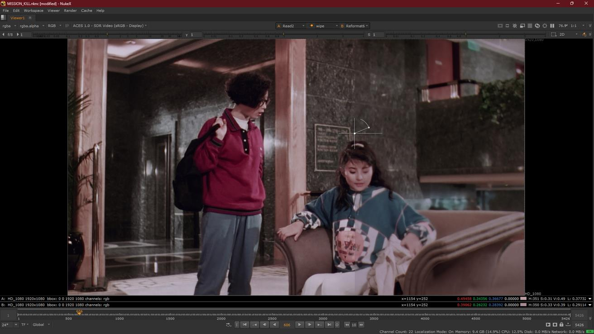

# Spatial Recovery Workflow

Figure 1 — Spatial recovery overview (Mission Kill comparison).

A comprehensive guide for using CopyCat in Nuke with convolutional neural networks (CNNs) to recover **spatial features** (resolution, sharpness, grain structure, detail) lost to damage or generational degradation. This workflow employs supervised learning to train custom models that transfer spatial characteristics between different sources of the same content, overcoming the limitations of traditional spatial filters that cannot "learn" from external references.

## Reference-Based Spatial Recovery

This workflow focuses on **reference-based spatial recovery**: transferring spatial characteristics from verifiable film sources (different gauges, generations, or preservation elements) to degraded targets using supervised learning with CNNs. The approach uses actual archival materials as spatial references rather than synthetic or pre-trained models.

**The fundamental technique is the same regardless of source type.** What varies is:
- **Available sources**: Different film gauges, generations, preservation elements (telecines, safety copies)
- **Specific scenario**: Damage patterns, completeness, quality differences
- **Application approach**: Single-step transfer, two-step for partial damage, combined with color recovery

**Common source scenarios:**
- Multiple film gauges (16mm vs 35mm)
- Different generations (print, internegative, duplicate)
- Early preservation elements (telecines, safety copies made closer to original)
- Multiple prints/scans of varying quality
- Combinations of the above (e.g., 35mm internegative + 16mm print = gauge + generation)

**Note on non-reference spatial recovery:**
Like color recovery has non-reference approaches (paintings, manual references), spatial recovery could theoretically use non-reference approaches by applying pre-trained commercial or open-source models (upscaling, denoising, etc.) without custom training on film-specific references. However, this is outside the scope of this repository, which focuses exclusively on reference-based methods using actual film sources and custom supervised learning.

## When to Use Spatial Recovery

**Ideal for films with intra-frame damage:**
- Detail loss from physical damage, generation loss, or nitrate decay
- Multiple sources with varying spatial qualities requiring homogenization
- Gauge-related quality differences (16mm vs 35mm)
- Generational degradation (print → duplicate → internegative)
- Partial damage where telecines or alternate sources preserve better spatial information

**Addresses limitations of traditional methods:**
- Traditional spatial filters (sharpen, blur, interpolation) operate only within same or neighboring frames
- Cannot "learn" spatial features from external references
- ML models overcome this by training on supervised pairs from different sources, applying that knowledge across entire films

**Real-world examples:**
- [Knights of the Trail](case-studies/knights-trail-spatial-recovery.md) - Multiple nitrate print sources
- [El Tinterillo](case-studies/tinterillo-spatial-recovery.md) - Early telecine preservation element (two-step approach)
- [Mission Kill](case-studies/missionkill-combined-recovery.md) - 35mm internegative + 16mm print (gauge + generation + color recovery)

---

## Workflow Overview

Spatial recovery uses supervised learning with CNNs, training on frame pairs from different containers of the same film (degraded source and spatial reference). Ground truth is constructed by combining Reference luma (spatial detail) with Source chroma (color) via YCbCr channel manipulation, ensuring only spatial features differ between Input and Target.

---

### 0. Resolve Export + Nuke Setup
Export in Resolve (Rec.709 ODT), then set up Nuke (OCIO/ACES + Reads).

### 1. Dataset Curation
Select representative paired frames (source + reference with superior spatial quality).

### 2. Alignment
Pixel-perfectly align reference to source and remove overscan.

### 3. `CopyCat` Training (CNN)
Train on paired frames (reference as ground truth) to transfer spatial characteristics while neutralizing color differences. Use CopyCat's preview input with a frame not included in the training dataset to monitor generalization in real-time during training.

### 4. Inference & Render
Apply the trained model to the shot/scene/sequence and render archival-quality outputs.

### 5. Validation
Compare against the original source and verify spatial improvement and grain preservation.

---

## Detailed Workflow Steps

### Stage 0: Resolve Export + Nuke Project Setup

**Objective:** Prepare matching sequences that constrain the task to spatial reconstruction.

**Rationale:**
- Training pairs _should_ differ only in spatial characteristics; misalignment or inconsistent transforms introduce nuisance variables that slow or mislead learning.
- Exporting 0–1 bounded image data stabilizes `CopyCat` training and avoids range clipping.

**Inputs:**
- Source scan (degraded spatial quality)
- Reference or higher-quality source (best available spatial detail)

**Outputs:**
- Two EXR sequences with identical resolution, pixel aspect, frame range, and channel set, in a consistent working/display space.

**Resolve Recipe (Recommended — Rec.709 ODT export for training pairs):**
1. Conform both sources in a single timeline; disable retimes, effects, and per‑clip grades.
2. Align the reference to the source in Edit/Inspector (Translate/Scale/Rotate). Allow letterbox/pillarbox as needed; keep a stable reference framing.
3. Use ACES project settings in Resolve, but export both Source and Reference with Rec.709 2.4 ODT to EXR. This keeps values bounded in [0–1], which `CopyCat` expects.
4. Verify parity: resolution, pixel aspect, frame range/rate, and channel set (RGB only is preferred; omit alpha).
5. Note any global offsets used (scale/translate/rotate) for later reference.
Note: Handling ACES 2065‑1 masters for interchange/delivery is detailed under Technical Considerations → ACES in Nuke (OCIO).

**Source Preparation (Cleaning):**
- Clean the Source before Nuke ingest to prevent artifacts from biasing training: remove dust, dirt, scratches, splice flashes, and obvious container defects. Keep the cleanup neutral (no creative grading).
- For spatial recovery, preserve original grain structure in the Source—do not degrain unless the Reference is also degrained. Grain mismatch introduces spurious spatial signals.
- Reference cleanup: clean enough to not interfere with training—remove dust, dirt, scratches that would bias spatial learning. **Do not use median filtering or blur on the Reference**; preserve all spatial detail (grain, sharpness, edge definition) as this is what the model will learn to transfer. For magnetic/video references, target only obvious compression artifacts (macroblocking, tape noise, 8‑bit banding) using tools that preserve spatial frequency content. Avoid geometry changes or temporal warping.
- Geometry/stabilization: prefer cleanup that does not alter geometry. If you must stabilize or reframe, apply identical transforms to both Source and Reference exports so alignment remains trivial.

**QC Checklist:**
- [ ] Dimensions, frame ranges, and pixel aspect match
- [ ] Channel sets match (RGB), values fall in 0–1 when read into Nuke
- [ ] No inadvertent retimes or additional color transforms

**Project Setup (Nuke):**

Objective: configure ACES/OCIO and Read nodes before dataset curation or alignment.

Project Settings:
- Color management: `OCIO` with `ACES 1.2` or `ACES 1.3`.
- Working space: `ACEScg` (scene‑linear, AP1).
- Viewer process: ACES ODT matching your display (e.g., `ACES 1.0 SDR‑video / Rec.709 2.4`).

Read Node Settings (both Source and Reference):
- Recommended for training pairs (from Resolve Rec.709 2.4 ODT): `Read.colorspace = Utility - sRGB - Color Picking`.
- ACES masters (interchange/comp): `Read.colorspace = ACES - ACES2065‑1`; if used for spatial training, transform to display‑referred (apply Rec.709 2.4 ODT) rather than naïvely clamping.

Verify:
- Toggle Viewer between Source/Reference and confirm consistent appearance under the chosen ODT.
- Confirm identical ingest transforms on both branches before proceeding.

See Technical Considerations → ACES in Nuke (OCIO) for rationale and alternatives (Log domain, Rec.709 vs ACES masters).
### Stage 1: Dataset Curation

**Objective:** Curate paired frames that isolate spatial differences while neutralizing color and geometry.

**Rationale:**
- `CopyCat` _should_ learn a mapping where only spatial features differ; mismatched framing or color variability introduces spurious signals and slows/harms convergence.
- Diversity across textures, lighting, and edge types improves generalization; spatial references yield the highest fidelity when they have measurably superior resolution, grain, and sharpness.

**Selection Criteria:**
- **Source frames**: representative grain structure, minimal gate weave; avoid frames dominated by motion blur unless matched in the reference.
- **Reference frames**: superior spatial detail (resolution, grain, edge definition), same shot/timecode (when available); avoid heavy compression, baked‑in subtitles/logos, and unstable frames.
- **Coverage requirements**: diverse textures (fabric, foliage, skin), edges (sharp lines, fine detail), extremes (deep shadows, specular highlights), grain patterns (static regions, smooth gradients).
- **Exclusions**: pairs with occlusions unique to one side (e.g., flashes, splice marks) that the model cannot reconcile.

**Pairing Requirements:**
- **Temporal matching**: pair the same frame index/timecode; if off‑by‑one, prefer the frame with maximal static structure overlap.
- **Spatial parity**: identical resolution/orientation; overscan/crop must be shared across both branches (residual differences will be removed in Stage 2).
- **Color space consistency**: keep both sides under the same transform (e.g., Rec.709 export for training pairs) so values remain in 0–1.

**Dataset Sizing (typical):**
- **Shots**: 4–9 pairs (add more if convergence stalls)
- **Scenes**: 12–24 pairs
- **Sequences**: 24–64+ pairs (scale with variability)
- **Distribution strategy**: for short ranges (e.g., frames 20–60), anchor at beginning/middle/middle/end; increase count if texture families are missing or convergence plateaus.

**Nuke Build (for `CopyCat` dataset extraction):**
- Create a `FrameHold` per selected index on both Source and Reference branches.
- Assemble ordered stacks with `AppendClip`: one stack for Source (Input) and one for Reference (Target).
- Keep a staging `AppendClip` upstream of the one referenced by downstream `PostageStamp` nodes to allow safe reordering.
- Verify each pair with viewer wipe or `Merge (difference)`; judge only geometry/alignment, not color (color differences will be isolated via YCbCr channel manipulation in Stage 3).
- Label each pair consistently and maintain a small table of indices/timecodes for traceability.

**Documentation & QC:**
- Record shot IDs, pair indices, and rationale.
- Note source types (gauge, generation, preservation element) and spatial quality assessment (which is high-quality vs low-quality).
- Flag compromises (compression, residual parallax) for later review during training/validation.

### Stage 2: Alignment

**Objective:** Achieve pixel‑accurate alignment with shared crop/bbox so only spatial characteristics differ between branches.

**Rationale:**
- Residual misalignment presents as false spatial artifacts during training and inference; tight alignment directly improves fidelity and reduces training steps.

**Strategy:**
- Do a single global solve with `F_Align` using a conservative central ROI. Avoid iterative tweaking.
- Immediately evaluate with `Merge (difference)`; if edges/geometry remain, switch to the manual path and keyframe `Transform`.
- Keep a single `Dissolve` to compare auto/manual paths quickly.

**Crop and subtitle handling (practical guidance):**
- Remove black borders/overscan on both branches to avoid training on non‑image content.
- Exclude burned‑in subtitles/logos; where unavoidable, animate a shared crop to exclude them.
- Apply the exact same crop to Source and Reference (clone/link) so pixel areas correspond.

**Nuke Build:**
 - Compare Reference to Source using Viewer wipe and `Merge (difference)`. Use a `Dissolve` to switch between auto/manual align paths, and keyframe it (0 = auto, 1 = manual) per frame after inspection to select the best alignment.
 - Auto path (one‑pass): `F_Align` with a conservative central ROI; run a single global solve (Translate/Scale/Rotate/Perspective) and avoid parameter chasing.
 - Manual path (preferred when auto is imperfect): `Transform` (translate/scale/rotate) keyed as needed; judge with `Merge (difference)`.
 - Reference `Crop` only (last step): once alignment is verified, add `Crop` on the aligned Reference to remove overscan/transient overlays. Keep it bypassed while solving; enable as the final step. Save this node to clone/link in Stage 3. Do not crop the Source here.

**Verification Checklist:**
 - [ ] `Merge (difference)` shows only color/photometric differences; geometry/edges are near‑black. Do not apply any Grade/color correction here—color isolation will be handled in Stage 3 via YCbCr channel manipulation.
 - [ ] No edge shimmer at borders/corners when toggling Source/Reference
 - [ ] After alignment passes, Reference crop removes overscan/mattes without hiding alignment cues

**Troubleshooting Notes:**
- Gate weave/parallax on warped multi‑generation references: expect manual `Transform` keyframing to be time‑consuming.

### Stage 3: `CopyCat` Training

**Objective:** Train a model that transfers spatial characteristics (resolution, grain, sharpness) while preserving chroma.

**Rationale:**
- Stability and fidelity improve when Input and Target share chroma/color; the network focuses on learning the spatial (luma) mapping only.

**Training Pair Build (Nuke):**
1. Source pre‑filter (optional, use with caution): If the Source has severe compression artifacts, jagged edges, or noise that would confuse training, a very light `Median` (size 3–5) _may_ be applied to the Source only. **CRITICAL**: If you apply any preprocessing to the Source during training, you _shall_ apply identical preprocessing during inference (Stage 4); otherwise the model receives an input distribution it was not trained on. In most cases, avoid filtering entirely and let the model learn from the original Source. **Do not apply median or blur to the Reference**—preserve all spatial detail (grain, sharpness, edge definition) as this is what the model will learn to transfer.
2. Apply linked Crop to Source only: clone/link the Stage 2 Reference `Crop` onto the Source branch so both paths have identical picture area. Do not add a new Crop to Reference here (it already has it from Stage 2). BBox parity is enforced later in step 8.
3. Convert both branches to YCbCr: add `Colorspace` on Source and Reference (Working → YCbCr) to separate luma (Y) from chroma (Cb/Cr).
4. Build Ground Truth in YCbCr with `Shuffle`:
   - Goal: Ground Truth = Reference luma (Y) + Source chroma (Cb/Cr) so only luma differs between Input (Source) and Target (Ground Truth).
   - Inputs: A = Reference (YCbCr), B = Source (YCbCr)
   - YCbCr packing in Nuke: red = Y, green = Cb, blue = Cr
   - Channel mapping:
     - red   ← A.red   (Y from Reference)
     - green ← B.green (Cb from Source)
     - blue  ← B.blue  (Cr from Source)
     - alpha ← black
5. Convert Ground Truth back to Working space: `Colorspace` (YCbCr → Working) on the Ground Truth.
6. Clamp ranges on both Input and Ground Truth: add `Grade` to both Source (Input) and the Ground Truth; enable black/white clamp to keep values in [0–1].
7. Remove alpha on both: add `Remove` to drop `alpha` on Source (Input) and the Ground Truth.
8. Copy bbox for consistency: `CopyBBox`/`SetBBox` to copy bbox from Reference to Source and the Ground Truth so spatial metadata matches.
9. Connect to `CopyCat`: Input = Source (post clamp/remove/bbox), Target = the Ground Truth (post clamp/remove/bbox). At this point, only luma differs.

**Hyperparameters:**
- Model: Medium; GPU enabled
- Patch: 512 (use 256 if crop‑limited; increase total steps accordingly)
- Batch: fixed 3 for predictable multi‑machine behavior (tune only if VRAM constrained)
- Steps: ~40–80k; if patch = 256, increase steps proportionally
- Checkpoints: every 10k; enable contact sheets every ~100 steps for visual progress
- Learning rate: default is robust; optional cosine decay after warmup

**Augmentations (paired on Input and ground truth):**
- Geometric: small translate/scale; horizontal flip if composition allows; avoid rotation if alignment is tight.
- Photometric: mild exposure jitter (±0.1). Avoid transforms that alter spatial characteristics (no sharpening, no blurring, no grain synthesis).

**Preview Input for Real-Time Validation:**
- Use CopyCat's preview input feature with a frame NOT included in the training dataset to monitor generalization during training.
- Select a preview frame with representative textures/edges to gauge whether the model is learning transferable spatial characteristics versus memorizing training pairs.
- Monitor the preview output at checkpoints (every 10k steps) to assess convergence quality before full inference.

**Monitoring & QC:**
- Track training loss progression; observe contact sheets every ~100 steps for visual convergence.
- Chroma identity: convert both to YCbCr and difference Cb/Cr; expect near‑zero.
- Range: confirm clamping prevented <0 or >1 values.
- BBox: confirm identical bbox on both streams.

### Stage 4: Inference & Render

**Objective:** Apply the trained model to full sequences and render archival masters.

**Scope vs Training (train small, infer big):**
- Training uses curated single‑frame pairs (via `FrameHold` + `AppendClip`) to learn the spatial mapping.
- Inference runs on the full shot/scene/sequence to verify generalization and complete the recovery.

**Inference Steps:**
1. Read the original Source; set `Read.colorspace` to match the training ingest domain.
2. **Apply identical Source preprocessing from Stage 3**: If you applied any preprocessing to the Source during training (e.g., light `Median` filtering for compression artifacts), you _shall_ apply the exact same preprocessing here. Preprocessing parameters (filter type, size, strength) _shall_ match training exactly. If no Source preprocessing was used in training, skip this step.
3. Add a live‑area `Crop` (remove sprockets and sound strip). Ensure the picture area feeding `Inference` matches what was used during training.
4. **No color space conversion needed**: Unlike training, inference operates directly on the Source in working space. The model was trained to map Source → (Reference.Y + Source.CbCr), so it inherently preserves the Source's original chroma while improving spatial detail. Simply feed the Source as‑is (after any preprocessing/crop from steps 2–3).
5. `Inference` node: load the trained model (`.cat`) produced by `CopyCat`; use the same patch/tiling settings as training.
6. The output will have improved spatial quality (resolution, grain, sharpness from Reference) while retaining the original Source chroma.
7. Convert to delivery space as required by the archival pipeline. Reformat/pad as needed; avoid modifying the Source beyond crop/reformat.
8. Validate on a short range first (e.g., 50–100 frames) before full render.

**Nuke version limits and output settings:**
- NukeX Non‑Commercial is limited to 1920×1080 output; reformat for previews only.
- For archival renders, use Nuke Indie/Full; write EXR 16‑bit half (DWAA/ZIP) with `Write.colorspace = ACES - ACES2065‑1` under `pipeline/04_inference_render/`.

**Outlier Review & Iteration:**
- Scrub the rendered range and flag outlier frames (over-sharpening, halos, grain inconsistency, flicker, edge artifacts).
- Extract the flagged indices and add them as new frame pairs (`FrameHold` per index on both Source/Reference). Update the `AppendClip` order to include these pairs while keeping a held‑out validation slice.
- If artifacts are localized to a region or overlay, confirm the live‑area `Crop` excludes it; otherwise, refine dust/scratch cleanup on the Reference in Stage 1 (preserve all spatial detail—do not use median filtering or blur on Reference).
- Retraining options:
  - Increase pair count along the escalation path (e.g., 4 → 7 → 11) targeting missing texture/edge families.
  - Extend total steps/checkpoints; keep model size and patch consistent with training, unless VRAM requires change.
  - Reduce photometric augmentations if they destabilize; keep geometry augmentations minimal.
- Re‑run training from the best checkpoint or fresh, then re‑infer a short validation range. Iterate until outliers meet acceptance criteria, then render the full sequence.

**Render Settings:**
- Container: EXR (ZIP or DWAA)
- Bit depth: 16‑bit half
- Colorspace: ACES 2065‑1 (AP0) or project archival standard
- Naming: include shot/scene, version, and model/checkpoint identifier

**QA During Render:**
- Check first/last frames and shot joins for seams or crop mismatches.
- Spot‑check difficult frames (fine textures, sharp edges, smooth gradients).

### Stage 5: Validation

**Objective:** Validate in Resolve by compositing/AB‑comparing Recovered vs Original; optionally assess spatial improvement metrics.

**Resolve Validation Steps:**
- Import Original (Source) and Recovered (Inference output) into the same ACES‑managed Resolve project used for exports.
- Stack on separate tracks; align timecode/frames; disable all clip grades/effects.
- Use viewer wipe or split‑screen to compare; toggle track visibility for quick A/B.
- Check scopes: waveform (Y) for improved luma detail/resolution; vectorscope for chroma (should match original Source, as chroma is preserved by design).
- Review across the whole sequence; note outliers for Stage 4 "Outlier Review & Iteration".

**Resolve Composition (Spatial Merge):**
- Goal: integrate only the improved spatial detail into the Original while preserving its color and overall characteristics.
- Edit page method: place Recovered on V2 above Original on V1, set V2 Composite Mode = `Luminosity` (transfers spatial detail while preserving color).
- Color page method: feed Original and Recovered into a `Layer Mixer`; set the mixer's Composite Mode = `Luminosity` (Recovered over Original).
- Keep project ACES‑managed with matched IDTs/ODT; avoid any additional grades on either plate.
- Render the composited result as your validation/final plate; this preserves Original color while applying learned spatial characteristics.

**Acceptance Criteria:**
- Spatial improvement visible: sharper edges, better grain structure, improved detail retention.
- No temporal artifacts: no flickering, consistent grain/detail across frames.
- Color preserved: no unintended color shifts (Source chroma is inherently preserved by the YCbCr training methodology).
- No over-sharpening or halos around edges.

**Documentation & Delivery:**
- Save model/checkpoint ID, dataset indices, and a handful of validation stills.
- Deliver EXR masters plus a concise validation note (source types, spatial quality assessment, and any remaining caveats).

---

## Technical Considerations

### ACES in Nuke (OCIO)

**Goal:** Consistent color management from ingest → training → inference → archival delivery using ACES.

**Nuke Project Setup (Recommended Default):**
- Color Management: `OCIO` with `ACES 1.2` or `ACES 1.3` config.
- Working space: `ACEScg` (scene‑linear, AP1). Node ops occur in this space.
- Viewer Process: an ACES ODT matching your display (e.g., `ACES 1.0 SDR‑video` / Rec.709 2.4).

**Read Nodes (Ingest):**
- Recommended for training pairs: Resolve Rec.709 2.4 ODT exports → `Utility - sRGB - Color Picking`. This mirrors our experiments and keeps training values stable after clamping.
- ACES masters/ACEScg: `ACES - ACES2065‑1` or `ACES - ACEScg` for interchange/comp; clamp to [0–1] before training.
- Other:
  - sRGB texture images → `Utility - sRGB - Texture`
  - Rec.709 display‑referred material → `Utility - Rec.709 - Display`
  - Camera‑specific IDTs for log camera material
  Keep both Source and Reference under identical transforms.

**Training Domain Options:**
- Recommended — Display‑referred spatial training: export Rec.709 2.4 ODT, ingest via `Utility - sRGB - Color Picking` (IDT), process in ACEScg, and apply YCbCr channel manipulation to isolate spatial differences before training. Values are naturally bounded; only light safety clamping may be needed.
- Alternative — Log domain: viable in theory, but may require careful handling of value ranges and normalization for spatial transfer.
- Not recommended for spatial — Naïve linear ACES clamp: ingesting ACES 2065‑1 and clamping to [0–1] before training crushes highlights and harms spatial mapping; avoid. If you must start from ACES masters, transform to display‑referred (apply ODT) before training.

Notes:
- Whichever option is chosen, both Input and Target must share the exact same domain and transforms. Do not mix linear and display‑referred between branches.

**Writes (Delivery):**
- Archival masters: `Write.colorspace = ACES - ACES2065‑1` (AP0), EXR 16‑bit half (ZIP/DWAA).
- Review/proxy: convert to Rec.709 ODT and render ProRes/H.264 as needed (document viewing intent and ODT).

**Resolve Interop:**
- Recommended: ACES 1.2/1.3 project; export ACES 2065‑1 EXR masters for ingest to Nuke (ACEScg working space).
- Alternative: for display‑referred training, export Rec.709 2.4 ODT and ingest with `Utility - sRGB - Color Picking`.
- Keep frame size, PAR, and channels identical across Source/Reference.

**Cross‑Reference:**
- Operator quick steps: see Annex A in this document.

## Troubleshooting & QC

### Alignment Issues

**Problem:** Residual misalignment visible in `Merge (difference)`
**Solution:** Switch to keyed `Transform` rather than over‑tuning `F_Align`; keyframe as needed for warped material.

### Training Convergence

**Problem:** Convergence stalls or plateaus
**Solution:** Add representative pairs covering texture families (fabric, foliage, skin, edges) and extremes (deep shadows, specular highlights, fine detail); extend training steps; or reduce photometric jitter.

### Spatial Artifacts

**Problem:** Over-sharpening, halos, or unnatural edge enhancement
**Solution:** Reduce total training steps; decrease patch size; verify reference source has superior spatial quality without artifacts; verify YCbCr channel swap correctly isolates spatial differences.

### Temporal Inconsistency

**Problem:** Flickering or inconsistent spatial quality across frames
**Solution:** Expand pair coverage near lighting transitions and difficult textures; re‑evaluate crops for transient overlays (subtitles, burned‑in elements); check alignment consistency.

### Grain Transfer Issues

**Problem:** Grain structure mismatch or inconsistent grain characteristics
**Solution:** Verify reference grain characteristics; ensure representative grain textures in training pairs; check that reference has superior grain structure; consider adding more textured frames to dataset.

### Detail Loss

**Problem:** Loss of original spatial detail or texture
**Solution:** Ensure Reference (Ground Truth) uses higher‑quality source; verify alignment preserves edge detail; verify YCbCr channel swap correctly builds Ground Truth (Reference.Y + Source.CbCr); reduce model complexity if overfitting.

---

## Annex A (informative) Operator Quick Reference — Spatial

Prerequisites
- NukeX Indie/Full recommended; Non‑Commercial limited to 1920×1080.
- GPU enabled for `CopyCat` (Apple Silicon or NVIDIA).
- Color management: ACES/OCIO; archival plates in ACES 2065‑1 EXR (half).

Color Management (recommended for spatial training)
- Export from Resolve with Rec.709 2.4 ODT.
- Ingest with `Read.colorspace = Utility - sRGB - Color Picking` (IDT).
- Process in ACEScg; use YCbCr channel manipulation to isolate spatial differences (Reference.Y + Source.CbCr); clamp to [0–1].

Pipeline Stages (condensed)
1) 01_dataset_curation — pick 4–9 pairs per shot; verify identical content.
2) 02_alignment — `F_Align` first, fallback to keyed `Transform`; compare with `Merge (difference)`; shared crop to remove overscan/subtitles.
3) 03_copycat_training — YCbCr channel swap (Reference.Y + Source.CbCr → Ground Truth); clamp, remove alpha, copy bbox; train (Batch 3, Patch 512/256, 40–80k steps, 10k checkpoints, contact sheets ~100 steps).
4) 04_inference_render — apply Source preprocessing if used in training; feed Source directly to Inference (no color transforms needed); validate on 50–100 frames; render EXR 16‑bit half, ACES 2065‑1.
5) 05_validation — compare to original; verify spatial improvement; keep QC plates/notes.

QC Tips
- Monitor contact sheets; watch for over-sharpening/halos/grain mismatch.
- If patch=256, extend total steps.
- Expand pairs (4 → 7 → 11) if convergence stalls.
- During training, preview an untrained frame (e.g., if pairs 1/4/6/8, check frame 5) to gauge generalization.

**Node Tips:**
- Use Viewer Wipe for before/after comparison
- Enable `CopyCat`'s built-in validation
- Save intermediate results for reference

---
