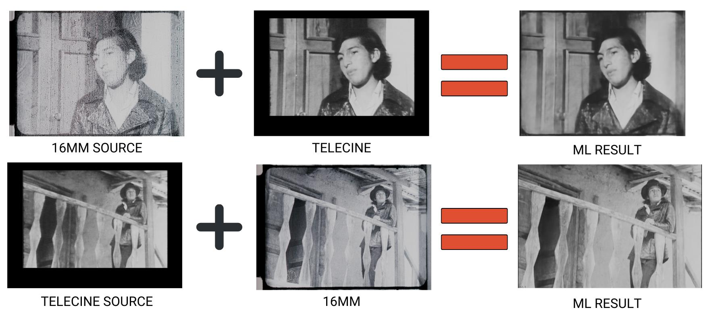
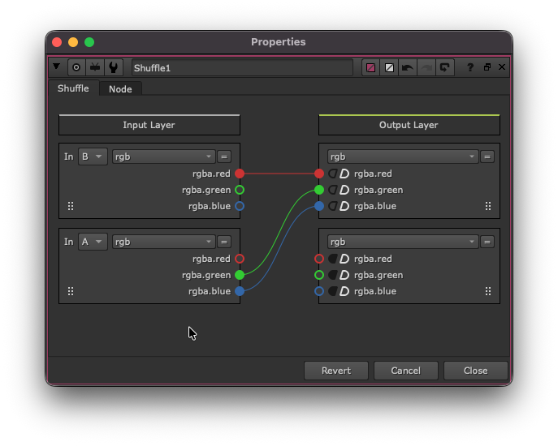
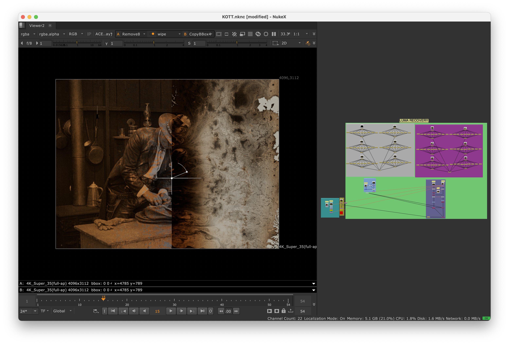

# Spatial Recovery: Building the Detail Target

> **Experimental branch:** spatial recovery is still under development. The public material documents a research route, not a finished archival workflow.

*El Tinterillo proof of concept using a 16mm print and a telecine. The test also exposes edge, grain, and invented-detail risks.*

Use this branch when a second element preserves better spatial information than the chosen source. Complete the [shared preparation and alignment stages](start-here.md) first. This page covers only the branch-specific target. Training, inference, and delivery are documented once in [Training, Inference, and Review](training-inference-review.md).

## When the route may help

- a different film gauge or generation contains better detail;
- an earlier telecine or preservation element retains information missing from a later scan;
- several partial elements can support one more complete image;
- local damage has removed detail that survives in another aligned source.

Higher resolution does not automatically make a better reference. Reject references with incompatible geometry, excessive edge enhancement, or artefacts that the model could mistake for detail.

## Build the target

The training target combines **reference luminance** with **source chroma**. This is the inverse of the chroma branch.

1. Avoid filtering the reference because its spatial detail is the evidence being transferred.
2. If severe compression forces light preprocessing on the source, record it and repeat it exactly during inference.
3. Clone the aligned reference crop onto the source so both branches use the same picture area.
4. Convert source and reference from the working space to YCbCr.
5. In a `Shuffle`, map:
   - red from Reference red (`Y`);
   - green from Source green (`Cb`);
   - blue from Source blue (`Cr`);
   - alpha to black.
6. Convert the target from YCbCr back to the working space.
7. Clamp input and target to the expected range, remove alpha, and copy the same bounding box to both.
8. Connect the prepared source as CopyCat input and the combined image as target.

*Bidirectional spatial-transfer test using the 16mm and telecine sources.*

*The spatial target uses Reference Y with Source Cb and Cr.*

## Branch-specific checks

- Difference the input and target in YCbCr. Their chroma should be nearly identical.
- Inspect edges, grain, fine textures, smooth gradients, and shot joins at full resolution.
- Reject results with halos, invented texture, unstable grain, or temporal sharpening changes.
- During inference, repeat any source preprocessing used during training.
- In Resolve, use the recovered render above the original with Composite Mode set to `Luminosity` when the delivery needs explicit source-colour protection.

*Knights of the Trail viewer wipe comparing the source and spatial-recovery output.*

## Spatial troubleshooting

| Problem | Check |
| --- | --- |
| Colour shifts | Verify that Source Cb and Cr, not Reference chroma, enter the target |
| Halos or oversharpening | Check the reference, reduce training duration, and review the channel mapping |
| Unstable grain or flicker | Add representative texture pairs and inspect alignment through motion |
| Invented detail | Reduce model authority and reject references that do not describe the same structure |

Continue with [Training, Inference, and Review](training-inference-review.md).
