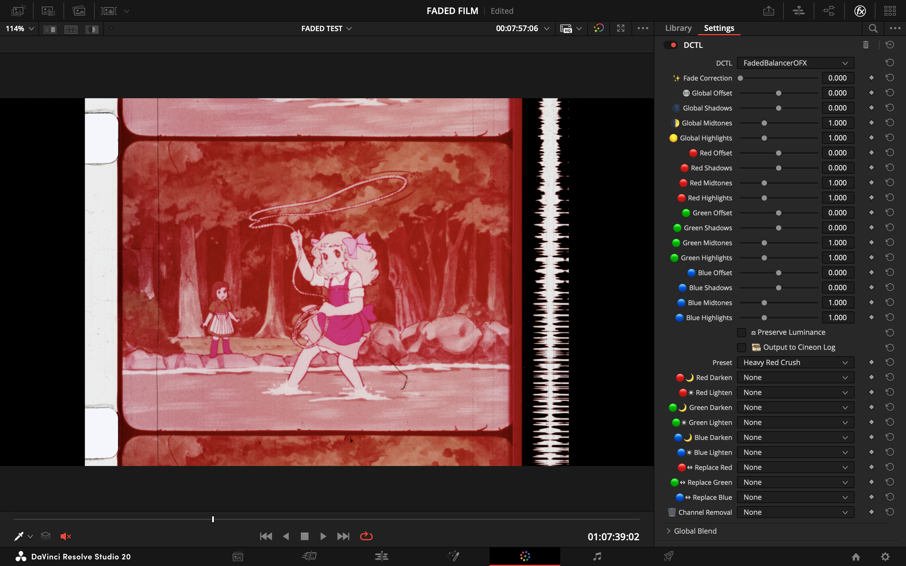
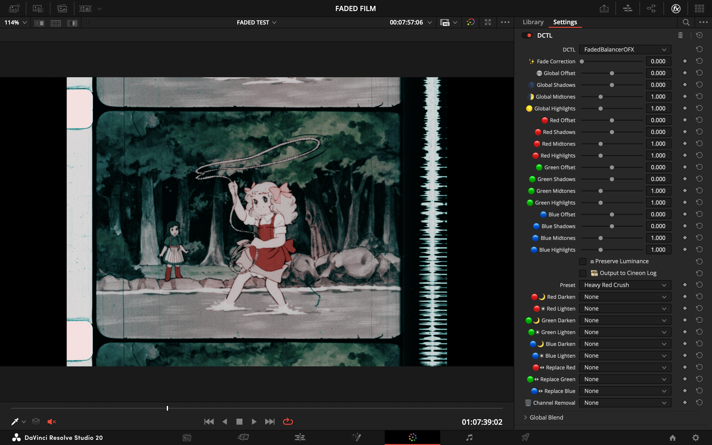
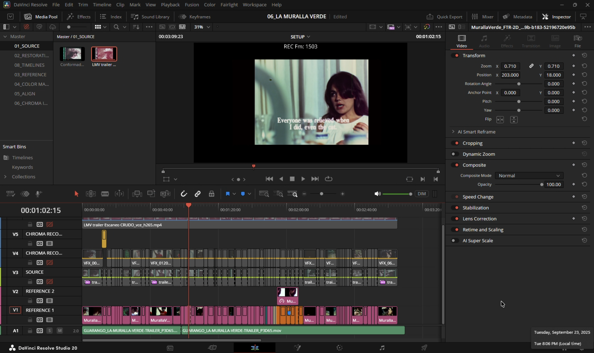
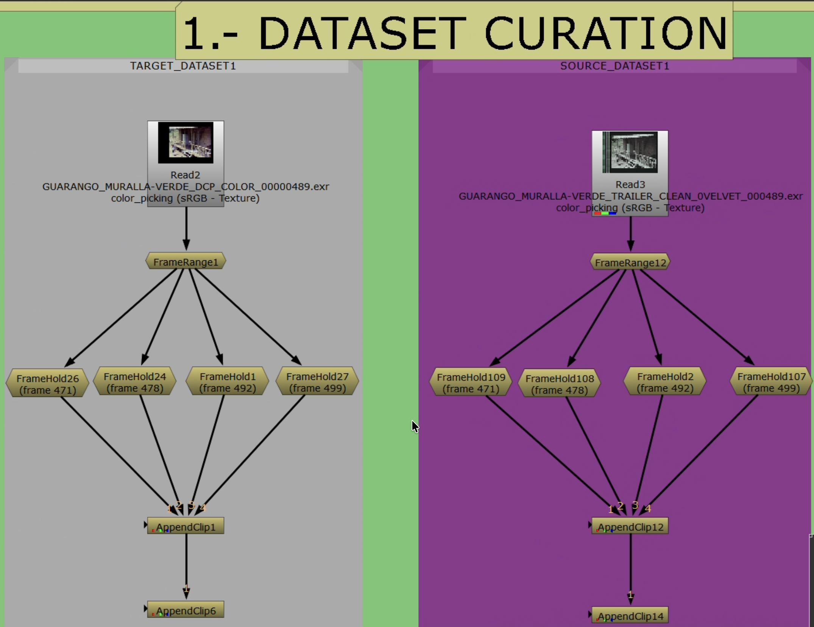
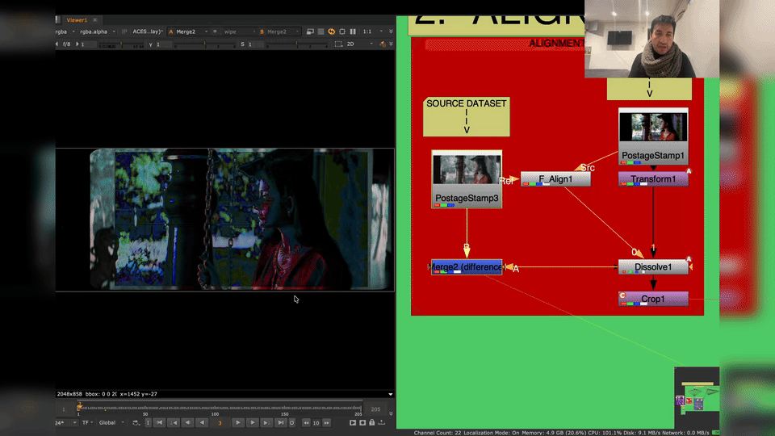
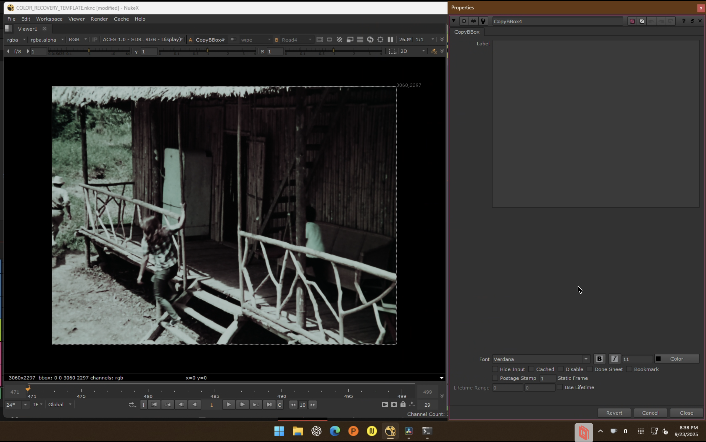

# Shared Workflow: Stages 0–2

This page covers everything both recovery modes share: Resolve export, Nuke project setup, dataset curation, alignment, shared crop, and the branch decision. Follow this page first, then continue in the guide for your chosen branch.

For automatic reel, shot, and frame-level alignment with strict training-pair rejection, use the [Automated Dataset Preparation](automated-dataset-preparation.md) runbook.

- [Chroma Recovery](chroma-recovery.md): when detail is intact but colour is faded, collapsed, or shifted.
- [Spatial Recovery](spatial-recovery.md): when colour is acceptable but detail, sharpness, or grain are weaker than the reference.

*End-to-end overview of the recovery workflow.*

---

## Stage 0: Resolve Export + Nuke Project Setup

Before starting the workflow, make sure the scan preserves as much recoverable image evidence as possible: avoid clipping, automatic white balance, baked creative grades, and compressed low-bit-depth intermediates. For the background thinking, see [Digitization: First Scan, Last Chance](additional-resources.md#digitization-first-scan-last-chance).

### Source and Reference Preparation

What matters is whether the reference preserves better information for the problem you are solving, not whether it is newer, sharper, or higher resolution.

*Source that should be technically balanced before training.*

*Balanced source plate used as cleaner input to the workflow.*

**Source preparation:**

- Technically balance the source (neutral, not creative).
- Remove severe flicker, dirt, splice flashes, and instability that would poison training.
- For chroma recovery: degrain the source for training if grain interferes with chroma learning. Document settings and keep the original plate.
- For spatial recovery: preserve original grain structure. Do not degrain unless the reference is also degrained.
- Global cast neutralization: if the source has a strong bias from dye fade or scanning, apply a neutral pre-balance. Recommended: [Faded Balancer DCTL/OFX](https://github.com/fabiocolor/Faded-Balancer-DCTL). For background on magenta dye fade and channel imbalance, see [Why Faded Scans Turn Magenta](additional-resources.md#why-faded-scans-turn-magenta).

| Before (raw faded scan) | After (Faded Balancer applied) |
| --- | --- |
|  |  |

*Faded Balancer DCTL neutralizing magenta dye fade in Resolve before Nuke ingest.*

**Reference preparation:**

- Clean enough to remove transfer artifacts that would mislead the model.
- For chroma recovery: suppress dust, compression noise, banding (light denoise/deband/median). Geometry changes and temporal warping are not recommended.
- For spatial recovery: remove dust, dirt, and scratches only. **Do not** median filter or blur the reference. Preserve all spatial detail, including grain, sharpness, and edge definition. For magnetic or video references, target only obvious compression artefacts using tools that preserve spatial frequency content.

**Geometry/stabilization:** prefer cleanup that does not alter geometry. If you must stabilize or reframe, apply identical transforms to both exports.

### Resolve Export

*Source and reference placed in the same Resolve container.*

1. Conform both sources in a single timeline. Disable retimes, effects, and per-clip grades.
2. Align the reference to the source in Edit/Inspector (Translate/Scale/Rotate). Allow letterbox/pillarbox; keep stable framing.
3. Use ACES project settings. Export both with **Rec.709 2.4 ODT** to EXR. This keeps values bounded in [0–1], which `CopyCat` expects.
4. Verify parity: resolution, pixel aspect, frame range/rate, channel set (RGB only; omit alpha).
5. Note any global offsets (scale/translate/rotate) for later reference.

**Rules:**

- Same frame range, framing, and resolution.
- No creative grading.
- Fix interlacing, cadence problems, and decode issues before export.

**QC checklist:**

- [ ] Dimensions, frame ranges, and pixel aspect match
- [ ] Channel sets match (RGB), values in 0–1 when read into Nuke
- [ ] No inadvertent retimes or additional color transforms

### Nuke Project Setup

**Project settings:**

- Color management: `OCIO` with `ACES 1.2` or `ACES 1.3`.
- Working space: `ACEScg` (scene-linear, AP1).
- Viewer process: ACES ODT matching your display (e.g., `ACES 1.0 SDR-video / Rec.709 2.4`).

**Read node settings (both Source and Reference):**

- Training pairs (from Resolve Rec.709 2.4 ODT): `Read.colorspace = Utility - sRGB - Color Picking`.
- ACES masters (interchange/comp): `Read.colorspace = ACES - ACES2065-1`. If used for training, transform to display-referred (apply Rec.709 2.4 ODT) rather than clamping naively.

**Verify:**

- Toggle Viewer between Source/Reference; confirm consistent appearance under the chosen ODT.
- Confirm identical ingest transforms on both branches.

### ACES and Color Management Reference

**Training domain (recommended):** Display-referred. Export Rec.709 2.4 ODT, ingest via `Utility - sRGB - Color Picking`, process in ACEScg, and build YCbCr ground truth with identical chains. Values are naturally bounded; only light safety clamping is needed.

**Alternative, log domain:** Viable in theory but significantly slower and, in testing, inferior for chroma recovery fidelity. Use only if the footage demands it.

**Not recommended, naive linear ACES clamp:** Ingesting ACES 2065-1 and clamping to [0–1] crushes highlights and harms both chroma and spatial mapping. If starting from ACES masters, transform to display-referred first.

**Both Input and Target must share the exact same domain and transforms.** Do not mix linear and display-referred between branches.

**Write nodes (delivery):**

- Archival: `Write.colorspace = ACES - ACES2065-1` (AP0), EXR 16-bit half (ZIP/DWAA).
- Review/proxy: Rec.709 ODT → ProRes/H.264. Document viewing intent and ODT.

**Resolve interop:**

- ACES 1.2/1.3 project; export ACES 2065-1 EXR masters for Nuke ingest.
- For display-referred training, export Rec.709 2.4 ODT and ingest with `Utility - sRGB - Color Picking`.
- Keep frame size, PAR, and channels identical.

---

## Stage 1: Dataset Curation

Build a small teaching set from representative frames. Do not put the whole sequence into training.

*Building paired training examples in Nuke.*

### Selection Criteria

- **Source frames:** intact luma/texture, representative grain, minimal gate weave. Avoid motion-blur-dominated frames unless matched in reference.
- **Reference frames:** same shot/timecode when available, or a well-constructed proxy. Avoid heavy compression, baked-in subtitles/logos, unstable grades.
- **Exclude:** pairs with occlusions unique to one side (flashes, splice marks) that the model cannot reconcile.

### Pair Counts

| Scope | Pairs | Notes |
| --- | --- | --- |
| Shot | 4–9 | Add more if convergence stalls |
| Scene | 12–24 | |
| Sequence | 24–64+ | Scale with variability |

For short ranges (e.g., frames 20–60), anchor at beginning/middle/middle/end.

### Coverage

Ensure diversity across:

- **Lighting:** warm/cool, day/night, interior/exterior
- **Subjects:** skin tones, foliage/sky, fabrics, neutrals
- **Extremes:** deep shadows, specular highlights, saturated primaries
- **Textures** (spatial recovery): fabric, foliage, skin, edges, smooth gradients

### Pairing Rules

- **Temporal:** match same frame index/timecode. If off-by-one, prefer the frame with maximal static structure overlap.
- **Spatial:** identical resolution/orientation. Overscan/crop must be shared (residual differences handled in Stage 2).
- **Color space:** both sides under the same transform (e.g., Rec.709 export) so values remain in 0–1.

### Nuke Build

1. Create a `FrameHold` per selected index on both Source and Reference branches.
2. Assemble ordered stacks with `AppendClip`: one for Source (Input), one for Reference (Target).
3. Keep a staging `AppendClip` upstream of the one referenced by downstream `PostageStamp` nodes for safe reordering.
4. Verify each pair with viewer wipe or `Merge (difference)`; judge geometry and alignment only, not colour.
5. Label pairs consistently. Maintain a table of indices/timecodes for traceability.

### Documentation

- Record shot IDs, pair indices, and rationale.
- Note whether references are direct (telecine/DVD/print) or constructed; cite sources.
- Flag compromises (compression, residual parallax) for review during training.

---

## Stage 2: Alignment

Pixel-accurate alignment with shared crop so branches differ only in the intended characteristic (color or spatial detail).

*Auto and manual alignment paths inside the template.*

### Strategy

1. Single global solve with `F_Align` using a conservative central ROI. Do not iterate.
2. Evaluate immediately with `Merge (difference)`. If edges/geometry remain, switch to manual `Transform` with keyframes.
3. Keep a `Dissolve` to compare auto/manual paths quickly.

*Merge (difference) in the viewer: geometry and edges should be near-black. Visible colour differences are expected; only structural misalignment is a problem.*

### Crop and Subtitle Handling

- Remove black borders and overscan on both branches; do not train on non-image content.
- Exclude burned-in subtitles/logos. Where unavoidable, animate a shared crop.
- Apply the **exact same crop** to Source and Reference (clone/link) so pixel areas correspond.

*Shared crop keeping both branches in the same live picture area.*

### Nuke Build

- Compare Reference to Source with Viewer wipe and `Merge (difference)`.
- Use a `Dissolve` to switch auto/manual paths. Keyframe per frame (0 = auto, 1 = manual) after inspection.
- **Auto path:** `F_Align` with conservative central ROI. Single global solve (Translate/Scale/Rotate/Perspective). No parameter chasing.
- **Manual path:** `Transform` (translate/scale/rotate) keyed as needed. Judge with `Merge (difference)`.
- **Reference Crop (last step):** add `Crop` on aligned Reference to remove overscan/transient overlays. Keep bypassed while solving; enable as final step. Save this node to clone/link in Stage 3. Do not crop Source here.

### Verification Checklist

- [ ] `Merge (difference)` shows only color/photometric differences; geometry/edges near-black. Do not apply Grade/color correction here.
- [ ] No edge shimmer at borders/corners when toggling Source/Reference.
- [ ] Reference crop removes overscan/mattes without hiding alignment cues.

**Troubleshooting:** Gate weave and parallax on warped multi-generation references can require time-consuming manual `Transform` keyframing.

---

## Branch Decision: Stage 3

This is where the workflow diverges. The layout is shared; the branch decision is which channels go into the ground-truth target.

*Convert both branches to YCbCr before channel recombination.*

*Shuffle node used to build the ground-truth target.*

*CopyBBox ensures identical bbox across Source and Ground Truth before connecting to CopyCat.*

| Branch | Ground truth target | Continue in |
| --- | --- | --- |
| **Chroma recovery** | Source `Y` + Reference `Cb/Cr` | [chroma-recovery.md](chroma-recovery.md) |
| **Spatial recovery** | Reference `Y` + Source `Cb/Cr` | [spatial-recovery.md](spatial-recovery.md) |

Do not combine chroma and spatial recovery in one target. After the target is built, both branches continue through the same [training, inference, and review stages](training-inference-review.md).

### Common Failure Modes

- Training on an unstable source (flicker, dirt, severe imbalance).
- Trusting a bad reference just because it is higher resolution.
- Keeping misaligned frames in the dataset.
- Leaving borders, subtitles, or overlays inside the training area.
- Expecting one model to solve every shot in a difficult sequence.
