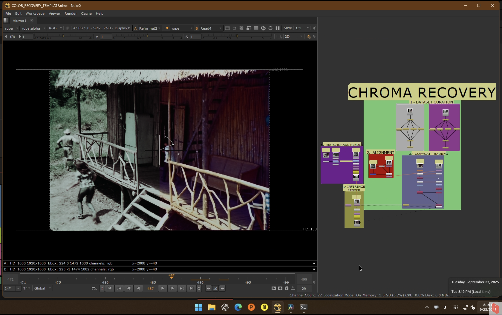
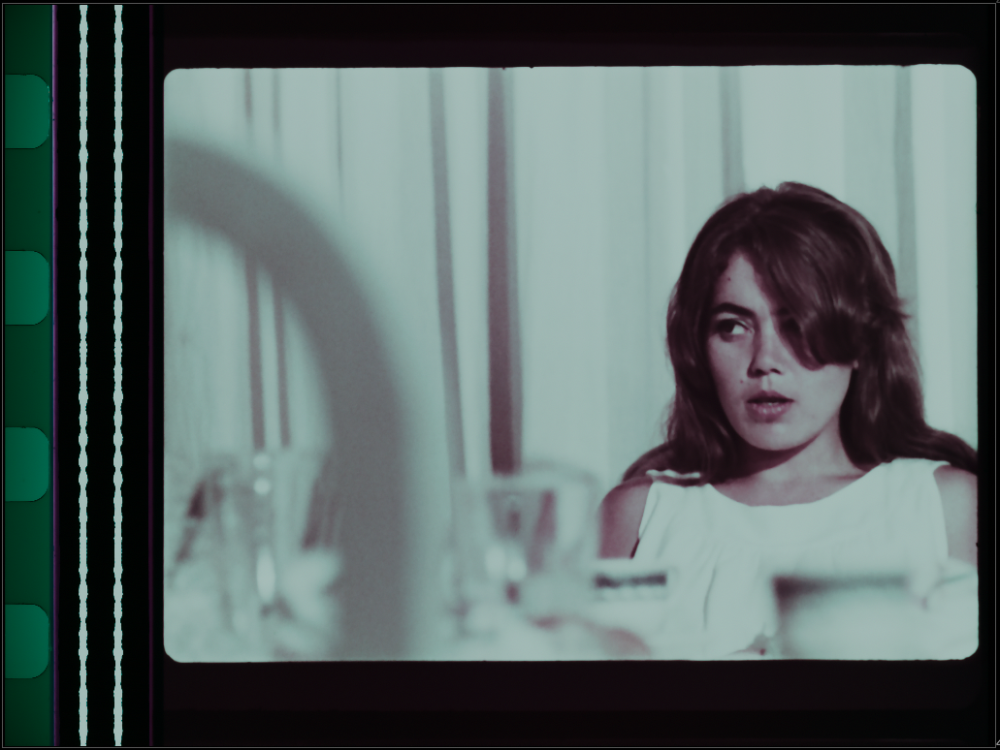
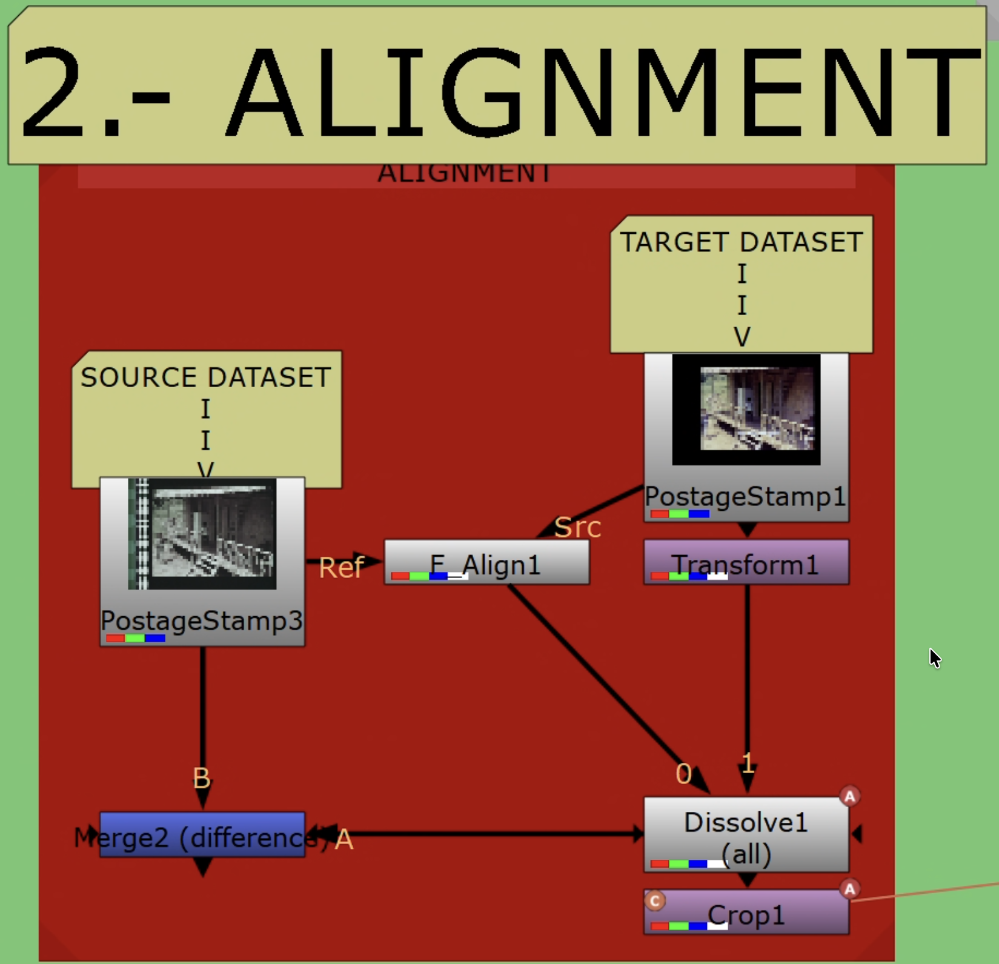
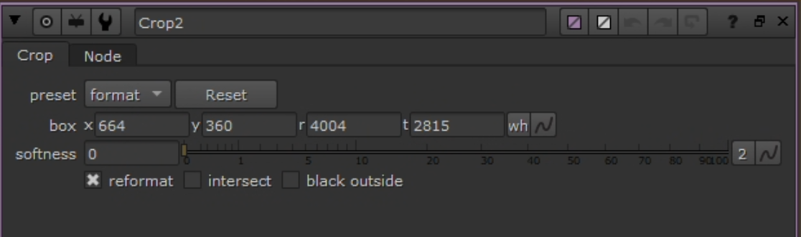
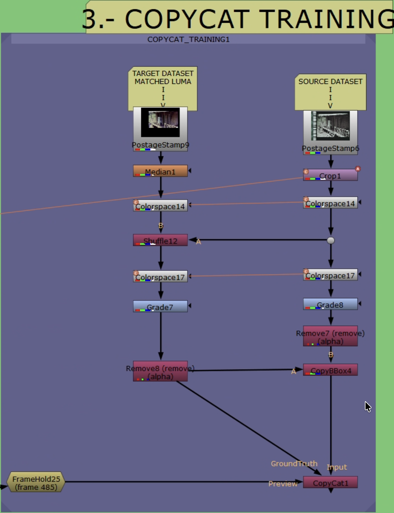
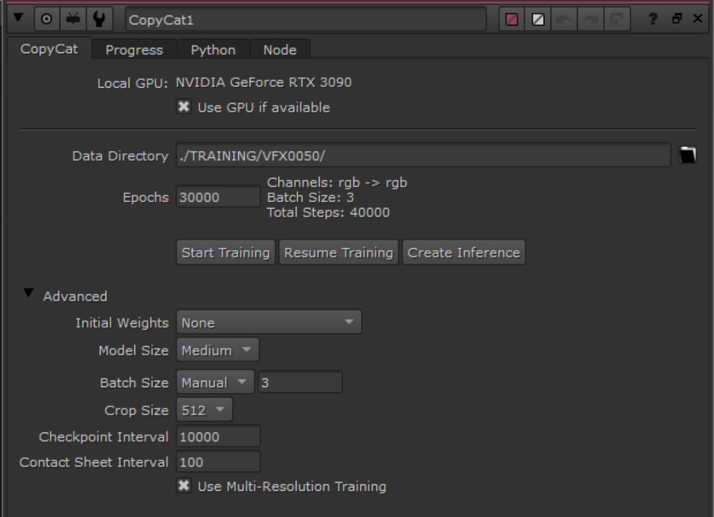
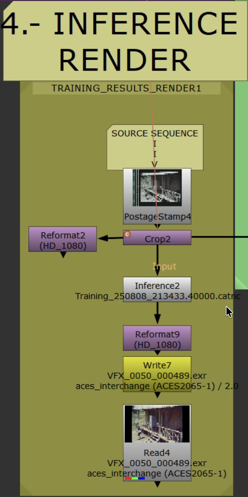
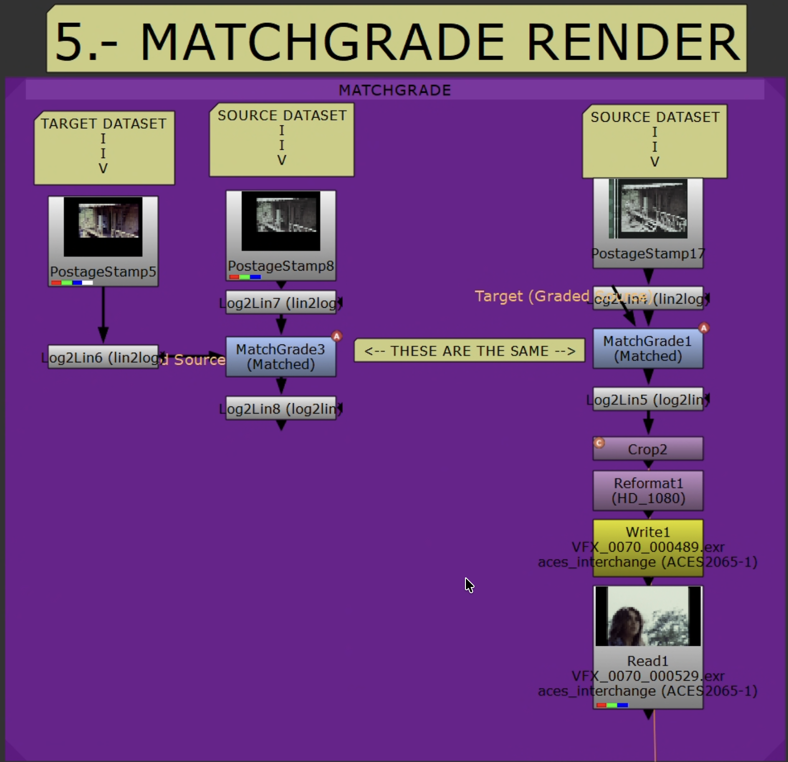

# Start Here: Video Companion Workflow

If you are arriving from the video and want one page to follow end to end, start with [one-step-guide.md](one-step-guide.md). This page is the shorter, plain-language version of the same workflow.

Figure 1 - End-to-end overview of the recovery workflow.

## What This Workflow Is

This repository is for reference-based recovery in Nuke:

- Chroma recovery when the source still has usable detail but the color has faded or collapsed
- Spatial recovery when another source preserves better detail, sharpness, or grain structure

If you are new to the repo, start with chroma. It is the more mature path here.

## The Core Idea

The workflow is simple in principle:

1. Prepare a stable source.
2. Secure the best available reference.
3. Align both in Resolve and Nuke.
4. Build a training target that isolates the problem you want to solve.
5. Train `CopyCat`, run inference, and validate the result against the original source and a simpler baseline.

The entire repo is an expansion of those five ideas.

## Before You Open Nuke

You need:

- A technically balanced or partially cleaned source
- A trustworthy reference
- Matching exports prepared before training

What matters most is not whether the reference is sharp or modern. What matters most is whether it preserves better color or better spatial information than the damaged source.

Figure 2 - Example of a source that should be technically balanced before training.

Figure 3 - Balanced source plate used as a cleaner input to the workflow.

## The Quick Path

### 1. Prep Both Sources in Resolve

Put source and reference in the same timeline, align them temporally first, then spatially, and export both inside the same container.

Rules:

- Keep the same frame range, framing, and resolution.
- Avoid creative grading.
- Fix interlacing, cadence problems, and obvious decode issues before training.

Figure 4 - Source and reference placed in the same Resolve container before Nuke.

### 2. Open the Template and Curate a Small Dataset

Start with the template that matches your Nuke edition. Build a small teaching set from representative frames rather than throwing the whole sequence into training.

Good pairs are:

- frame-matched
- aligned well enough to compare cleanly
- diverse enough to cover lighting, materials, and difficult colors or textures

Figure 5 - Building paired training examples in Nuke.

### 3. Align and Crop Properly

Try `F_Align` first. Check it with `Merge (difference)`. If it fails, switch to a keyed `Transform`. Once alignment is acceptable, crop out borders, subtitles, and empty container space, then link that crop so both branches always match.

Figure 6 - Auto and manual alignment paths inside the template.

Figure 7 - Shared crop used to keep both branches in the same live picture area.

### 4. Build the Right Target

This is the decision point that matters most:

- Chroma recovery target: Source `Y` + Reference `Cb/Cr`
- Spatial recovery target: Reference `Y` + Source `Cb/Cr`

That is why the same template can support both branches. The main difference is which channels you borrow from the reference.

Figure 8 - Convert both branches to YCbCr before channel recombination.

Figure 9 - `Shuffle` node used to build the ground-truth target.

### 5. Train the First Model

A solid starting point:

- Model: `Medium`
- Patch size: `512`
- Batch size: `3`
- Checkpoints: every `10000` steps
- Preview input: one held-out frame that is not in the training set

Start broad with a sequence-level model. If only a few shots fail, split those into smaller shot-level retrains.

Figure 10 - Training layout used for `CopyCat`.

Figure 11 - Starting `CopyCat` settings for the first training pass.

### 6. Run Inference on the Full Source

Inference should run on the full source sequence, not just the reduced training set. Keep preprocessing consistent with what the model saw during training.

Figure 12 - Inference and render stage after model training.

### 7. Compare Against a Simpler Baseline

Use a quick `MatchGrade` or LUT-like control result so you can prove that the trained model is doing more than shifting overall color.

- Good result: stable color, believable separation, preserved source detail
- Bad result: pulsing hues, unstable skin or fabrics, new artifacts, or obvious drift

If the sequence-wide model works except for a few outlier shots, stop forcing one model to solve everything and train those shots separately.

Figure 13 - Useful baseline for comparing ML output against a simpler grade-driven result.

## What Usually Breaks the Workflow

- Training on an unstable source with flicker, dirt, or severe imbalance
- Trusting a bad reference just because it is higher resolution
- Keeping misaligned frames in the dataset
- Leaving borders, subtitles, or overlays inside the training area
- Expecting one model to solve every shot in a difficult sequence

## Where To Go Next

- Use [one-step-guide.md](one-step-guide.md) for the full reference-based workflow that covers both chroma and spatial recovery.
- Use [chroma-recovery.md](chroma-recovery.md) when color loss is the main problem.
- Use [spatial-recovery.md](spatial-recovery.md) when detail loss is the main problem and you have a stronger spatial reference.
- Use [watch-the-video.md](watch-the-video.md) for the walkthrough link and the repo/video relationship.
