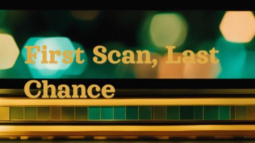
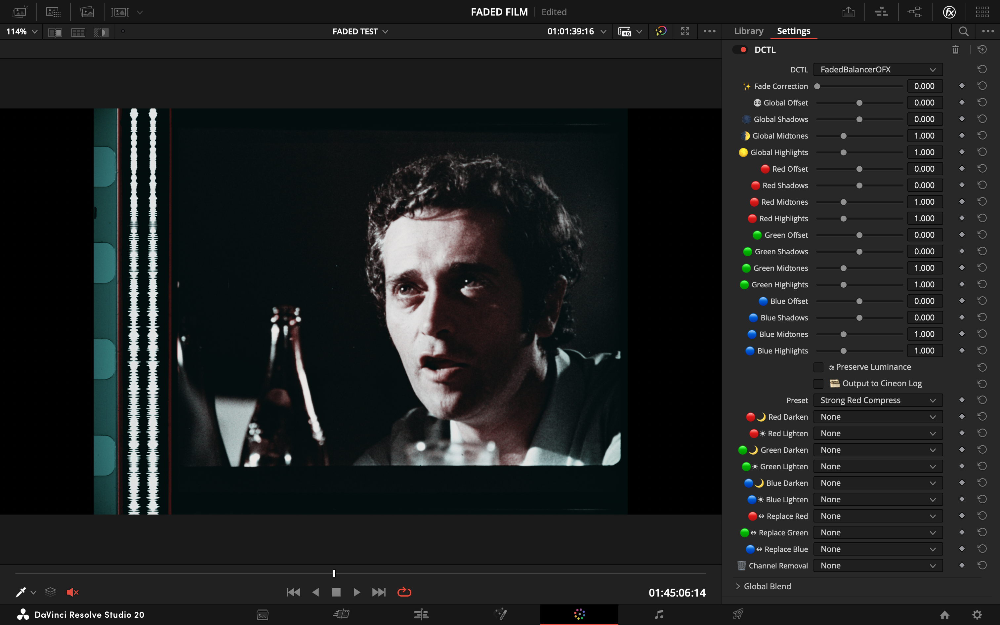
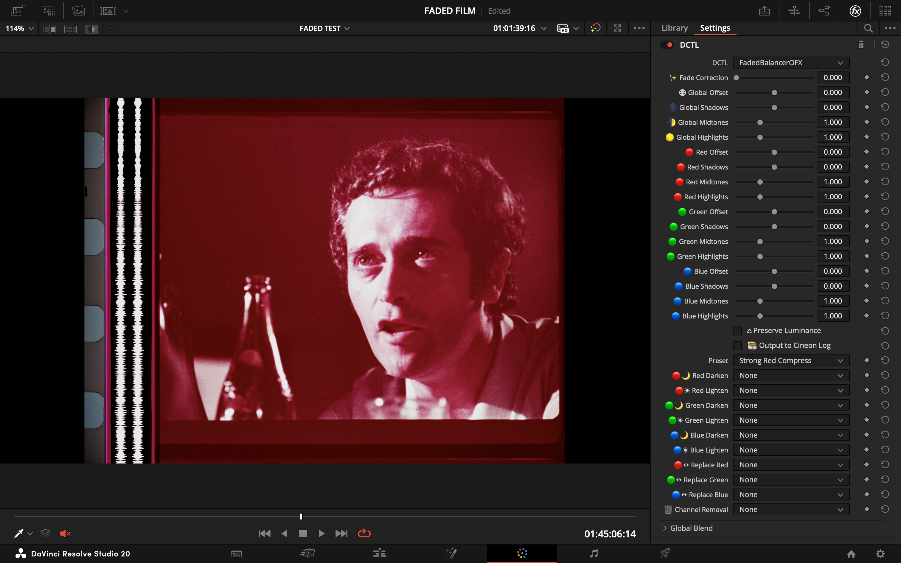
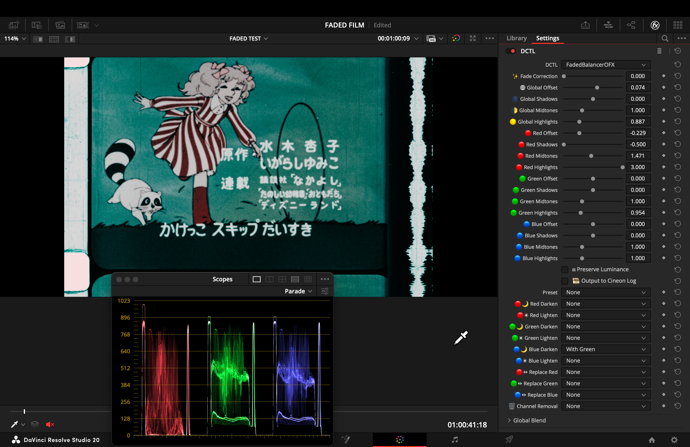

<strong>Language:</strong> English | <a href="{{ '/es/start-here/' | relative_url }}">Español</a>

# Shared Workflow — Stages 0–2

This page covers everything both recovery modes share: Resolve export, Nuke project setup, dataset curation, alignment, shared crop, and the branch decision. Follow this page first, then continue in the guide for your chosen branch.

- [Chroma Recovery](chroma-recovery.md) — when detail is intact but color is faded, collapsed, or shifted.
- [Spatial Recovery](spatial-recovery.md) — when color is acceptable but detail, sharpness, or grain are weaker than the reference.

*End-to-end overview of the recovery workflow.*

---

## Stage 0: Resolve Export + Nuke Project Setup

### Digitization: First Scan, Last Chance

Digitization is the preservation handoff where the image content is separated from a fragile physical container. Treat the scan as the foundation for every later restoration step, not as a quick transfer or a baked creative grade. For damaged or rare materials, the first scan may also be the only practical scan: the film may not survive repeated handling, the budget may not allow a second pass, or decay may advance before another attempt is possible.

*Article image from "First Scan, Last Chance": digitization as the moment where content is separated from a fragile film container.*

The goal is to capture the maximum recoverable information in RGB and luminance. A good scan should preserve the film's dynamic range, color-channel separation, density variation, grain, and texture so later tools can make informed decisions. A poor scan can permanently remove evidence: clipped highlights, crushed shadows, bad white balance, automatic exposure decisions, or channel clipping cannot reliably be reconstructed downstream.

**Scanning principles:**

- Capture a preservation-grade digital surrogate before restoration decisions are baked in.
- Avoid highlight clipping, shadow crushing, automatic white balance, heavy noise reduction, sharpening, or creative LUTs during capture.
- Monitor RGB parade, waveform, histogram, and channel clipping during setup and final capture.
- Run a preliminary assessment pass to find the sequence's tonal extremes, density shifts, splice flashes, severe fading, and any scanner settings likely to fail.
- Record scanner model, gate, optics, resolution, bit depth, color encoding, transforms, exposure settings, and any wet-gate or cleanup choices.
- Preserve the raw scan or archival master separately from restoration renders, review proxies, and creative grades.

| Risk during digitization | Why it matters later |
| --- | --- |
| Clipped highlights or channels | Removes image information permanently and weakens color recovery, deflicker, dust removal, and grading. |
| Incorrect white point | Adds a false color relationship that restoration tools may learn or amplify. |
| Automatic scanner decisions | Can vary shot to shot, causing artificial flicker, unstable density, or inconsistent channel balance. |
| Baked creative grade | Narrows the evidence available for future restoration or alternate interpretation. |
| Low bit depth / compressed delivery format | Reduces subtle density and chroma information needed for restoration, especially in faded material. |

For historical or deteriorated material, prefer a conservative high-bit-depth scan that keeps the system's captured information intact, then make restoration choices in a controlled post pipeline. ADX, Cineon, linear, ACES, and display-referred workflows can all be useful in the right context, but they should be tested against the specific film element rather than assumed correct. For the chroma-recovery workflow in this repo, the key rule is continuity: whatever scan and transform path is chosen, Source and Reference must be carried into training with matching, documented transforms.

Digitization, restoration, and remastering are related but distinct. Digitization captures the analog film as data. Restoration addresses damage or loss introduced by the physical container. Remastering may adapt the work for a new display, release, or audience. Keep those boundaries visible in metadata so future users know which decisions came from the object, the restoration process, or the delivery master.

Reference and source image: [First Scan, Last Chance: The Critical Role of Digitization in Preserving Film Heritage](https://www.linkedin.com/pulse/first-scan-last-chance-critical-role-digitization-film-fabio-bedoya-hvzte/).

### Source and Reference Preparation

What matters is whether the reference preserves better information for the problem you are solving — not whether it is newer, sharper, or higher resolution.

*Source that should be technically balanced before training.*

*Balanced source plate used as cleaner input to the workflow.*

**Source preparation:**

- Technically balance the source (neutral, not creative).
- Remove severe flicker, dirt, splice flashes, and instability that would poison training.
- For chroma recovery: degrain the source for training if grain interferes with chroma learning. Document settings and keep the original plate.
- For spatial recovery: preserve original grain structure — do not degrain unless the reference is also degrained.
- Global cast neutralization: if the source has a strong bias from dye fade or scanning, apply a neutral pre-balance. Recommended: [Faded Balancer DCTL/OFX](https://github.com/fabiocolor/Faded-Balancer-DCTL).

| Before (raw faded scan) | After (Faded Balancer applied) |
| --- | --- |
|  |  |

*Faded Balancer DCTL neutralizing magenta dye fade in Resolve before Nuke ingest.*

### Why Faded Scans Turn Magenta {#why-faded-scans-turn-magenta}

Color film records the image through subtractive dye layers. When the surviving density is no longer balanced, the scan no longer carries even RGB information. A common failure is a pink/magenta cast: cyan and yellow densities weaken against the remaining dye, so red and blue dominate while the green channel loses useful chromatic separation.

For this workflow, the point is practical more than aesthetic: the magenta image often still preserves usable luma, texture, and grain, but its chroma channels are biased, compressed, or partly clipped. A neutral pre-balance gives `CopyCat` a cleaner input distribution before introducing chroma from the reference.

  <figure>
    
    <figcaption>Faded scan with a strong red/magenta bias.</figcaption>
  </figure>
  <figure>
    
    <figcaption>Technical red compression/rebalance to prepare a cleaner input before ML training.</figcaption>
  </figure>

*Resolve parade scope and Faded Balancer controls showing channel imbalance in faded film. The goal is a technical pre-balance, not a final creative grade.*

  <figure>
    
    <figcaption>Faded animation scan before channel-specific correction.</figcaption>
  </figure>
  <figure>
    
    <figcaption>Diagnostic red-channel correction: helps isolate and control a dominant component.</figcaption>
  </figure>

#### Technical Data For The Investigation

**What is failing:** In chromogenic materials, the final image is formed by superimposed cyan, magenta, and yellow dye clouds in gelatin layers. These organic dyes do not age at the same rate. When cyan and yellow density fade faster than magenta, the visual balance shifts toward pink, purple, or magenta. NARA's inspection guidance describes this diagnosis directly: magenta film has experienced color fading because the cyan and yellow dye layers have weakened, leaving magenta dominant. The NFPF describes the same pattern for modern color motion picture films: spontaneous chemical changes in image dyes, often with a purplish cast caused by rapid cyan and yellow dye fading.

**Why it happened:** The root cause is not a bad scan or a bad grade, though either can make the symptom more visible. It is accumulated chemical deterioration: broken molecular bonds in image dyes, unequal dye stability, heat, humidity, light exposure, time, and storage history. Graphics Atlas notes that chromogenic dye fading can happen in both light exposure and dark storage; cyan dye fade in dark storage can leave the image overall magenta. Older chromogenic stocks and prints, especially mid-century materials before later stability improvements, are more vulnerable than modern stocks.

**Why ordinary grading is limited:** An RGB grade can rebalance channels globally, but it cannot recreate chroma that is absent or compressed into contaminated channel relationships. Recent digital unfading research frames this as a reconstruction problem constrained by residual dye information, scan quality, and available references. Severe cases need informed inference: direct references, constructed references, spectral/density analysis, documented memory color, or supervised learning.

**Data worth capturing before restoration:**

| Data | Why it helps |
| --- | --- |
| Stock, generation, and approximate date | Establishes dye-stability risk and likely chromogenic process. |
| Storage history | Heat, humidity, and light help explain fading speed and pattern. |
| Physical inspection | Separates dye fading from vinegar syndrome, dirt, shrinkage, mold, mechanical damage, or emulsion problems. |
| RGB parade scopes / histograms | Shows channel compression, clipping, and separation before and after pre-balance. |
| Dmin/Dmax or neutral patches when available | Measures density loss and highlight/shadow contamination. |
| Reference comparison | DVD, telecine, alternate print, artwork, or constructed reference separates evidence from subjective decisions. |
| Transform log | Records scanner settings, ODT, color space, pre-balance, cleanup, and clamp choices before CopyCat. |

**How to deal with it in this workflow:** First stabilize preservation risk: cool/dry storage, inspection, cleaning, and digitization before decay advances. Then apply a technical, non-creative pre-balance to reduce extreme bias and give Nuke a more useful source plate. In chroma recovery, `CopyCat` does not replace the whole image: it preserves source luma/detail and learns to reconstruct Cb/Cr from an aligned or constructed reference. If a channel is biased but still carries information, pre-balance may recover a lot. If chroma is genuinely gone, restoration depends on external evidence and should be documented as interpretation.

**Technical references:**

- [National Archives - Motion Picture Film Condition Assessment](https://www.archives.gov/preservation/formats/motion-picture-film-condition-assessment.html)
- [National Film Preservation Foundation - Color Dye Fading](https://www.filmpreservation.org/preservation-basics/color-dye-fading)
- [Graphics Atlas - Chromogenic deterioration](https://new.graphicsatlas.org/chromogenic/object-view)
- [Heritage, 2023 - Digital Unfading of Chromogenic Film Informed by Its Spectral Densities](https://www.mdpi.com/2571-9408/6/4/181)
- [National Film Preservation Foundation - The Film Preservation Guide](https://www.filmpreservation.org/userfiles/image/PDFs/fpg.pdf)

**Reference preparation:**

- Clean enough to remove transfer artifacts that would mislead the model.
- For chroma recovery: suppress dust, compression noise, banding (light denoise/deband/median). Geometry changes and temporal warping are not recommended.
- For spatial recovery: remove dust/dirt/scratches only. **Do not** median filter or blur the reference — preserve all spatial detail (grain, sharpness, edge definition). For magnetic/video references, target only obvious compression artifacts using tools that preserve spatial frequency content.

**Geometry/stabilization:** prefer cleanup that does not alter geometry. If you must stabilize or reframe, apply identical transforms to both exports.

### Resolve Export

*Source and reference placed in the same Resolve container.*

1. Conform both sources in a single timeline. Disable retimes, effects, and per-clip grades.
2. Align the reference to the source in Edit/Inspector (Translate/Scale/Rotate). Allow letterbox/pillarbox; keep stable framing.
3. Use ACES project settings. Export both with **Rec.709 2.4 ODT** to EXR — keeps values bounded in [0–1], which `CopyCat` expects.
4. Verify parity: resolution, pixel aspect, frame range/rate, channel set (RGB only; omit alpha).
5. Note any global offsets (scale/translate/rotate) for later reference.

**Rules:**

- Same frame range, framing, and resolution.
- No creative grading.
- Fix interlacing, cadence problems, and decode issues before export.

**QC checklist:**

- [ ] Dimensions, frame ranges, and pixel aspect match
- [ ] Channel sets match (RGB), values in 0–1 when read into Nuke
- [ ] No inadvertent retimes or additional color transforms

### Nuke Project Setup

**Project settings:**

- Color management: `OCIO` with `ACES 1.2` or `ACES 1.3`.
- Working space: `ACEScg` (scene-linear, AP1).
- Viewer process: ACES ODT matching your display (e.g., `ACES 1.0 SDR-video / Rec.709 2.4`).

**Read node settings (both Source and Reference):**

- Training pairs (from Resolve Rec.709 2.4 ODT): `Read.colorspace = Utility - sRGB - Color Picking`.
- ACES masters (interchange/comp): `Read.colorspace = ACES - ACES2065-1`. If used for training, transform to display-referred (apply Rec.709 2.4 ODT) rather than clamping naively.

**Verify:**

- Toggle Viewer between Source/Reference; confirm consistent appearance under the chosen ODT.
- Confirm identical ingest transforms on both branches.

### ACES and Color Management Reference

**Training domain (recommended):** Display-referred — export Rec.709 2.4 ODT, ingest via `Utility - sRGB - Color Picking`, process in ACEScg, build YCbCr ground truth with identical chains. Values are naturally bounded; only light safety clamping needed.

**Alternative — Log domain:** Viable in theory but significantly slower and, in testing, inferior for chroma recovery fidelity. Use only if footage demands it.

**Not recommended — Naive linear ACES clamp:** Ingesting ACES 2065-1 and clamping to [0–1] crushes highlights and harms both chroma and spatial mapping. If starting from ACES masters, transform to display-referred first.

**Both Input and Target must share the exact same domain and transforms.** Do not mix linear and display-referred between branches.

**Write nodes (delivery):**

- Archival: `Write.colorspace = ACES - ACES2065-1` (AP0), EXR 16-bit half (ZIP/DWAA).
- Review/proxy: Rec.709 ODT → ProRes/H.264. Document viewing intent and ODT.

**Resolve interop:**

- ACES 1.2/1.3 project; export ACES 2065-1 EXR masters for Nuke ingest.
- For display-referred training, export Rec.709 2.4 ODT and ingest with `Utility - sRGB - Color Picking`.
- Keep frame size, PAR, and channels identical.

---

## Stage 1: Dataset Curation

Build a small teaching set from representative frames — do not throw the whole sequence into training.

*Building paired training examples in Nuke.*

### Selection Criteria

- **Source frames:** intact luma/texture, representative grain, minimal gate weave. Avoid motion-blur-dominated frames unless matched in reference.
- **Reference frames:** same shot/timecode when available, or a well-constructed proxy. Avoid heavy compression, baked-in subtitles/logos, unstable grades.
- **Exclude:** pairs with occlusions unique to one side (flashes, splice marks) that the model cannot reconcile.

### Pair Counts

| Scope | Pairs | Notes |
| --- | --- | --- |
| Shot | 4–9 | Add more if convergence stalls |
| Scene | 12–24 | |
| Sequence | 24–64+ | Scale with variability |

For short ranges (e.g., frames 20–60), anchor at beginning/middle/middle/end.

### Coverage

Ensure diversity across:

- **Lighting:** warm/cool, day/night, interior/exterior
- **Subjects:** skin tones, foliage/sky, fabrics, neutrals
- **Extremes:** deep shadows, specular highlights, saturated primaries
- **Textures** (spatial recovery): fabric, foliage, skin, edges, smooth gradients

### Pairing Rules

- **Temporal:** match same frame index/timecode. If off-by-one, prefer the frame with maximal static structure overlap.
- **Spatial:** identical resolution/orientation. Overscan/crop must be shared (residual differences handled in Stage 2).
- **Color space:** both sides under the same transform (e.g., Rec.709 export) so values remain in 0–1.

### Nuke Build

1. Create a `FrameHold` per selected index on both Source and Reference branches.
2. Assemble ordered stacks with `AppendClip`: one for Source (Input), one for Reference (Target).
3. Keep a staging `AppendClip` upstream of the one referenced by downstream `PostageStamp` nodes for safe reordering.
4. Verify each pair with viewer wipe or `Merge (difference)` — judge geometry/alignment only, not color.
5. Label pairs consistently. Maintain a table of indices/timecodes for traceability.

### Documentation

- Record shot IDs, pair indices, and rationale.
- Note whether references are direct (telecine/DVD/print) or constructed; cite sources.
- Flag compromises (compression, residual parallax) for review during training.

---

## Stage 2: Alignment

Pixel-accurate alignment with shared crop so branches differ only in the intended characteristic (color or spatial detail).

*Auto and manual alignment paths inside the template.*

### Strategy

1. Single global solve with `F_Align` using a conservative central ROI. Do not iterate.
2. Evaluate immediately with `Merge (difference)`. If edges/geometry remain, switch to manual `Transform` with keyframes.
3. Keep a `Dissolve` to compare auto/manual paths quickly.

*Merge (difference) in the viewer: geometry/edges should be near-black. Visible color differences are expected — only structural misalignment is a problem.*

### Crop and Subtitle Handling

- Remove black borders/overscan on both branches — do not train on non-image content.
- Exclude burned-in subtitles/logos. Where unavoidable, animate a shared crop.
- Apply the **exact same crop** to Source and Reference (clone/link) so pixel areas correspond.

*Shared crop keeping both branches in the same live picture area.*

### Nuke Build

- Compare Reference to Source with Viewer wipe and `Merge (difference)`.
- Use a `Dissolve` to switch auto/manual paths. Keyframe per frame (0 = auto, 1 = manual) after inspection.
- **Auto path:** `F_Align` with conservative central ROI. Single global solve (Translate/Scale/Rotate/Perspective). No parameter chasing.
- **Manual path:** `Transform` (translate/scale/rotate) keyed as needed. Judge with `Merge (difference)`.
- **Reference Crop (last step):** add `Crop` on aligned Reference to remove overscan/transient overlays. Keep bypassed while solving; enable as final step. Save this node to clone/link in Stage 3. Do not crop Source here.

### Verification Checklist

- [ ] `Merge (difference)` shows only color/photometric differences; geometry/edges near-black. Do not apply Grade/color correction here.
- [ ] No edge shimmer at borders/corners when toggling Source/Reference.
- [ ] Reference crop removes overscan/mattes without hiding alignment cues.

**Troubleshooting:** Gate weave/parallax on warped multi-generation references — expect manual `Transform` keyframing to be time-consuming.

---

## Branch Decision — Stage 3

This is where the workflow diverges. The layout is shared; the branch decision is which channels go into the ground-truth target.

*Convert both branches to YCbCr before channel recombination.*

*Shuffle node used to build the ground-truth target.*

*CopyBBox ensures identical bbox across Source and Ground Truth before connecting to CopyCat.*

| Branch | Ground truth target | Continue in |
| --- | --- | --- |
| **Chroma recovery** | Source `Y` + Reference `Cb/Cr` | [chroma-recovery.md](chroma-recovery.md) |
| **Spatial recovery** | Reference `Y` + Source `Cb/Cr` | [spatial-recovery.md](spatial-recovery.md) |

### Rules After the Branch

- Do not combine chroma and spatial recovery in the same target build.
- Validate one pass before attempting the second.
- Train sequence-level first; split to shot-level only where the wide pass fails.
- Run inference on the full source, not just training frames.
- Compare against a baseline (`MatchGrade`) to prove the model is doing something specific.

### Common Failure Modes

- Training on an unstable source (flicker, dirt, severe imbalance).
- Trusting a bad reference just because it is higher resolution.
- Keeping misaligned frames in the dataset.
- Leaving borders, subtitles, or overlays inside the training area.
- Expecting one model to solve every shot in a difficult sequence.
